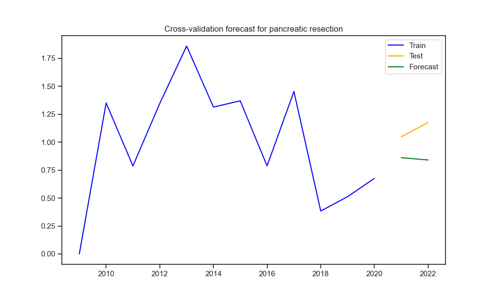

# Modeling

### Fold 1 Results
#### Random Forest Regressor
- MSE: 716.71, R²: -0.07, MAE: 5.16, RMSE: 26.77
#### Linear Regression
- MSE: 646.82, R²: 0.04, MAE: 6.52, RMSE: 25.43

#### Predicted vs Actual Scatter Plot

### Fold 2 Results
#### Random Forest Regressor
- MSE: 722.67, R²: -0.00, MAE: 5.30, RMSE: 26.88
#### Linear Regression
- MSE: 693.68, R²: 0.04, MAE: 6.77, RMSE: 26.34

#### Predicted vs Actual Scatter Plot

### Fold 3 Results
#### Random Forest Regressor
- MSE: 678.25, R²: 0.07, MAE: 5.13, RMSE: 26.04
#### Linear Regression
- MSE: 698.56, R²: 0.04, MAE: 6.80, RMSE: 26.43

#### Predicted vs Actual Scatter Plot

### Fold 4 Results
#### Random Forest Regressor
- MSE: 611.42, R²: 0.01, MAE: 5.10, RMSE: 24.73
#### Linear Regression
- MSE: 590.72, R²: 0.04, MAE: 6.62, RMSE: 24.30

#### Predicted vs Actual Scatter Plot

### Fold 5 Results
#### Random Forest Regressor
- MSE: 639.03, R²: -0.07, MAE: 5.01, RMSE: 25.28
#### Linear Regression
- MSE: 575.66, R²: 0.04, MAE: 6.41, RMSE: 23.99

#### Predicted vs Actual Scatter Plot

## Overall Model Performance Summary
### Random Forest Regressor
- Avg MSE: 673.62, Avg R²: -0.01, Avg MAE: 5.14, Avg RMSE: 25.94

### Linear Regression
- Avg MSE: 641.09, Avg R²: 0.04, Avg MAE: 6.62, Avg RMSE: 25.30
### MSE Comparison Across Folds

## Fold 1 Results

### Random Forest Performance Metrics
- Accuracy: 0.96
- Weighted Precision: 0.96
- Weighted F1 Score: 0.96

### Classification Report
              precision    recall  f1-score   support

           0       0.43      0.09      0.15        32
           1       0.96      0.97      0.96      2219
           2       1.00      0.05      0.09        21
           3       0.97      0.97      0.97      1842

    accuracy                           0.96      4114
   macro avg       0.84      0.52      0.54      4114
weighted avg       0.96      0.96      0.96      4114

### Confusion Matrix Heatmap

## Fold 2 Results

### Random Forest Performance Metrics
- Accuracy: 0.96
- Weighted Precision: 0.95
- Weighted F1 Score: 0.95

### Classification Report
              precision    recall  f1-score   support

           0       0.00      0.00      0.00        33
           1       0.95      0.97      0.96      2218
           2       0.33      0.05      0.08        21
           3       0.97      0.97      0.97      1842

    accuracy                           0.96      4114
   macro avg       0.56      0.50      0.50      4114
weighted avg       0.95      0.96      0.95      4114

### Confusion Matrix Heatmap

## Fold 3 Results

### Random Forest Performance Metrics
- Accuracy: 0.96
- Weighted Precision: 0.95
- Weighted F1 Score: 0.95

### Classification Report
              precision    recall  f1-score   support

           0       0.43      0.09      0.15        32
           1       0.96      0.96      0.96      2218
           2       0.00      0.00      0.00        21
           3       0.95      0.98      0.97      1842

    accuracy                           0.96      4113
   macro avg       0.59      0.51      0.52      4113
weighted avg       0.95      0.96      0.95      4113

### Confusion Matrix Heatmap

## Cross-Validation Summary
The results for all folds are summarized in the markdown file.
## Exponential Smoothing Predictions for carotid endarterectomy

Predictions for the next 2 years: [0.32296348613212644, 0.41576609945529125]

## Exponential Smoothing Predictions for esophageal resection

Predictions for the next 2 years: [0.6190106547016877, 0.64594919710916]

## Exponential Smoothing Predictions for pancreatic resection

Predictions for the next 2 years: [0.961004142204866, 0.96133147835756]

## Exponential Smoothing Predictions for pci

Predictions for the next 2 years: [2.4600298024583402, 2.709510271240393]

## Exponential Smoothing Predictions for aaa repair

Predictions for the next 2 years: [0.10114291381134688, -5.8991370818078925e-06]

## Exponential Smoothing Predictions for gi hemorrhage

Predictions for the next 2 years: [2.6661576558407902, 2.818218988721661]

## Exponential Smoothing Predictions for heart failure

Predictions for the next 2 years: [2.6174947299900535, 2.7331982674230813]

## Exponential Smoothing Predictions for pneumonia

Predictions for the next 2 years: [8.832126070696837, 9.537368564284602]

## Exponential Smoothing Predictions for craniotomy

Predictions for the next 2 years: [4.027816518641115, 4.020968140198912]

## Exponential Smoothing Predictions for hip fracture

Predictions for the next 2 years: [1.4013451045423253, 1.29614583176129]

## Exponential Smoothing Predictions for ami

Predictions for the next 2 years: [4.445886302526294, 4.599876156046165]

## Exponential Smoothing Predictions for acute stroke

Predictions for the next 2 years: [7.231710232637744, 6.946980982467859]

## Exponential Smoothing Predictions for 30-day readmission (ischemic stroke)

Predictions for the next 2 years: [10.951573991360815, 10.823433361348737]

.png)

## Exponential Smoothing Predictions for 30-day mortality (ischemic stroke)

Predictions for the next 2 years: [9.765271458075805, 9.571516856248344]

.png)

## Exponential Smoothing Predictions for pancreatic cancer

Predictions for the next 2 years: [0.5819306537202552, 0.11457189330831147]

## Exponential Smoothing Predictions for pancreatic other

Predictions for the next 2 years: [0.4009091838805826, 0.12003499935575139]

## Exponential Smoothing Predictions for acute stroke subarachnoid

Predictions for the next 2 years: [9.429249227229581, 9.481869853107954]

## Exponential Smoothing Predictions for acute stroke ischemic

Predictions for the next 2 years: [4.003885012510752, 3.9481384189791395]

## Exponential Smoothing Predictions for acute stroke hemorrhagic

Predictions for the next 2 years: [12.12347783328433, 12.324098619371382]

## Exponential Smoothing Predictions for cabg operative mortality

Predictions for the next 2 years: [3.140299984032837, 3.361262664348765]

## Exponential Smoothing Predictions for isolated cabg operative mortality

Predictions for the next 2 years: [2.4597910708336532, 2.8282619652682914]

## Exponential Smoothing Predictions for elective pci stroke

Predictions for the next 2 years: [0.12755252983607393, 0.14820085132605337]

## Exponential Smoothing Predictions for elective pci mortality

Predictions for the next 2 years: [0.050184564699646134, 0.36924130940077093]

## Exponential Smoothing Predictions for isolated cabg 30-day readmission

Predictions for the next 2 years: [20.737399804971435, 17.181461456500475]

## Exponential Smoothing Predictions for elective surgeries

Predictions for the next 2 years: [0.5263722558193977, 0.5154551648106618]

## ARIMA Analysis for aaa repair (un-ruptured, endovascular)
### Augmented Dickey-Fuller Test
ADF Statistic: -7.0898, p-value: 0.0000

### ARIMA Forecast Results
RMSE: 0.3956

### Automatic ARIMA Model Summary
                               SARIMAX Results                                
==============================================================================
Dep. Variable:                      y   No. Observations:                    5
Model:               SARIMAX(1, 0, 0)   Log Likelihood                  -8.521
Date:                Wed, 01 Jan 2025   AIC                             21.043
Time:                        16:47:12   BIC                             20.262
Sample:                    01-01-2009   HQIC                            18.946
                         - 01-01-2013                                         
Covariance Type:                  opg                                         
==============================================================================
                 coef    std err          z      P>|z|      [0.025      0.975]
------------------------------------------------------------------------------
ar.L1          0.9042      0.177      5.104      0.000       0.557       1.251
sigma2         1.2592      1.001      1.258      0.209      -0.703       3.222
===================================================================================
Ljung-Box (L1) (Q):                   1.89   Jarque-Bera (JB):                 0.32
Prob(Q):                              0.17   Prob(JB):                         0.85
Heteroskedasticity (H):               0.37   Skew:                             0.36
Prob(H) (two-sided):                  0.54   Kurtosis:                         1.99
===================================================================================

Warnings:
[1] Covariance matrix calculated using the outer product of gradients (complex-step).

## ARIMA Analysis for aaa repair (un-ruptured, endovascular)
### Augmented Dickey-Fuller Test
ADF Statistic: -7.0898, p-value: 0.0000

### ARIMA Forecast Results
RMSE: 1.1049

### Automatic ARIMA Model Summary
                               SARIMAX Results                                
==============================================================================
Dep. Variable:                      y   No. Observations:                    8
Model:               SARIMAX(1, 0, 0)   Log Likelihood                 -11.749
Date:                Wed, 01 Jan 2025   AIC                             27.499
Time:                        16:47:14   BIC                             27.658
Sample:                    01-01-2009   HQIC                            26.427
                         - 01-01-2016                                         
Covariance Type:                  opg                                         
==============================================================================
                 coef    std err          z      P>|z|      [0.025      0.975]
------------------------------------------------------------------------------
ar.L1          0.9165      0.133      6.874      0.000       0.655       1.178
sigma2         0.8785      0.447      1.964      0.050       0.002       1.755
===================================================================================
Ljung-Box (L1) (Q):                   0.15   Jarque-Bera (JB):                 0.32
Prob(Q):                              0.70   Prob(JB):                         0.85
Heteroskedasticity (H):               0.18   Skew:                             0.39
Prob(H) (two-sided):                  0.20   Kurtosis:                         2.42
===================================================================================

Warnings:
[1] Covariance matrix calculated using the outer product of gradients (complex-step).

## ARIMA Analysis for aaa repair (un-ruptured, endovascular)
### Augmented Dickey-Fuller Test
ADF Statistic: -7.0898, p-value: 0.0000

### ARIMA Forecast Results
RMSE: 0.3637

### Automatic ARIMA Model Summary
                               SARIMAX Results                                
==============================================================================
Dep. Variable:                      y   No. Observations:                   11
Model:               SARIMAX(2, 0, 0)   Log Likelihood                 -13.690
Date:                Wed, 01 Jan 2025   AIC                             33.381
Time:                        16:47:16   BIC                             34.574
Sample:                    01-01-2009   HQIC                            32.628
                         - 01-01-2019                                         
Covariance Type:                  opg                                         
==============================================================================
                 coef    std err          z      P>|z|      [0.025      0.975]
------------------------------------------------------------------------------
ar.L1          1.5155      0.312      4.856      0.000       0.904       2.127
ar.L2         -0.5843      0.274     -2.131      0.033      -1.122      -0.047
sigma2         0.5227      0.289      1.807      0.071      -0.044       1.089
===================================================================================
Ljung-Box (L1) (Q):                   3.47   Jarque-Bera (JB):                 1.26
Prob(Q):                              0.06   Prob(JB):                         0.53
Heteroskedasticity (H):               0.71   Skew:                             0.71
Prob(H) (two-sided):                  0.75   Kurtosis:                         2.15
===================================================================================

Warnings:
[1] Covariance matrix calculated using the outer product of gradients (complex-step).

## ARIMA Analysis for cabg
### Augmented Dickey-Fuller Test
ADF Statistic: -7.0898, p-value: 0.0000

### ARIMA Forecast Results
RMSE: 0.3956

### Automatic ARIMA Model Summary
                               SARIMAX Results                                
==============================================================================
Dep. Variable:                      y   No. Observations:                    5
Model:               SARIMAX(1, 0, 0)   Log Likelihood                  -8.521
Date:                Wed, 01 Jan 2025   AIC                             21.043
Time:                        16:47:17   BIC                             20.262
Sample:                    01-01-2009   HQIC                            18.946
                         - 01-01-2013                                         
Covariance Type:                  opg                                         
==============================================================================
                 coef    std err          z      P>|z|      [0.025      0.975]
------------------------------------------------------------------------------
ar.L1          0.9042      0.177      5.104      0.000       0.557       1.251
sigma2         1.2592      1.001      1.258      0.209      -0.703       3.222
===================================================================================
Ljung-Box (L1) (Q):                   1.89   Jarque-Bera (JB):                 0.32
Prob(Q):                              0.17   Prob(JB):                         0.85
Heteroskedasticity (H):               0.37   Skew:                             0.36
Prob(H) (two-sided):                  0.54   Kurtosis:                         1.99
===================================================================================

Warnings:
[1] Covariance matrix calculated using the outer product of gradients (complex-step).

## ARIMA Analysis for cabg
### Augmented Dickey-Fuller Test
ADF Statistic: -7.0898, p-value: 0.0000

### ARIMA Forecast Results
RMSE: 1.1049

### Automatic ARIMA Model Summary
                               SARIMAX Results                                
==============================================================================
Dep. Variable:                      y   No. Observations:                    8
Model:               SARIMAX(1, 0, 0)   Log Likelihood                 -11.749
Date:                Wed, 01 Jan 2025   AIC                             27.499
Time:                        16:47:19   BIC                             27.658
Sample:                    01-01-2009   HQIC                            26.427
                         - 01-01-2016                                         
Covariance Type:                  opg                                         
==============================================================================
                 coef    std err          z      P>|z|      [0.025      0.975]
------------------------------------------------------------------------------
ar.L1          0.9165      0.133      6.874      0.000       0.655       1.178
sigma2         0.8785      0.447      1.964      0.050       0.002       1.755
===================================================================================
Ljung-Box (L1) (Q):                   0.15   Jarque-Bera (JB):                 0.32
Prob(Q):                              0.70   Prob(JB):                         0.85
Heteroskedasticity (H):               0.18   Skew:                             0.39
Prob(H) (two-sided):                  0.20   Kurtosis:                         2.42
===================================================================================

Warnings:
[1] Covariance matrix calculated using the outer product of gradients (complex-step).

## ARIMA Analysis for cabg
### Augmented Dickey-Fuller Test
ADF Statistic: -7.0898, p-value: 0.0000

### ARIMA Forecast Results
RMSE: 0.3637

### Automatic ARIMA Model Summary
                               SARIMAX Results                                
==============================================================================
Dep. Variable:                      y   No. Observations:                   11
Model:               SARIMAX(2, 0, 0)   Log Likelihood                 -13.690
Date:                Wed, 01 Jan 2025   AIC                             33.381
Time:                        16:47:21   BIC                             34.574
Sample:                    01-01-2009   HQIC                            32.628
                         - 01-01-2019                                         
Covariance Type:                  opg                                         
==============================================================================
                 coef    std err          z      P>|z|      [0.025      0.975]
------------------------------------------------------------------------------
ar.L1          1.5155      0.312      4.856      0.000       0.904       2.127
ar.L2         -0.5843      0.274     -2.131      0.033      -1.122      -0.047
sigma2         0.5227      0.289      1.807      0.071      -0.044       1.089
===================================================================================
Ljung-Box (L1) (Q):                   3.47   Jarque-Bera (JB):                 1.26
Prob(Q):                              0.06   Prob(JB):                         0.53
Heteroskedasticity (H):               0.71   Skew:                             0.71
Prob(H) (two-sided):                  0.75   Kurtosis:                         2.15
===================================================================================

Warnings:
[1] Covariance matrix calculated using the outer product of gradients (complex-step).

## ARIMA Analysis for carotid endarterectomy
### Augmented Dickey-Fuller Test
ADF Statistic: -7.0898, p-value: 0.0000

### ARIMA Forecast Results
RMSE: 0.3956

### Automatic ARIMA Model Summary
                               SARIMAX Results                                
==============================================================================
Dep. Variable:                      y   No. Observations:                    5
Model:               SARIMAX(1, 0, 0)   Log Likelihood                  -8.521
Date:                Wed, 01 Jan 2025   AIC                             21.043
Time:                        16:47:23   BIC                             20.262
Sample:                    01-01-2009   HQIC                            18.946
                         - 01-01-2013                                         
Covariance Type:                  opg                                         
==============================================================================
                 coef    std err          z      P>|z|      [0.025      0.975]
------------------------------------------------------------------------------
ar.L1          0.9042      0.177      5.104      0.000       0.557       1.251
sigma2         1.2592      1.001      1.258      0.209      -0.703       3.222
===================================================================================
Ljung-Box (L1) (Q):                   1.89   Jarque-Bera (JB):                 0.32
Prob(Q):                              0.17   Prob(JB):                         0.85
Heteroskedasticity (H):               0.37   Skew:                             0.36
Prob(H) (two-sided):                  0.54   Kurtosis:                         1.99
===================================================================================

Warnings:
[1] Covariance matrix calculated using the outer product of gradients (complex-step).

## ARIMA Analysis for carotid endarterectomy
### Augmented Dickey-Fuller Test
ADF Statistic: -7.0898, p-value: 0.0000

### ARIMA Forecast Results
RMSE: 1.1049

### Automatic ARIMA Model Summary
                               SARIMAX Results                                
==============================================================================
Dep. Variable:                      y   No. Observations:                    8
Model:               SARIMAX(1, 0, 0)   Log Likelihood                 -11.749
Date:                Wed, 01 Jan 2025   AIC                             27.499
Time:                        16:47:25   BIC                             27.658
Sample:                    01-01-2009   HQIC                            26.427
                         - 01-01-2016                                         
Covariance Type:                  opg                                         
==============================================================================
                 coef    std err          z      P>|z|      [0.025      0.975]
------------------------------------------------------------------------------
ar.L1          0.9165      0.133      6.874      0.000       0.655       1.178
sigma2         0.8785      0.447      1.964      0.050       0.002       1.755
===================================================================================
Ljung-Box (L1) (Q):                   0.15   Jarque-Bera (JB):                 0.32
Prob(Q):                              0.70   Prob(JB):                         0.85
Heteroskedasticity (H):               0.18   Skew:                             0.39
Prob(H) (two-sided):                  0.20   Kurtosis:                         2.42
===================================================================================

Warnings:
[1] Covariance matrix calculated using the outer product of gradients (complex-step).

## ARIMA Analysis for carotid endarterectomy
### Augmented Dickey-Fuller Test
ADF Statistic: -7.0898, p-value: 0.0000

### ARIMA Forecast Results
RMSE: 0.3637

### Automatic ARIMA Model Summary
                               SARIMAX Results                                
==============================================================================
Dep. Variable:                      y   No. Observations:                   11
Model:               SARIMAX(2, 0, 0)   Log Likelihood                 -13.690
Date:                Wed, 01 Jan 2025   AIC                             33.381
Time:                        16:47:27   BIC                             34.574
Sample:                    01-01-2009   HQIC                            32.628
                         - 01-01-2019                                         
Covariance Type:                  opg                                         
==============================================================================
                 coef    std err          z      P>|z|      [0.025      0.975]
------------------------------------------------------------------------------
ar.L1          1.5155      0.312      4.856      0.000       0.904       2.127
ar.L2         -0.5843      0.274     -2.131      0.033      -1.122      -0.047
sigma2         0.5227      0.289      1.807      0.071      -0.044       1.089
===================================================================================
Ljung-Box (L1) (Q):                   3.47   Jarque-Bera (JB):                 1.26
Prob(Q):                              0.06   Prob(JB):                         0.53
Heteroskedasticity (H):               0.71   Skew:                             0.71
Prob(H) (two-sided):                  0.75   Kurtosis:                         2.15
===================================================================================

Warnings:
[1] Covariance matrix calculated using the outer product of gradients (complex-step).

## ARIMA Analysis for esophageal resection
### Augmented Dickey-Fuller Test
ADF Statistic: -7.0898, p-value: 0.0000

### ARIMA Forecast Results
RMSE: 0.3956

### Automatic ARIMA Model Summary
                               SARIMAX Results                                
==============================================================================
Dep. Variable:                      y   No. Observations:                    5
Model:               SARIMAX(1, 0, 0)   Log Likelihood                  -8.521
Date:                Wed, 01 Jan 2025   AIC                             21.043
Time:                        16:47:28   BIC                             20.262
Sample:                    01-01-2009   HQIC                            18.946
                         - 01-01-2013                                         
Covariance Type:                  opg                                         
==============================================================================
                 coef    std err          z      P>|z|      [0.025      0.975]
------------------------------------------------------------------------------
ar.L1          0.9042      0.177      5.104      0.000       0.557       1.251
sigma2         1.2592      1.001      1.258      0.209      -0.703       3.222
===================================================================================
Ljung-Box (L1) (Q):                   1.89   Jarque-Bera (JB):                 0.32
Prob(Q):                              0.17   Prob(JB):                         0.85
Heteroskedasticity (H):               0.37   Skew:                             0.36
Prob(H) (two-sided):                  0.54   Kurtosis:                         1.99
===================================================================================

Warnings:
[1] Covariance matrix calculated using the outer product of gradients (complex-step).

## ARIMA Analysis for esophageal resection
### Augmented Dickey-Fuller Test
ADF Statistic: -7.0898, p-value: 0.0000

### ARIMA Forecast Results
RMSE: 1.1049

### Automatic ARIMA Model Summary
                               SARIMAX Results                                
==============================================================================
Dep. Variable:                      y   No. Observations:                    8
Model:               SARIMAX(1, 0, 0)   Log Likelihood                 -11.749
Date:                Wed, 01 Jan 2025   AIC                             27.499
Time:                        16:47:30   BIC                             27.658
Sample:                    01-01-2009   HQIC                            26.427
                         - 01-01-2016                                         
Covariance Type:                  opg                                         
==============================================================================
                 coef    std err          z      P>|z|      [0.025      0.975]
------------------------------------------------------------------------------
ar.L1          0.9165      0.133      6.874      0.000       0.655       1.178
sigma2         0.8785      0.447      1.964      0.050       0.002       1.755
===================================================================================
Ljung-Box (L1) (Q):                   0.15   Jarque-Bera (JB):                 0.32
Prob(Q):                              0.70   Prob(JB):                         0.85
Heteroskedasticity (H):               0.18   Skew:                             0.39
Prob(H) (two-sided):                  0.20   Kurtosis:                         2.42
===================================================================================

Warnings:
[1] Covariance matrix calculated using the outer product of gradients (complex-step).

## ARIMA Analysis for esophageal resection
### Augmented Dickey-Fuller Test
ADF Statistic: -7.0898, p-value: 0.0000

### ARIMA Forecast Results
RMSE: 0.3637

### Automatic ARIMA Model Summary
                               SARIMAX Results                                
==============================================================================
Dep. Variable:                      y   No. Observations:                   11
Model:               SARIMAX(2, 0, 0)   Log Likelihood                 -13.690
Date:                Wed, 01 Jan 2025   AIC                             33.381
Time:                        16:47:31   BIC                             34.574
Sample:                    01-01-2009   HQIC                            32.628
                         - 01-01-2019                                         
Covariance Type:                  opg                                         
==============================================================================
                 coef    std err          z      P>|z|      [0.025      0.975]
------------------------------------------------------------------------------
ar.L1          1.5155      0.312      4.856      0.000       0.904       2.127
ar.L2         -0.5843      0.274     -2.131      0.033      -1.122      -0.047
sigma2         0.5227      0.289      1.807      0.071      -0.044       1.089
===================================================================================
Ljung-Box (L1) (Q):                   3.47   Jarque-Bera (JB):                 1.26
Prob(Q):                              0.06   Prob(JB):                         0.53
Heteroskedasticity (H):               0.71   Skew:                             0.71
Prob(H) (two-sided):                  0.75   Kurtosis:                         2.15
===================================================================================

Warnings:
[1] Covariance matrix calculated using the outer product of gradients (complex-step).

## ARIMA Analysis for pancreatic resection
### Augmented Dickey-Fuller Test
ADF Statistic: -7.0898, p-value: 0.0000

### ARIMA Forecast Results
RMSE: 0.3956

### Automatic ARIMA Model Summary
                               SARIMAX Results                                
==============================================================================
Dep. Variable:                      y   No. Observations:                    5
Model:               SARIMAX(1, 0, 0)   Log Likelihood                  -8.521
Date:                Wed, 01 Jan 2025   AIC                             21.043
Time:                        16:47:32   BIC                             20.262
Sample:                    01-01-2009   HQIC                            18.946
                         - 01-01-2013                                         
Covariance Type:                  opg                                         
==============================================================================
                 coef    std err          z      P>|z|      [0.025      0.975]
------------------------------------------------------------------------------
ar.L1          0.9042      0.177      5.104      0.000       0.557       1.251
sigma2         1.2592      1.001      1.258      0.209      -0.703       3.222
===================================================================================
Ljung-Box (L1) (Q):                   1.89   Jarque-Bera (JB):                 0.32
Prob(Q):                              0.17   Prob(JB):                         0.85
Heteroskedasticity (H):               0.37   Skew:                             0.36
Prob(H) (two-sided):                  0.54   Kurtosis:                         1.99
===================================================================================

Warnings:
[1] Covariance matrix calculated using the outer product of gradients (complex-step).

## ARIMA Analysis for pancreatic resection
### Augmented Dickey-Fuller Test
ADF Statistic: -7.0898, p-value: 0.0000

### ARIMA Forecast Results
RMSE: 1.1049

### Automatic ARIMA Model Summary
                               SARIMAX Results                                
==============================================================================
Dep. Variable:                      y   No. Observations:                    8
Model:               SARIMAX(1, 0, 0)   Log Likelihood                 -11.749
Date:                Wed, 01 Jan 2025   AIC                             27.499
Time:                        16:47:34   BIC                             27.658
Sample:                    01-01-2009   HQIC                            26.427
                         - 01-01-2016                                         
Covariance Type:                  opg                                         
==============================================================================
                 coef    std err          z      P>|z|      [0.025      0.975]
------------------------------------------------------------------------------
ar.L1          0.9165      0.133      6.874      0.000       0.655       1.178
sigma2         0.8785      0.447      1.964      0.050       0.002       1.755
===================================================================================
Ljung-Box (L1) (Q):                   0.15   Jarque-Bera (JB):                 0.32
Prob(Q):                              0.70   Prob(JB):                         0.85
Heteroskedasticity (H):               0.18   Skew:                             0.39
Prob(H) (two-sided):                  0.20   Kurtosis:                         2.42
===================================================================================

Warnings:
[1] Covariance matrix calculated using the outer product of gradients (complex-step).

## ARIMA Analysis for pancreatic resection
### Augmented Dickey-Fuller Test
ADF Statistic: -7.0898, p-value: 0.0000

### ARIMA Forecast Results
RMSE: 0.3637

### Automatic ARIMA Model Summary
                               SARIMAX Results                                
==============================================================================
Dep. Variable:                      y   No. Observations:                   11
Model:               SARIMAX(2, 0, 0)   Log Likelihood                 -13.690
Date:                Wed, 01 Jan 2025   AIC                             33.381
Time:                        16:47:35   BIC                             34.574
Sample:                    01-01-2009   HQIC                            32.628
                         - 01-01-2019                                         
Covariance Type:                  opg                                         
==============================================================================
                 coef    std err          z      P>|z|      [0.025      0.975]
------------------------------------------------------------------------------
ar.L1          1.5155      0.312      4.856      0.000       0.904       2.127
ar.L2         -0.5843      0.274     -2.131      0.033      -1.122      -0.047
sigma2         0.5227      0.289      1.807      0.071      -0.044       1.089
===================================================================================
Ljung-Box (L1) (Q):                   3.47   Jarque-Bera (JB):                 1.26
Prob(Q):                              0.06   Prob(JB):                         0.53
Heteroskedasticity (H):               0.71   Skew:                             0.71
Prob(H) (two-sided):                  0.75   Kurtosis:                         2.15
===================================================================================

Warnings:
[1] Covariance matrix calculated using the outer product of gradients (complex-step).

## ARIMA Analysis for pancreatic resection (cancer)
### Augmented Dickey-Fuller Test
ADF Statistic: -7.0898, p-value: 0.0000

### ARIMA Forecast Results
RMSE: 0.3956

### Automatic ARIMA Model Summary
                               SARIMAX Results                                
==============================================================================
Dep. Variable:                      y   No. Observations:                    5
Model:               SARIMAX(1, 0, 0)   Log Likelihood                  -8.521
Date:                Wed, 01 Jan 2025   AIC                             21.043
Time:                        16:47:36   BIC                             20.262
Sample:                    01-01-2009   HQIC                            18.946
                         - 01-01-2013                                         
Covariance Type:                  opg                                         
==============================================================================
                 coef    std err          z      P>|z|      [0.025      0.975]
------------------------------------------------------------------------------
ar.L1          0.9042      0.177      5.104      0.000       0.557       1.251
sigma2         1.2592      1.001      1.258      0.209      -0.703       3.222
===================================================================================
Ljung-Box (L1) (Q):                   1.89   Jarque-Bera (JB):                 0.32
Prob(Q):                              0.17   Prob(JB):                         0.85
Heteroskedasticity (H):               0.37   Skew:                             0.36
Prob(H) (two-sided):                  0.54   Kurtosis:                         1.99
===================================================================================

Warnings:
[1] Covariance matrix calculated using the outer product of gradients (complex-step).

## ARIMA Analysis for pancreatic resection (cancer)
### Augmented Dickey-Fuller Test
ADF Statistic: -7.0898, p-value: 0.0000

### ARIMA Forecast Results
RMSE: 1.1049

### Automatic ARIMA Model Summary
                               SARIMAX Results                                
==============================================================================
Dep. Variable:                      y   No. Observations:                    8
Model:               SARIMAX(1, 0, 0)   Log Likelihood                 -11.749
Date:                Wed, 01 Jan 2025   AIC                             27.499
Time:                        16:47:38   BIC                             27.658
Sample:                    01-01-2009   HQIC                            26.427
                         - 01-01-2016                                         
Covariance Type:                  opg                                         
==============================================================================
                 coef    std err          z      P>|z|      [0.025      0.975]
------------------------------------------------------------------------------
ar.L1          0.9165      0.133      6.874      0.000       0.655       1.178
sigma2         0.8785      0.447      1.964      0.050       0.002       1.755
===================================================================================
Ljung-Box (L1) (Q):                   0.15   Jarque-Bera (JB):                 0.32
Prob(Q):                              0.70   Prob(JB):                         0.85
Heteroskedasticity (H):               0.18   Skew:                             0.39
Prob(H) (two-sided):                  0.20   Kurtosis:                         2.42
===================================================================================

Warnings:
[1] Covariance matrix calculated using the outer product of gradients (complex-step).

## ARIMA Analysis for pancreatic resection (cancer)
### Augmented Dickey-Fuller Test
ADF Statistic: -7.0898, p-value: 0.0000

### ARIMA Forecast Results
RMSE: 0.3637

### Automatic ARIMA Model Summary
                               SARIMAX Results                                
==============================================================================
Dep. Variable:                      y   No. Observations:                   11
Model:               SARIMAX(2, 0, 0)   Log Likelihood                 -13.690
Date:                Wed, 01 Jan 2025   AIC                             33.381
Time:                        16:47:39   BIC                             34.574
Sample:                    01-01-2009   HQIC                            32.628
                         - 01-01-2019                                         
Covariance Type:                  opg                                         
==============================================================================
                 coef    std err          z      P>|z|      [0.025      0.975]
------------------------------------------------------------------------------
ar.L1          1.5155      0.312      4.856      0.000       0.904       2.127
ar.L2         -0.5843      0.274     -2.131      0.033      -1.122      -0.047
sigma2         0.5227      0.289      1.807      0.071      -0.044       1.089
===================================================================================
Ljung-Box (L1) (Q):                   3.47   Jarque-Bera (JB):                 1.26
Prob(Q):                              0.06   Prob(JB):                         0.53
Heteroskedasticity (H):               0.71   Skew:                             0.71
Prob(H) (two-sided):                  0.75   Kurtosis:                         2.15
===================================================================================

Warnings:
[1] Covariance matrix calculated using the outer product of gradients (complex-step).

## ARIMA Analysis for pancreatic resection (other)
### Augmented Dickey-Fuller Test
ADF Statistic: -7.0898, p-value: 0.0000

### ARIMA Forecast Results
RMSE: 0.3956

### Automatic ARIMA Model Summary
                               SARIMAX Results                                
==============================================================================
Dep. Variable:                      y   No. Observations:                    5
Model:               SARIMAX(1, 0, 0)   Log Likelihood                  -8.521
Date:                Wed, 01 Jan 2025   AIC                             21.043
Time:                        16:47:41   BIC                             20.262
Sample:                    01-01-2009   HQIC                            18.946
                         - 01-01-2013                                         
Covariance Type:                  opg                                         
==============================================================================
                 coef    std err          z      P>|z|      [0.025      0.975]
------------------------------------------------------------------------------
ar.L1          0.9042      0.177      5.104      0.000       0.557       1.251
sigma2         1.2592      1.001      1.258      0.209      -0.703       3.222
===================================================================================
Ljung-Box (L1) (Q):                   1.89   Jarque-Bera (JB):                 0.32
Prob(Q):                              0.17   Prob(JB):                         0.85
Heteroskedasticity (H):               0.37   Skew:                             0.36
Prob(H) (two-sided):                  0.54   Kurtosis:                         1.99
===================================================================================

Warnings:
[1] Covariance matrix calculated using the outer product of gradients (complex-step).

## ARIMA Analysis for pancreatic resection (other)
### Augmented Dickey-Fuller Test
ADF Statistic: -7.0898, p-value: 0.0000

### ARIMA Forecast Results
RMSE: 1.1049

### Automatic ARIMA Model Summary
                               SARIMAX Results                                
==============================================================================
Dep. Variable:                      y   No. Observations:                    8
Model:               SARIMAX(1, 0, 0)   Log Likelihood                 -11.749
Date:                Wed, 01 Jan 2025   AIC                             27.499
Time:                        16:47:42   BIC                             27.658
Sample:                    01-01-2009   HQIC                            26.427
                         - 01-01-2016                                         
Covariance Type:                  opg                                         
==============================================================================
                 coef    std err          z      P>|z|      [0.025      0.975]
------------------------------------------------------------------------------
ar.L1          0.9165      0.133      6.874      0.000       0.655       1.178
sigma2         0.8785      0.447      1.964      0.050       0.002       1.755
===================================================================================
Ljung-Box (L1) (Q):                   0.15   Jarque-Bera (JB):                 0.32
Prob(Q):                              0.70   Prob(JB):                         0.85
Heteroskedasticity (H):               0.18   Skew:                             0.39
Prob(H) (two-sided):                  0.20   Kurtosis:                         2.42
===================================================================================

Warnings:
[1] Covariance matrix calculated using the outer product of gradients (complex-step).

## ARIMA Analysis for pancreatic resection (other)
### Augmented Dickey-Fuller Test
ADF Statistic: -7.0898, p-value: 0.0000

### ARIMA Forecast Results
RMSE: 0.3637

### Automatic ARIMA Model Summary
                               SARIMAX Results                                
==============================================================================
Dep. Variable:                      y   No. Observations:                   11
Model:               SARIMAX(2, 0, 0)   Log Likelihood                 -13.690
Date:                Wed, 01 Jan 2025   AIC                             33.381
Time:                        16:47:44   BIC                             34.574
Sample:                    01-01-2009   HQIC                            32.628
                         - 01-01-2019                                         
Covariance Type:                  opg                                         
==============================================================================
                 coef    std err          z      P>|z|      [0.025      0.975]
------------------------------------------------------------------------------
ar.L1          1.5155      0.312      4.856      0.000       0.904       2.127
ar.L2         -0.5843      0.274     -2.131      0.033      -1.122      -0.047
sigma2         0.5227      0.289      1.807      0.071      -0.044       1.089
===================================================================================
Ljung-Box (L1) (Q):                   3.47   Jarque-Bera (JB):                 1.26
Prob(Q):                              0.06   Prob(JB):                         0.53
Heteroskedasticity (H):               0.71   Skew:                             0.71
Prob(H) (two-sided):                  0.75   Kurtosis:                         2.15
===================================================================================

Warnings:
[1] Covariance matrix calculated using the outer product of gradients (complex-step).

## ARIMA Analysis for aaa repair (un-ruptured, open)
### Augmented Dickey-Fuller Test
ADF Statistic: -7.0898, p-value: 0.0000

### ARIMA Forecast Results
RMSE: 0.3956

### Automatic ARIMA Model Summary
                               SARIMAX Results                                
==============================================================================
Dep. Variable:                      y   No. Observations:                    5
Model:               SARIMAX(1, 0, 0)   Log Likelihood                  -8.521
Date:                Wed, 01 Jan 2025   AIC                             21.043
Time:                        16:47:46   BIC                             20.262
Sample:                    01-01-2009   HQIC                            18.946
                         - 01-01-2013                                         
Covariance Type:                  opg                                         
==============================================================================
                 coef    std err          z      P>|z|      [0.025      0.975]
------------------------------------------------------------------------------
ar.L1          0.9042      0.177      5.104      0.000       0.557       1.251
sigma2         1.2592      1.001      1.258      0.209      -0.703       3.222
===================================================================================
Ljung-Box (L1) (Q):                   1.89   Jarque-Bera (JB):                 0.32
Prob(Q):                              0.17   Prob(JB):                         0.85
Heteroskedasticity (H):               0.37   Skew:                             0.36
Prob(H) (two-sided):                  0.54   Kurtosis:                         1.99
===================================================================================

Warnings:
[1] Covariance matrix calculated using the outer product of gradients (complex-step).

## ARIMA Analysis for aaa repair (un-ruptured, open)
### Augmented Dickey-Fuller Test
ADF Statistic: -7.0898, p-value: 0.0000

### ARIMA Forecast Results
RMSE: 1.1049

### Automatic ARIMA Model Summary
                               SARIMAX Results                                
==============================================================================
Dep. Variable:                      y   No. Observations:                    8
Model:               SARIMAX(1, 0, 0)   Log Likelihood                 -11.749
Date:                Wed, 01 Jan 2025   AIC                             27.499
Time:                        16:47:49   BIC                             27.658
Sample:                    01-01-2009   HQIC                            26.427
                         - 01-01-2016                                         
Covariance Type:                  opg                                         
==============================================================================
                 coef    std err          z      P>|z|      [0.025      0.975]
------------------------------------------------------------------------------
ar.L1          0.9165      0.133      6.874      0.000       0.655       1.178
sigma2         0.8785      0.447      1.964      0.050       0.002       1.755
===================================================================================
Ljung-Box (L1) (Q):                   0.15   Jarque-Bera (JB):                 0.32
Prob(Q):                              0.70   Prob(JB):                         0.85
Heteroskedasticity (H):               0.18   Skew:                             0.39
Prob(H) (two-sided):                  0.20   Kurtosis:                         2.42
===================================================================================

Warnings:
[1] Covariance matrix calculated using the outer product of gradients (complex-step).

## ARIMA Analysis for aaa repair (un-ruptured, open)
### Augmented Dickey-Fuller Test
ADF Statistic: -7.0898, p-value: 0.0000

### ARIMA Forecast Results
RMSE: 0.3637

### Automatic ARIMA Model Summary
                               SARIMAX Results                                
==============================================================================
Dep. Variable:                      y   No. Observations:                   11
Model:               SARIMAX(2, 0, 0)   Log Likelihood                 -13.690
Date:                Wed, 01 Jan 2025   AIC                             33.381
Time:                        16:47:51   BIC                             34.574
Sample:                    01-01-2009   HQIC                            32.628
                         - 01-01-2019                                         
Covariance Type:                  opg                                         
==============================================================================
                 coef    std err          z      P>|z|      [0.025      0.975]
------------------------------------------------------------------------------
ar.L1          1.5155      0.312      4.856      0.000       0.904       2.127
ar.L2         -0.5843      0.274     -2.131      0.033      -1.122      -0.047
sigma2         0.5227      0.289      1.807      0.071      -0.044       1.089
===================================================================================
Ljung-Box (L1) (Q):                   3.47   Jarque-Bera (JB):                 1.26
Prob(Q):                              0.06   Prob(JB):                         0.53
Heteroskedasticity (H):               0.71   Skew:                             0.71
Prob(H) (two-sided):                  0.75   Kurtosis:                         2.15
===================================================================================

Warnings:
[1] Covariance matrix calculated using the outer product of gradients (complex-step).

## ARIMA Analysis for pci
### Augmented Dickey-Fuller Test
ADF Statistic: -7.0898, p-value: 0.0000

### ARIMA Forecast Results
RMSE: 0.3956

### Automatic ARIMA Model Summary
                               SARIMAX Results                                
==============================================================================
Dep. Variable:                      y   No. Observations:                    5
Model:               SARIMAX(1, 0, 0)   Log Likelihood                  -8.521
Date:                Wed, 01 Jan 2025   AIC                             21.043
Time:                        16:47:53   BIC                             20.262
Sample:                    01-01-2009   HQIC                            18.946
                         - 01-01-2013                                         
Covariance Type:                  opg                                         
==============================================================================
                 coef    std err          z      P>|z|      [0.025      0.975]
------------------------------------------------------------------------------
ar.L1          0.9042      0.177      5.104      0.000       0.557       1.251
sigma2         1.2592      1.001      1.258      0.209      -0.703       3.222
===================================================================================
Ljung-Box (L1) (Q):                   1.89   Jarque-Bera (JB):                 0.32
Prob(Q):                              0.17   Prob(JB):                         0.85
Heteroskedasticity (H):               0.37   Skew:                             0.36
Prob(H) (two-sided):                  0.54   Kurtosis:                         1.99
===================================================================================

Warnings:
[1] Covariance matrix calculated using the outer product of gradients (complex-step).

## ARIMA Analysis for pci
### Augmented Dickey-Fuller Test
ADF Statistic: -7.0898, p-value: 0.0000

### ARIMA Forecast Results
RMSE: 1.1049

### Automatic ARIMA Model Summary
                               SARIMAX Results                                
==============================================================================
Dep. Variable:                      y   No. Observations:                    8
Model:               SARIMAX(1, 0, 0)   Log Likelihood                 -11.749
Date:                Wed, 01 Jan 2025   AIC                             27.499
Time:                        16:47:55   BIC                             27.658
Sample:                    01-01-2009   HQIC                            26.427
                         - 01-01-2016                                         
Covariance Type:                  opg                                         
==============================================================================
                 coef    std err          z      P>|z|      [0.025      0.975]
------------------------------------------------------------------------------
ar.L1          0.9165      0.133      6.874      0.000       0.655       1.178
sigma2         0.8785      0.447      1.964      0.050       0.002       1.755
===================================================================================
Ljung-Box (L1) (Q):                   0.15   Jarque-Bera (JB):                 0.32
Prob(Q):                              0.70   Prob(JB):                         0.85
Heteroskedasticity (H):               0.18   Skew:                             0.39
Prob(H) (two-sided):                  0.20   Kurtosis:                         2.42
===================================================================================

Warnings:
[1] Covariance matrix calculated using the outer product of gradients (complex-step).

## ARIMA Analysis for pci
### Augmented Dickey-Fuller Test
ADF Statistic: -7.0898, p-value: 0.0000

### ARIMA Forecast Results
RMSE: 0.3637

### Automatic ARIMA Model Summary
                               SARIMAX Results                                
==============================================================================
Dep. Variable:                      y   No. Observations:                   11
Model:               SARIMAX(2, 0, 0)   Log Likelihood                 -13.690
Date:                Wed, 01 Jan 2025   AIC                             33.381
Time:                        16:47:58   BIC                             34.574
Sample:                    01-01-2009   HQIC                            32.628
                         - 01-01-2019                                         
Covariance Type:                  opg                                         
==============================================================================
                 coef    std err          z      P>|z|      [0.025      0.975]
------------------------------------------------------------------------------
ar.L1          1.5155      0.312      4.856      0.000       0.904       2.127
ar.L2         -0.5843      0.274     -2.131      0.033      -1.122      -0.047
sigma2         0.5227      0.289      1.807      0.071      -0.044       1.089
===================================================================================
Ljung-Box (L1) (Q):                   3.47   Jarque-Bera (JB):                 1.26
Prob(Q):                              0.06   Prob(JB):                         0.53
Heteroskedasticity (H):               0.71   Skew:                             0.71
Prob(H) (two-sided):                  0.75   Kurtosis:                         2.15
===================================================================================

Warnings:
[1] Covariance matrix calculated using the outer product of gradients (complex-step).

## ARIMA Analysis for aaa repair (ruptured, endovascular)
### Augmented Dickey-Fuller Test
ADF Statistic: -7.0898, p-value: 0.0000

### ARIMA Forecast Results
RMSE: 0.3956

### Automatic ARIMA Model Summary
                               SARIMAX Results                                
==============================================================================
Dep. Variable:                      y   No. Observations:                    5
Model:               SARIMAX(1, 0, 0)   Log Likelihood                  -8.521
Date:                Wed, 01 Jan 2025   AIC                             21.043
Time:                        16:48:01   BIC                             20.262
Sample:                    01-01-2009   HQIC                            18.946
                         - 01-01-2013                                         
Covariance Type:                  opg                                         
==============================================================================
                 coef    std err          z      P>|z|      [0.025      0.975]
------------------------------------------------------------------------------
ar.L1          0.9042      0.177      5.104      0.000       0.557       1.251
sigma2         1.2592      1.001      1.258      0.209      -0.703       3.222
===================================================================================
Ljung-Box (L1) (Q):                   1.89   Jarque-Bera (JB):                 0.32
Prob(Q):                              0.17   Prob(JB):                         0.85
Heteroskedasticity (H):               0.37   Skew:                             0.36
Prob(H) (two-sided):                  0.54   Kurtosis:                         1.99
===================================================================================

Warnings:
[1] Covariance matrix calculated using the outer product of gradients (complex-step).

## ARIMA Analysis for aaa repair (ruptured, endovascular)
### Augmented Dickey-Fuller Test
ADF Statistic: -7.0898, p-value: 0.0000

### ARIMA Forecast Results
RMSE: 1.1049

### Automatic ARIMA Model Summary
                               SARIMAX Results                                
==============================================================================
Dep. Variable:                      y   No. Observations:                    8
Model:               SARIMAX(1, 0, 0)   Log Likelihood                 -11.749
Date:                Wed, 01 Jan 2025   AIC                             27.499
Time:                        16:48:04   BIC                             27.658
Sample:                    01-01-2009   HQIC                            26.427
                         - 01-01-2016                                         
Covariance Type:                  opg                                         
==============================================================================
                 coef    std err          z      P>|z|      [0.025      0.975]
------------------------------------------------------------------------------
ar.L1          0.9165      0.133      6.874      0.000       0.655       1.178
sigma2         0.8785      0.447      1.964      0.050       0.002       1.755
===================================================================================
Ljung-Box (L1) (Q):                   0.15   Jarque-Bera (JB):                 0.32
Prob(Q):                              0.70   Prob(JB):                         0.85
Heteroskedasticity (H):               0.18   Skew:                             0.39
Prob(H) (two-sided):                  0.20   Kurtosis:                         2.42
===================================================================================

Warnings:
[1] Covariance matrix calculated using the outer product of gradients (complex-step).

## ARIMA Analysis for aaa repair (ruptured, endovascular)
### Augmented Dickey-Fuller Test
ADF Statistic: -7.0898, p-value: 0.0000

### ARIMA Forecast Results
RMSE: 0.3637

### Automatic ARIMA Model Summary
                               SARIMAX Results                                
==============================================================================
Dep. Variable:                      y   No. Observations:                   11
Model:               SARIMAX(2, 0, 0)   Log Likelihood                 -13.690
Date:                Wed, 01 Jan 2025   AIC                             33.381
Time:                        16:48:08   BIC                             34.574
Sample:                    01-01-2009   HQIC                            32.628
                         - 01-01-2019                                         
Covariance Type:                  opg                                         
==============================================================================
                 coef    std err          z      P>|z|      [0.025      0.975]
------------------------------------------------------------------------------
ar.L1          1.5155      0.312      4.856      0.000       0.904       2.127
ar.L2         -0.5843      0.274     -2.131      0.033      -1.122      -0.047
sigma2         0.5227      0.289      1.807      0.071      -0.044       1.089
===================================================================================
Ljung-Box (L1) (Q):                   3.47   Jarque-Bera (JB):                 1.26
Prob(Q):                              0.06   Prob(JB):                         0.53
Heteroskedasticity (H):               0.71   Skew:                             0.71
Prob(H) (two-sided):                  0.75   Kurtosis:                         2.15
===================================================================================

Warnings:
[1] Covariance matrix calculated using the outer product of gradients (complex-step).

## ARIMA Analysis for aaa repair (ruptured, open)
### Augmented Dickey-Fuller Test
ADF Statistic: -7.0898, p-value: 0.0000

### ARIMA Forecast Results
RMSE: 0.3956

### Automatic ARIMA Model Summary
                               SARIMAX Results                                
==============================================================================
Dep. Variable:                      y   No. Observations:                    5
Model:               SARIMAX(1, 0, 0)   Log Likelihood                  -8.521
Date:                Wed, 01 Jan 2025   AIC                             21.043
Time:                        16:48:10   BIC                             20.262
Sample:                    01-01-2009   HQIC                            18.946
                         - 01-01-2013                                         
Covariance Type:                  opg                                         
==============================================================================
                 coef    std err          z      P>|z|      [0.025      0.975]
------------------------------------------------------------------------------
ar.L1          0.9042      0.177      5.104      0.000       0.557       1.251
sigma2         1.2592      1.001      1.258      0.209      -0.703       3.222
===================================================================================
Ljung-Box (L1) (Q):                   1.89   Jarque-Bera (JB):                 0.32
Prob(Q):                              0.17   Prob(JB):                         0.85
Heteroskedasticity (H):               0.37   Skew:                             0.36
Prob(H) (two-sided):                  0.54   Kurtosis:                         1.99
===================================================================================

Warnings:
[1] Covariance matrix calculated using the outer product of gradients (complex-step).

## ARIMA Analysis for aaa repair (ruptured, open)
### Augmented Dickey-Fuller Test
ADF Statistic: -7.0898, p-value: 0.0000

### ARIMA Forecast Results
RMSE: 1.1049

### Automatic ARIMA Model Summary
                               SARIMAX Results                                
==============================================================================
Dep. Variable:                      y   No. Observations:                    8
Model:               SARIMAX(1, 0, 0)   Log Likelihood                 -11.749
Date:                Wed, 01 Jan 2025   AIC                             27.499
Time:                        16:48:12   BIC                             27.658
Sample:                    01-01-2009   HQIC                            26.427
                         - 01-01-2016                                         
Covariance Type:                  opg                                         
==============================================================================
                 coef    std err          z      P>|z|      [0.025      0.975]
------------------------------------------------------------------------------
ar.L1          0.9165      0.133      6.874      0.000       0.655       1.178
sigma2         0.8785      0.447      1.964      0.050       0.002       1.755
===================================================================================
Ljung-Box (L1) (Q):                   0.15   Jarque-Bera (JB):                 0.32
Prob(Q):                              0.70   Prob(JB):                         0.85
Heteroskedasticity (H):               0.18   Skew:                             0.39
Prob(H) (two-sided):                  0.20   Kurtosis:                         2.42
===================================================================================

Warnings:
[1] Covariance matrix calculated using the outer product of gradients (complex-step).

## ARIMA Analysis for aaa repair (ruptured, open)
### Augmented Dickey-Fuller Test
ADF Statistic: -7.0898, p-value: 0.0000

### ARIMA Forecast Results
RMSE: 0.3637

### Automatic ARIMA Model Summary
                               SARIMAX Results                                
==============================================================================
Dep. Variable:                      y   No. Observations:                   11
Model:               SARIMAX(2, 0, 0)   Log Likelihood                 -13.690
Date:                Wed, 01 Jan 2025   AIC                             33.381
Time:                        16:48:14   BIC                             34.574
Sample:                    01-01-2009   HQIC                            32.628
                         - 01-01-2019                                         
Covariance Type:                  opg                                         
==============================================================================
                 coef    std err          z      P>|z|      [0.025      0.975]
------------------------------------------------------------------------------
ar.L1          1.5155      0.312      4.856      0.000       0.904       2.127
ar.L2         -0.5843      0.274     -2.131      0.033      -1.122      -0.047
sigma2         0.5227      0.289      1.807      0.071      -0.044       1.089
===================================================================================
Ljung-Box (L1) (Q):                   3.47   Jarque-Bera (JB):                 1.26
Prob(Q):                              0.06   Prob(JB):                         0.53
Heteroskedasticity (H):               0.71   Skew:                             0.71
Prob(H) (two-sided):                  0.75   Kurtosis:                         2.15
===================================================================================

Warnings:
[1] Covariance matrix calculated using the outer product of gradients (complex-step).

## ARIMA Analysis for aaa repair
### Augmented Dickey-Fuller Test
ADF Statistic: -7.0898, p-value: 0.0000

### ARIMA Forecast Results
RMSE: 0.3956

### Automatic ARIMA Model Summary
                               SARIMAX Results                                
==============================================================================
Dep. Variable:                      y   No. Observations:                    5
Model:               SARIMAX(1, 0, 0)   Log Likelihood                  -8.521
Date:                Wed, 01 Jan 2025   AIC                             21.043
Time:                        16:48:16   BIC                             20.262
Sample:                    01-01-2009   HQIC                            18.946
                         - 01-01-2013                                         
Covariance Type:                  opg                                         
==============================================================================
                 coef    std err          z      P>|z|      [0.025      0.975]
------------------------------------------------------------------------------
ar.L1          0.9042      0.177      5.104      0.000       0.557       1.251
sigma2         1.2592      1.001      1.258      0.209      -0.703       3.222
===================================================================================
Ljung-Box (L1) (Q):                   1.89   Jarque-Bera (JB):                 0.32
Prob(Q):                              0.17   Prob(JB):                         0.85
Heteroskedasticity (H):               0.37   Skew:                             0.36
Prob(H) (two-sided):                  0.54   Kurtosis:                         1.99
===================================================================================

Warnings:
[1] Covariance matrix calculated using the outer product of gradients (complex-step).

## ARIMA Analysis for aaa repair
### Augmented Dickey-Fuller Test
ADF Statistic: -7.0898, p-value: 0.0000

### ARIMA Forecast Results
RMSE: 1.1049

### Automatic ARIMA Model Summary
                               SARIMAX Results                                
==============================================================================
Dep. Variable:                      y   No. Observations:                    8
Model:               SARIMAX(1, 0, 0)   Log Likelihood                 -11.749
Date:                Wed, 01 Jan 2025   AIC                             27.499
Time:                        16:48:18   BIC                             27.658
Sample:                    01-01-2009   HQIC                            26.427
                         - 01-01-2016                                         
Covariance Type:                  opg                                         
==============================================================================
                 coef    std err          z      P>|z|      [0.025      0.975]
------------------------------------------------------------------------------
ar.L1          0.9165      0.133      6.874      0.000       0.655       1.178
sigma2         0.8785      0.447      1.964      0.050       0.002       1.755
===================================================================================
Ljung-Box (L1) (Q):                   0.15   Jarque-Bera (JB):                 0.32
Prob(Q):                              0.70   Prob(JB):                         0.85
Heteroskedasticity (H):               0.18   Skew:                             0.39
Prob(H) (two-sided):                  0.20   Kurtosis:                         2.42
===================================================================================

Warnings:
[1] Covariance matrix calculated using the outer product of gradients (complex-step).

## ARIMA Analysis for aaa repair
### Augmented Dickey-Fuller Test
ADF Statistic: -7.0898, p-value: 0.0000

### ARIMA Forecast Results
RMSE: 0.3637

### Automatic ARIMA Model Summary
                               SARIMAX Results                                
==============================================================================
Dep. Variable:                      y   No. Observations:                   11
Model:               SARIMAX(2, 0, 0)   Log Likelihood                 -13.690
Date:                Wed, 01 Jan 2025   AIC                             33.381
Time:                        16:48:20   BIC                             34.574
Sample:                    01-01-2009   HQIC                            32.628
                         - 01-01-2019                                         
Covariance Type:                  opg                                         
==============================================================================
                 coef    std err          z      P>|z|      [0.025      0.975]
------------------------------------------------------------------------------
ar.L1          1.5155      0.312      4.856      0.000       0.904       2.127
ar.L2         -0.5843      0.274     -2.131      0.033      -1.122      -0.047
sigma2         0.5227      0.289      1.807      0.071      -0.044       1.089
===================================================================================
Ljung-Box (L1) (Q):                   3.47   Jarque-Bera (JB):                 1.26
Prob(Q):                              0.06   Prob(JB):                         0.53
Heteroskedasticity (H):               0.71   Skew:                             0.71
Prob(H) (two-sided):                  0.75   Kurtosis:                         2.15
===================================================================================

Warnings:
[1] Covariance matrix calculated using the outer product of gradients (complex-step).

## ARIMA Analysis for openrygb (weight loss surgery)
### Augmented Dickey-Fuller Test
ADF Statistic: -7.0898, p-value: 0.0000

### ARIMA Forecast Results
RMSE: 0.3956

### Automatic ARIMA Model Summary
                               SARIMAX Results                                
==============================================================================
Dep. Variable:                      y   No. Observations:                    5
Model:               SARIMAX(1, 0, 0)   Log Likelihood                  -8.521
Date:                Wed, 01 Jan 2025   AIC                             21.043
Time:                        16:48:22   BIC                             20.262
Sample:                    01-01-2009   HQIC                            18.946
                         - 01-01-2013                                         
Covariance Type:                  opg                                         
==============================================================================
                 coef    std err          z      P>|z|      [0.025      0.975]
------------------------------------------------------------------------------
ar.L1          0.9042      0.177      5.104      0.000       0.557       1.251
sigma2         1.2592      1.001      1.258      0.209      -0.703       3.222
===================================================================================
Ljung-Box (L1) (Q):                   1.89   Jarque-Bera (JB):                 0.32
Prob(Q):                              0.17   Prob(JB):                         0.85
Heteroskedasticity (H):               0.37   Skew:                             0.36
Prob(H) (two-sided):                  0.54   Kurtosis:                         1.99
===================================================================================

Warnings:
[1] Covariance matrix calculated using the outer product of gradients (complex-step).

## ARIMA Analysis for openrygb (weight loss surgery)
### Augmented Dickey-Fuller Test
ADF Statistic: -7.0898, p-value: 0.0000

### ARIMA Forecast Results
RMSE: 1.1049

### Automatic ARIMA Model Summary
                               SARIMAX Results                                
==============================================================================
Dep. Variable:                      y   No. Observations:                    8
Model:               SARIMAX(1, 0, 0)   Log Likelihood                 -11.749
Date:                Wed, 01 Jan 2025   AIC                             27.499
Time:                        16:48:24   BIC                             27.658
Sample:                    01-01-2009   HQIC                            26.427
                         - 01-01-2016                                         
Covariance Type:                  opg                                         
==============================================================================
                 coef    std err          z      P>|z|      [0.025      0.975]
------------------------------------------------------------------------------
ar.L1          0.9165      0.133      6.874      0.000       0.655       1.178
sigma2         0.8785      0.447      1.964      0.050       0.002       1.755
===================================================================================
Ljung-Box (L1) (Q):                   0.15   Jarque-Bera (JB):                 0.32
Prob(Q):                              0.70   Prob(JB):                         0.85
Heteroskedasticity (H):               0.18   Skew:                             0.39
Prob(H) (two-sided):                  0.20   Kurtosis:                         2.42
===================================================================================

Warnings:
[1] Covariance matrix calculated using the outer product of gradients (complex-step).

## ARIMA Analysis for openrygb (weight loss surgery)
### Augmented Dickey-Fuller Test
ADF Statistic: -7.0898, p-value: 0.0000

### ARIMA Forecast Results
RMSE: 0.3637

### Automatic ARIMA Model Summary
                               SARIMAX Results                                
==============================================================================
Dep. Variable:                      y   No. Observations:                   11
Model:               SARIMAX(2, 0, 0)   Log Likelihood                 -13.690
Date:                Wed, 01 Jan 2025   AIC                             33.381
Time:                        16:48:26   BIC                             34.574
Sample:                    01-01-2009   HQIC                            32.628
                         - 01-01-2019                                         
Covariance Type:                  opg                                         
==============================================================================
                 coef    std err          z      P>|z|      [0.025      0.975]
------------------------------------------------------------------------------
ar.L1          1.5155      0.312      4.856      0.000       0.904       2.127
ar.L2         -0.5843      0.274     -2.131      0.033      -1.122      -0.047
sigma2         0.5227      0.289      1.807      0.071      -0.044       1.089
===================================================================================
Ljung-Box (L1) (Q):                   3.47   Jarque-Bera (JB):                 1.26
Prob(Q):                              0.06   Prob(JB):                         0.53
Heteroskedasticity (H):               0.71   Skew:                             0.71
Prob(H) (two-sided):                  0.75   Kurtosis:                         2.15
===================================================================================

Warnings:
[1] Covariance matrix calculated using the outer product of gradients (complex-step).

## ARIMA Analysis for vsg (weight loss surgery)
### Augmented Dickey-Fuller Test
ADF Statistic: -7.0898, p-value: 0.0000

### ARIMA Forecast Results
RMSE: 0.3956

### Automatic ARIMA Model Summary
                               SARIMAX Results                                
==============================================================================
Dep. Variable:                      y   No. Observations:                    5
Model:               SARIMAX(1, 0, 0)   Log Likelihood                  -8.521
Date:                Wed, 01 Jan 2025   AIC                             21.043
Time:                        16:48:28   BIC                             20.262
Sample:                    01-01-2009   HQIC                            18.946
                         - 01-01-2013                                         
Covariance Type:                  opg                                         
==============================================================================
                 coef    std err          z      P>|z|      [0.025      0.975]
------------------------------------------------------------------------------
ar.L1          0.9042      0.177      5.104      0.000       0.557       1.251
sigma2         1.2592      1.001      1.258      0.209      -0.703       3.222
===================================================================================
Ljung-Box (L1) (Q):                   1.89   Jarque-Bera (JB):                 0.32
Prob(Q):                              0.17   Prob(JB):                         0.85
Heteroskedasticity (H):               0.37   Skew:                             0.36
Prob(H) (two-sided):                  0.54   Kurtosis:                         1.99
===================================================================================

Warnings:
[1] Covariance matrix calculated using the outer product of gradients (complex-step).

## ARIMA Analysis for vsg (weight loss surgery)
### Augmented Dickey-Fuller Test
ADF Statistic: -7.0898, p-value: 0.0000

### ARIMA Forecast Results
RMSE: 1.1049

### Automatic ARIMA Model Summary
                               SARIMAX Results                                
==============================================================================
Dep. Variable:                      y   No. Observations:                    8
Model:               SARIMAX(1, 0, 0)   Log Likelihood                 -11.749
Date:                Wed, 01 Jan 2025   AIC                             27.499
Time:                        16:48:30   BIC                             27.658
Sample:                    01-01-2009   HQIC                            26.427
                         - 01-01-2016                                         
Covariance Type:                  opg                                         
==============================================================================
                 coef    std err          z      P>|z|      [0.025      0.975]
------------------------------------------------------------------------------
ar.L1          0.9165      0.133      6.874      0.000       0.655       1.178
sigma2         0.8785      0.447      1.964      0.050       0.002       1.755
===================================================================================
Ljung-Box (L1) (Q):                   0.15   Jarque-Bera (JB):                 0.32
Prob(Q):                              0.70   Prob(JB):                         0.85
Heteroskedasticity (H):               0.18   Skew:                             0.39
Prob(H) (two-sided):                  0.20   Kurtosis:                         2.42
===================================================================================

Warnings:
[1] Covariance matrix calculated using the outer product of gradients (complex-step).

## ARIMA Analysis for vsg (weight loss surgery)
### Augmented Dickey-Fuller Test
ADF Statistic: -7.0898, p-value: 0.0000

### ARIMA Forecast Results
RMSE: 0.3637

### Automatic ARIMA Model Summary
                               SARIMAX Results                                
==============================================================================
Dep. Variable:                      y   No. Observations:                   11
Model:               SARIMAX(2, 0, 0)   Log Likelihood                 -13.690
Date:                Wed, 01 Jan 2025   AIC                             33.381
Time:                        16:48:33   BIC                             34.574
Sample:                    01-01-2009   HQIC                            32.628
                         - 01-01-2019                                         
Covariance Type:                  opg                                         
==============================================================================
                 coef    std err          z      P>|z|      [0.025      0.975]
------------------------------------------------------------------------------
ar.L1          1.5155      0.312      4.856      0.000       0.904       2.127
ar.L2         -0.5843      0.274     -2.131      0.033      -1.122      -0.047
sigma2         0.5227      0.289      1.807      0.071      -0.044       1.089
===================================================================================
Ljung-Box (L1) (Q):                   3.47   Jarque-Bera (JB):                 1.26
Prob(Q):                              0.06   Prob(JB):                         0.53
Heteroskedasticity (H):               0.71   Skew:                             0.71
Prob(H) (two-sided):                  0.75   Kurtosis:                         2.15
===================================================================================

Warnings:
[1] Covariance matrix calculated using the outer product of gradients (complex-step).

## ARIMA Analysis for bpd (weight loss surgery)
### Augmented Dickey-Fuller Test
ADF Statistic: -7.0898, p-value: 0.0000

### ARIMA Forecast Results
RMSE: 0.3956

### Automatic ARIMA Model Summary
                               SARIMAX Results                                
==============================================================================
Dep. Variable:                      y   No. Observations:                    5
Model:               SARIMAX(1, 0, 0)   Log Likelihood                  -8.521
Date:                Wed, 01 Jan 2025   AIC                             21.043
Time:                        16:48:35   BIC                             20.262
Sample:                    01-01-2009   HQIC                            18.946
                         - 01-01-2013                                         
Covariance Type:                  opg                                         
==============================================================================
                 coef    std err          z      P>|z|      [0.025      0.975]
------------------------------------------------------------------------------
ar.L1          0.9042      0.177      5.104      0.000       0.557       1.251
sigma2         1.2592      1.001      1.258      0.209      -0.703       3.222
===================================================================================
Ljung-Box (L1) (Q):                   1.89   Jarque-Bera (JB):                 0.32
Prob(Q):                              0.17   Prob(JB):                         0.85
Heteroskedasticity (H):               0.37   Skew:                             0.36
Prob(H) (two-sided):                  0.54   Kurtosis:                         1.99
===================================================================================

Warnings:
[1] Covariance matrix calculated using the outer product of gradients (complex-step).

## ARIMA Analysis for bpd (weight loss surgery)
### Augmented Dickey-Fuller Test
ADF Statistic: -7.0898, p-value: 0.0000

### ARIMA Forecast Results
RMSE: 1.1049

### Automatic ARIMA Model Summary
                               SARIMAX Results                                
==============================================================================
Dep. Variable:                      y   No. Observations:                    8
Model:               SARIMAX(1, 0, 0)   Log Likelihood                 -11.749
Date:                Wed, 01 Jan 2025   AIC                             27.499
Time:                        16:48:36   BIC                             27.658
Sample:                    01-01-2009   HQIC                            26.427
                         - 01-01-2016                                         
Covariance Type:                  opg                                         
==============================================================================
                 coef    std err          z      P>|z|      [0.025      0.975]
------------------------------------------------------------------------------
ar.L1          0.9165      0.133      6.874      0.000       0.655       1.178
sigma2         0.8785      0.447      1.964      0.050       0.002       1.755
===================================================================================
Ljung-Box (L1) (Q):                   0.15   Jarque-Bera (JB):                 0.32
Prob(Q):                              0.70   Prob(JB):                         0.85
Heteroskedasticity (H):               0.18   Skew:                             0.39
Prob(H) (two-sided):                  0.20   Kurtosis:                         2.42
===================================================================================

Warnings:
[1] Covariance matrix calculated using the outer product of gradients (complex-step).

## ARIMA Analysis for bpd (weight loss surgery)
### Augmented Dickey-Fuller Test
ADF Statistic: -7.0898, p-value: 0.0000

### ARIMA Forecast Results
RMSE: 0.3637

### Automatic ARIMA Model Summary
                               SARIMAX Results                                
==============================================================================
Dep. Variable:                      y   No. Observations:                   11
Model:               SARIMAX(2, 0, 0)   Log Likelihood                 -13.690
Date:                Wed, 01 Jan 2025   AIC                             33.381
Time:                        16:48:38   BIC                             34.574
Sample:                    01-01-2009   HQIC                            32.628
                         - 01-01-2019                                         
Covariance Type:                  opg                                         
==============================================================================
                 coef    std err          z      P>|z|      [0.025      0.975]
------------------------------------------------------------------------------
ar.L1          1.5155      0.312      4.856      0.000       0.904       2.127
ar.L2         -0.5843      0.274     -2.131      0.033      -1.122      -0.047
sigma2         0.5227      0.289      1.807      0.071      -0.044       1.089
===================================================================================
Ljung-Box (L1) (Q):                   3.47   Jarque-Bera (JB):                 1.26
Prob(Q):                              0.06   Prob(JB):                         0.53
Heteroskedasticity (H):               0.71   Skew:                             0.71
Prob(H) (two-sided):                  0.75   Kurtosis:                         2.15
===================================================================================

Warnings:
[1] Covariance matrix calculated using the outer product of gradients (complex-step).

## ARIMA Analysis for laprygb
### Augmented Dickey-Fuller Test
ADF Statistic: -7.0898, p-value: 0.0000

### ARIMA Forecast Results
RMSE: 0.3956

### Automatic ARIMA Model Summary
                               SARIMAX Results                                
==============================================================================
Dep. Variable:                      y   No. Observations:                    5
Model:               SARIMAX(1, 0, 0)   Log Likelihood                  -8.521
Date:                Wed, 01 Jan 2025   AIC                             21.043
Time:                        16:48:39   BIC                             20.262
Sample:                    01-01-2009   HQIC                            18.946
                         - 01-01-2013                                         
Covariance Type:                  opg                                         
==============================================================================
                 coef    std err          z      P>|z|      [0.025      0.975]
------------------------------------------------------------------------------
ar.L1          0.9042      0.177      5.104      0.000       0.557       1.251
sigma2         1.2592      1.001      1.258      0.209      -0.703       3.222
===================================================================================
Ljung-Box (L1) (Q):                   1.89   Jarque-Bera (JB):                 0.32
Prob(Q):                              0.17   Prob(JB):                         0.85
Heteroskedasticity (H):               0.37   Skew:                             0.36
Prob(H) (two-sided):                  0.54   Kurtosis:                         1.99
===================================================================================

Warnings:
[1] Covariance matrix calculated using the outer product of gradients (complex-step).

## ARIMA Analysis for laprygb
### Augmented Dickey-Fuller Test
ADF Statistic: -7.0898, p-value: 0.0000

### ARIMA Forecast Results
RMSE: 1.1049

### Automatic ARIMA Model Summary
                               SARIMAX Results                                
==============================================================================
Dep. Variable:                      y   No. Observations:                    8
Model:               SARIMAX(1, 0, 0)   Log Likelihood                 -11.749
Date:                Wed, 01 Jan 2025   AIC                             27.499
Time:                        16:48:41   BIC                             27.658
Sample:                    01-01-2009   HQIC                            26.427
                         - 01-01-2016                                         
Covariance Type:                  opg                                         
==============================================================================
                 coef    std err          z      P>|z|      [0.025      0.975]
------------------------------------------------------------------------------
ar.L1          0.9165      0.133      6.874      0.000       0.655       1.178
sigma2         0.8785      0.447      1.964      0.050       0.002       1.755
===================================================================================
Ljung-Box (L1) (Q):                   0.15   Jarque-Bera (JB):                 0.32
Prob(Q):                              0.70   Prob(JB):                         0.85
Heteroskedasticity (H):               0.18   Skew:                             0.39
Prob(H) (two-sided):                  0.20   Kurtosis:                         2.42
===================================================================================

Warnings:
[1] Covariance matrix calculated using the outer product of gradients (complex-step).

## ARIMA Analysis for laprygb
### Augmented Dickey-Fuller Test
ADF Statistic: -7.0898, p-value: 0.0000

### ARIMA Forecast Results
RMSE: 0.3637

### Automatic ARIMA Model Summary
                               SARIMAX Results                                
==============================================================================
Dep. Variable:                      y   No. Observations:                   11
Model:               SARIMAX(2, 0, 0)   Log Likelihood                 -13.690
Date:                Wed, 01 Jan 2025   AIC                             33.381
Time:                        16:48:43   BIC                             34.574
Sample:                    01-01-2009   HQIC                            32.628
                         - 01-01-2019                                         
Covariance Type:                  opg                                         
==============================================================================
                 coef    std err          z      P>|z|      [0.025      0.975]
------------------------------------------------------------------------------
ar.L1          1.5155      0.312      4.856      0.000       0.904       2.127
ar.L2         -0.5843      0.274     -2.131      0.033      -1.122      -0.047
sigma2         0.5227      0.289      1.807      0.071      -0.044       1.089
===================================================================================
Ljung-Box (L1) (Q):                   3.47   Jarque-Bera (JB):                 1.26
Prob(Q):                              0.06   Prob(JB):                         0.53
Heteroskedasticity (H):               0.71   Skew:                             0.71
Prob(H) (two-sided):                  0.75   Kurtosis:                         2.15
===================================================================================

Warnings:
[1] Covariance matrix calculated using the outer product of gradients (complex-step).

## ARIMA Analysis for lapband (weight loss surgery)
### Augmented Dickey-Fuller Test
ADF Statistic: -7.0898, p-value: 0.0000

### ARIMA Forecast Results
RMSE: 0.3956

### Automatic ARIMA Model Summary
                               SARIMAX Results                                
==============================================================================
Dep. Variable:                      y   No. Observations:                    5
Model:               SARIMAX(1, 0, 0)   Log Likelihood                  -8.521
Date:                Wed, 01 Jan 2025   AIC                             21.043
Time:                        16:48:45   BIC                             20.262
Sample:                    01-01-2009   HQIC                            18.946
                         - 01-01-2013                                         
Covariance Type:                  opg                                         
==============================================================================
                 coef    std err          z      P>|z|      [0.025      0.975]
------------------------------------------------------------------------------
ar.L1          0.9042      0.177      5.104      0.000       0.557       1.251
sigma2         1.2592      1.001      1.258      0.209      -0.703       3.222
===================================================================================
Ljung-Box (L1) (Q):                   1.89   Jarque-Bera (JB):                 0.32
Prob(Q):                              0.17   Prob(JB):                         0.85
Heteroskedasticity (H):               0.37   Skew:                             0.36
Prob(H) (two-sided):                  0.54   Kurtosis:                         1.99
===================================================================================

Warnings:
[1] Covariance matrix calculated using the outer product of gradients (complex-step).

## ARIMA Analysis for lapband (weight loss surgery)
### Augmented Dickey-Fuller Test
ADF Statistic: -7.0898, p-value: 0.0000

### ARIMA Forecast Results
RMSE: 1.1049

### Automatic ARIMA Model Summary
                               SARIMAX Results                                
==============================================================================
Dep. Variable:                      y   No. Observations:                    8
Model:               SARIMAX(1, 0, 0)   Log Likelihood                 -11.749
Date:                Wed, 01 Jan 2025   AIC                             27.499
Time:                        16:48:47   BIC                             27.658
Sample:                    01-01-2009   HQIC                            26.427
                         - 01-01-2016                                         
Covariance Type:                  opg                                         
==============================================================================
                 coef    std err          z      P>|z|      [0.025      0.975]
------------------------------------------------------------------------------
ar.L1          0.9165      0.133      6.874      0.000       0.655       1.178
sigma2         0.8785      0.447      1.964      0.050       0.002       1.755
===================================================================================
Ljung-Box (L1) (Q):                   0.15   Jarque-Bera (JB):                 0.32
Prob(Q):                              0.70   Prob(JB):                         0.85
Heteroskedasticity (H):               0.18   Skew:                             0.39
Prob(H) (two-sided):                  0.20   Kurtosis:                         2.42
===================================================================================

Warnings:
[1] Covariance matrix calculated using the outer product of gradients (complex-step).

## ARIMA Analysis for lapband (weight loss surgery)
### Augmented Dickey-Fuller Test
ADF Statistic: -7.0898, p-value: 0.0000

### ARIMA Forecast Results
RMSE: 0.3637

### Automatic ARIMA Model Summary
                               SARIMAX Results                                
==============================================================================
Dep. Variable:                      y   No. Observations:                   11
Model:               SARIMAX(2, 0, 0)   Log Likelihood                 -13.690
Date:                Wed, 01 Jan 2025   AIC                             33.381
Time:                        16:48:49   BIC                             34.574
Sample:                    01-01-2009   HQIC                            32.628
                         - 01-01-2019                                         
Covariance Type:                  opg                                         
==============================================================================
                 coef    std err          z      P>|z|      [0.025      0.975]
------------------------------------------------------------------------------
ar.L1          1.5155      0.312      4.856      0.000       0.904       2.127
ar.L2         -0.5843      0.274     -2.131      0.033      -1.122      -0.047
sigma2         0.5227      0.289      1.807      0.071      -0.044       1.089
===================================================================================
Ljung-Box (L1) (Q):                   3.47   Jarque-Bera (JB):                 1.26
Prob(Q):                              0.06   Prob(JB):                         0.53
Heteroskedasticity (H):               0.71   Skew:                             0.71
Prob(H) (two-sided):                  0.75   Kurtosis:                         2.15
===================================================================================

Warnings:
[1] Covariance matrix calculated using the outer product of gradients (complex-step).

## ARIMA Analysis for gi hemorrhage
### Augmented Dickey-Fuller Test
ADF Statistic: -7.0898, p-value: 0.0000

### ARIMA Forecast Results
RMSE: 0.3956

### Automatic ARIMA Model Summary
                               SARIMAX Results                                
==============================================================================
Dep. Variable:                      y   No. Observations:                    5
Model:               SARIMAX(1, 0, 0)   Log Likelihood                  -8.521
Date:                Wed, 01 Jan 2025   AIC                             21.043
Time:                        16:48:50   BIC                             20.262
Sample:                    01-01-2009   HQIC                            18.946
                         - 01-01-2013                                         
Covariance Type:                  opg                                         
==============================================================================
                 coef    std err          z      P>|z|      [0.025      0.975]
------------------------------------------------------------------------------
ar.L1          0.9042      0.177      5.104      0.000       0.557       1.251
sigma2         1.2592      1.001      1.258      0.209      -0.703       3.222
===================================================================================
Ljung-Box (L1) (Q):                   1.89   Jarque-Bera (JB):                 0.32
Prob(Q):                              0.17   Prob(JB):                         0.85
Heteroskedasticity (H):               0.37   Skew:                             0.36
Prob(H) (two-sided):                  0.54   Kurtosis:                         1.99
===================================================================================

Warnings:
[1] Covariance matrix calculated using the outer product of gradients (complex-step).

## ARIMA Analysis for gi hemorrhage
### Augmented Dickey-Fuller Test
ADF Statistic: -7.0898, p-value: 0.0000

### ARIMA Forecast Results
RMSE: 1.1049

### Automatic ARIMA Model Summary
                               SARIMAX Results                                
==============================================================================
Dep. Variable:                      y   No. Observations:                    8
Model:               SARIMAX(1, 0, 0)   Log Likelihood                 -11.749
Date:                Wed, 01 Jan 2025   AIC                             27.499
Time:                        16:48:52   BIC                             27.658
Sample:                    01-01-2009   HQIC                            26.427
                         - 01-01-2016                                         
Covariance Type:                  opg                                         
==============================================================================
                 coef    std err          z      P>|z|      [0.025      0.975]
------------------------------------------------------------------------------
ar.L1          0.9165      0.133      6.874      0.000       0.655       1.178
sigma2         0.8785      0.447      1.964      0.050       0.002       1.755
===================================================================================
Ljung-Box (L1) (Q):                   0.15   Jarque-Bera (JB):                 0.32
Prob(Q):                              0.70   Prob(JB):                         0.85
Heteroskedasticity (H):               0.18   Skew:                             0.39
Prob(H) (two-sided):                  0.20   Kurtosis:                         2.42
===================================================================================

Warnings:
[1] Covariance matrix calculated using the outer product of gradients (complex-step).

## ARIMA Analysis for gi hemorrhage
### Augmented Dickey-Fuller Test
ADF Statistic: -7.0898, p-value: 0.0000

### ARIMA Forecast Results
RMSE: 0.3637

### Automatic ARIMA Model Summary
                               SARIMAX Results                                
==============================================================================
Dep. Variable:                      y   No. Observations:                   11
Model:               SARIMAX(2, 0, 0)   Log Likelihood                 -13.690
Date:                Wed, 01 Jan 2025   AIC                             33.381
Time:                        16:48:54   BIC                             34.574
Sample:                    01-01-2009   HQIC                            32.628
                         - 01-01-2019                                         
Covariance Type:                  opg                                         
==============================================================================
                 coef    std err          z      P>|z|      [0.025      0.975]
------------------------------------------------------------------------------
ar.L1          1.5155      0.312      4.856      0.000       0.904       2.127
ar.L2         -0.5843      0.274     -2.131      0.033      -1.122      -0.047
sigma2         0.5227      0.289      1.807      0.071      -0.044       1.089
===================================================================================
Ljung-Box (L1) (Q):                   3.47   Jarque-Bera (JB):                 1.26
Prob(Q):                              0.06   Prob(JB):                         0.53
Heteroskedasticity (H):               0.71   Skew:                             0.71
Prob(H) (two-sided):                  0.75   Kurtosis:                         2.15
===================================================================================

Warnings:
[1] Covariance matrix calculated using the outer product of gradients (complex-step).

## ARIMA Analysis for heart failure
### Augmented Dickey-Fuller Test
ADF Statistic: -7.0898, p-value: 0.0000

### ARIMA Forecast Results
RMSE: 0.3956

### Automatic ARIMA Model Summary
                               SARIMAX Results                                
==============================================================================
Dep. Variable:                      y   No. Observations:                    5
Model:               SARIMAX(1, 0, 0)   Log Likelihood                  -8.521
Date:                Wed, 01 Jan 2025   AIC                             21.043
Time:                        16:48:55   BIC                             20.262
Sample:                    01-01-2009   HQIC                            18.946
                         - 01-01-2013                                         
Covariance Type:                  opg                                         
==============================================================================
                 coef    std err          z      P>|z|      [0.025      0.975]
------------------------------------------------------------------------------
ar.L1          0.9042      0.177      5.104      0.000       0.557       1.251
sigma2         1.2592      1.001      1.258      0.209      -0.703       3.222
===================================================================================
Ljung-Box (L1) (Q):                   1.89   Jarque-Bera (JB):                 0.32
Prob(Q):                              0.17   Prob(JB):                         0.85
Heteroskedasticity (H):               0.37   Skew:                             0.36
Prob(H) (two-sided):                  0.54   Kurtosis:                         1.99
===================================================================================

Warnings:
[1] Covariance matrix calculated using the outer product of gradients (complex-step).

## ARIMA Analysis for heart failure
### Augmented Dickey-Fuller Test
ADF Statistic: -7.0898, p-value: 0.0000

### ARIMA Forecast Results
RMSE: 1.1049

### Automatic ARIMA Model Summary
                               SARIMAX Results                                
==============================================================================
Dep. Variable:                      y   No. Observations:                    8
Model:               SARIMAX(1, 0, 0)   Log Likelihood                 -11.749
Date:                Wed, 01 Jan 2025   AIC                             27.499
Time:                        16:48:57   BIC                             27.658
Sample:                    01-01-2009   HQIC                            26.427
                         - 01-01-2016                                         
Covariance Type:                  opg                                         
==============================================================================
                 coef    std err          z      P>|z|      [0.025      0.975]
------------------------------------------------------------------------------
ar.L1          0.9165      0.133      6.874      0.000       0.655       1.178
sigma2         0.8785      0.447      1.964      0.050       0.002       1.755
===================================================================================
Ljung-Box (L1) (Q):                   0.15   Jarque-Bera (JB):                 0.32
Prob(Q):                              0.70   Prob(JB):                         0.85
Heteroskedasticity (H):               0.18   Skew:                             0.39
Prob(H) (two-sided):                  0.20   Kurtosis:                         2.42
===================================================================================

Warnings:
[1] Covariance matrix calculated using the outer product of gradients (complex-step).

## ARIMA Analysis for heart failure
### Augmented Dickey-Fuller Test
ADF Statistic: -7.0898, p-value: 0.0000

### ARIMA Forecast Results
RMSE: 0.3637

### Automatic ARIMA Model Summary
                               SARIMAX Results                                
==============================================================================
Dep. Variable:                      y   No. Observations:                   11
Model:               SARIMAX(2, 0, 0)   Log Likelihood                 -13.690
Date:                Wed, 01 Jan 2025   AIC                             33.381
Time:                        16:48:59   BIC                             34.574
Sample:                    01-01-2009   HQIC                            32.628
                         - 01-01-2019                                         
Covariance Type:                  opg                                         
==============================================================================
                 coef    std err          z      P>|z|      [0.025      0.975]
------------------------------------------------------------------------------
ar.L1          1.5155      0.312      4.856      0.000       0.904       2.127
ar.L2         -0.5843      0.274     -2.131      0.033      -1.122      -0.047
sigma2         0.5227      0.289      1.807      0.071      -0.044       1.089
===================================================================================
Ljung-Box (L1) (Q):                   3.47   Jarque-Bera (JB):                 1.26
Prob(Q):                              0.06   Prob(JB):                         0.53
Heteroskedasticity (H):               0.71   Skew:                             0.71
Prob(H) (two-sided):                  0.75   Kurtosis:                         2.15
===================================================================================

Warnings:
[1] Covariance matrix calculated using the outer product of gradients (complex-step).

## ARIMA Analysis for pneumonia
### Augmented Dickey-Fuller Test
ADF Statistic: -7.0898, p-value: 0.0000

### ARIMA Forecast Results
RMSE: 0.3956

### Automatic ARIMA Model Summary
                               SARIMAX Results                                
==============================================================================
Dep. Variable:                      y   No. Observations:                    5
Model:               SARIMAX(1, 0, 0)   Log Likelihood                  -8.521
Date:                Wed, 01 Jan 2025   AIC                             21.043
Time:                        16:49:00   BIC                             20.262
Sample:                    01-01-2009   HQIC                            18.946
                         - 01-01-2013                                         
Covariance Type:                  opg                                         
==============================================================================
                 coef    std err          z      P>|z|      [0.025      0.975]
------------------------------------------------------------------------------
ar.L1          0.9042      0.177      5.104      0.000       0.557       1.251
sigma2         1.2592      1.001      1.258      0.209      -0.703       3.222
===================================================================================
Ljung-Box (L1) (Q):                   1.89   Jarque-Bera (JB):                 0.32
Prob(Q):                              0.17   Prob(JB):                         0.85
Heteroskedasticity (H):               0.37   Skew:                             0.36
Prob(H) (two-sided):                  0.54   Kurtosis:                         1.99
===================================================================================

Warnings:
[1] Covariance matrix calculated using the outer product of gradients (complex-step).

## ARIMA Analysis for pneumonia
### Augmented Dickey-Fuller Test
ADF Statistic: -7.0898, p-value: 0.0000

### ARIMA Forecast Results
RMSE: 1.1049

### Automatic ARIMA Model Summary
                               SARIMAX Results                                
==============================================================================
Dep. Variable:                      y   No. Observations:                    8
Model:               SARIMAX(1, 0, 0)   Log Likelihood                 -11.749
Date:                Wed, 01 Jan 2025   AIC                             27.499
Time:                        16:49:01   BIC                             27.658
Sample:                    01-01-2009   HQIC                            26.427
                         - 01-01-2016                                         
Covariance Type:                  opg                                         
==============================================================================
                 coef    std err          z      P>|z|      [0.025      0.975]
------------------------------------------------------------------------------
ar.L1          0.9165      0.133      6.874      0.000       0.655       1.178
sigma2         0.8785      0.447      1.964      0.050       0.002       1.755
===================================================================================
Ljung-Box (L1) (Q):                   0.15   Jarque-Bera (JB):                 0.32
Prob(Q):                              0.70   Prob(JB):                         0.85
Heteroskedasticity (H):               0.18   Skew:                             0.39
Prob(H) (two-sided):                  0.20   Kurtosis:                         2.42
===================================================================================

Warnings:
[1] Covariance matrix calculated using the outer product of gradients (complex-step).

## ARIMA Analysis for pneumonia
### Augmented Dickey-Fuller Test
ADF Statistic: -7.0898, p-value: 0.0000

### ARIMA Forecast Results
RMSE: 0.3637

### Automatic ARIMA Model Summary
                               SARIMAX Results                                
==============================================================================
Dep. Variable:                      y   No. Observations:                   11
Model:               SARIMAX(2, 0, 0)   Log Likelihood                 -13.690
Date:                Wed, 01 Jan 2025   AIC                             33.381
Time:                        16:49:03   BIC                             34.574
Sample:                    01-01-2009   HQIC                            32.628
                         - 01-01-2019                                         
Covariance Type:                  opg                                         
==============================================================================
                 coef    std err          z      P>|z|      [0.025      0.975]
------------------------------------------------------------------------------
ar.L1          1.5155      0.312      4.856      0.000       0.904       2.127
ar.L2         -0.5843      0.274     -2.131      0.033      -1.122      -0.047
sigma2         0.5227      0.289      1.807      0.071      -0.044       1.089
===================================================================================
Ljung-Box (L1) (Q):                   3.47   Jarque-Bera (JB):                 1.26
Prob(Q):                              0.06   Prob(JB):                         0.53
Heteroskedasticity (H):               0.71   Skew:                             0.71
Prob(H) (two-sided):                  0.75   Kurtosis:                         2.15
===================================================================================

Warnings:
[1] Covariance matrix calculated using the outer product of gradients (complex-step).

## ARIMA Analysis for craniotomy
### Augmented Dickey-Fuller Test
ADF Statistic: -7.0898, p-value: 0.0000

### ARIMA Forecast Results
RMSE: 0.3956

### Automatic ARIMA Model Summary
                               SARIMAX Results                                
==============================================================================
Dep. Variable:                      y   No. Observations:                    5
Model:               SARIMAX(1, 0, 0)   Log Likelihood                  -8.521
Date:                Wed, 01 Jan 2025   AIC                             21.043
Time:                        16:49:04   BIC                             20.262
Sample:                    01-01-2009   HQIC                            18.946
                         - 01-01-2013                                         
Covariance Type:                  opg                                         
==============================================================================
                 coef    std err          z      P>|z|      [0.025      0.975]
------------------------------------------------------------------------------
ar.L1          0.9042      0.177      5.104      0.000       0.557       1.251
sigma2         1.2592      1.001      1.258      0.209      -0.703       3.222
===================================================================================
Ljung-Box (L1) (Q):                   1.89   Jarque-Bera (JB):                 0.32
Prob(Q):                              0.17   Prob(JB):                         0.85
Heteroskedasticity (H):               0.37   Skew:                             0.36
Prob(H) (two-sided):                  0.54   Kurtosis:                         1.99
===================================================================================

Warnings:
[1] Covariance matrix calculated using the outer product of gradients (complex-step).

## ARIMA Analysis for craniotomy
### Augmented Dickey-Fuller Test
ADF Statistic: -7.0898, p-value: 0.0000

### ARIMA Forecast Results
RMSE: 1.1049

### Automatic ARIMA Model Summary
                               SARIMAX Results                                
==============================================================================
Dep. Variable:                      y   No. Observations:                    8
Model:               SARIMAX(1, 0, 0)   Log Likelihood                 -11.749
Date:                Wed, 01 Jan 2025   AIC                             27.499
Time:                        16:49:06   BIC                             27.658
Sample:                    01-01-2009   HQIC                            26.427
                         - 01-01-2016                                         
Covariance Type:                  opg                                         
==============================================================================
                 coef    std err          z      P>|z|      [0.025      0.975]
------------------------------------------------------------------------------
ar.L1          0.9165      0.133      6.874      0.000       0.655       1.178
sigma2         0.8785      0.447      1.964      0.050       0.002       1.755
===================================================================================
Ljung-Box (L1) (Q):                   0.15   Jarque-Bera (JB):                 0.32
Prob(Q):                              0.70   Prob(JB):                         0.85
Heteroskedasticity (H):               0.18   Skew:                             0.39
Prob(H) (two-sided):                  0.20   Kurtosis:                         2.42
===================================================================================

Warnings:
[1] Covariance matrix calculated using the outer product of gradients (complex-step).

## ARIMA Analysis for craniotomy
### Augmented Dickey-Fuller Test
ADF Statistic: -7.0898, p-value: 0.0000

### ARIMA Forecast Results
RMSE: 0.3637

### Automatic ARIMA Model Summary
                               SARIMAX Results                                
==============================================================================
Dep. Variable:                      y   No. Observations:                   11
Model:               SARIMAX(2, 0, 0)   Log Likelihood                 -13.690
Date:                Wed, 01 Jan 2025   AIC                             33.381
Time:                        16:49:07   BIC                             34.574
Sample:                    01-01-2009   HQIC                            32.628
                         - 01-01-2019                                         
Covariance Type:                  opg                                         
==============================================================================
                 coef    std err          z      P>|z|      [0.025      0.975]
------------------------------------------------------------------------------
ar.L1          1.5155      0.312      4.856      0.000       0.904       2.127
ar.L2         -0.5843      0.274     -2.131      0.033      -1.122      -0.047
sigma2         0.5227      0.289      1.807      0.071      -0.044       1.089
===================================================================================
Ljung-Box (L1) (Q):                   3.47   Jarque-Bera (JB):                 1.26
Prob(Q):                              0.06   Prob(JB):                         0.53
Heteroskedasticity (H):               0.71   Skew:                             0.71
Prob(H) (two-sided):                  0.75   Kurtosis:                         2.15
===================================================================================

Warnings:
[1] Covariance matrix calculated using the outer product of gradients (complex-step).

## ARIMA Analysis for hip fracture
### Augmented Dickey-Fuller Test
ADF Statistic: -7.0898, p-value: 0.0000

### ARIMA Forecast Results
RMSE: 0.3956

### Automatic ARIMA Model Summary
                               SARIMAX Results                                
==============================================================================
Dep. Variable:                      y   No. Observations:                    5
Model:               SARIMAX(1, 0, 0)   Log Likelihood                  -8.521
Date:                Wed, 01 Jan 2025   AIC                             21.043
Time:                        16:49:09   BIC                             20.262
Sample:                    01-01-2009   HQIC                            18.946
                         - 01-01-2013                                         
Covariance Type:                  opg                                         
==============================================================================
                 coef    std err          z      P>|z|      [0.025      0.975]
------------------------------------------------------------------------------
ar.L1          0.9042      0.177      5.104      0.000       0.557       1.251
sigma2         1.2592      1.001      1.258      0.209      -0.703       3.222
===================================================================================
Ljung-Box (L1) (Q):                   1.89   Jarque-Bera (JB):                 0.32
Prob(Q):                              0.17   Prob(JB):                         0.85
Heteroskedasticity (H):               0.37   Skew:                             0.36
Prob(H) (two-sided):                  0.54   Kurtosis:                         1.99
===================================================================================

Warnings:
[1] Covariance matrix calculated using the outer product of gradients (complex-step).

## ARIMA Analysis for hip fracture
### Augmented Dickey-Fuller Test
ADF Statistic: -7.0898, p-value: 0.0000

### ARIMA Forecast Results
RMSE: 1.1049

### Automatic ARIMA Model Summary
                               SARIMAX Results                                
==============================================================================
Dep. Variable:                      y   No. Observations:                    8
Model:               SARIMAX(1, 0, 0)   Log Likelihood                 -11.749
Date:                Wed, 01 Jan 2025   AIC                             27.499
Time:                        16:49:10   BIC                             27.658
Sample:                    01-01-2009   HQIC                            26.427
                         - 01-01-2016                                         
Covariance Type:                  opg                                         
==============================================================================
                 coef    std err          z      P>|z|      [0.025      0.975]
------------------------------------------------------------------------------
ar.L1          0.9165      0.133      6.874      0.000       0.655       1.178
sigma2         0.8785      0.447      1.964      0.050       0.002       1.755
===================================================================================
Ljung-Box (L1) (Q):                   0.15   Jarque-Bera (JB):                 0.32
Prob(Q):                              0.70   Prob(JB):                         0.85
Heteroskedasticity (H):               0.18   Skew:                             0.39
Prob(H) (two-sided):                  0.20   Kurtosis:                         2.42
===================================================================================

Warnings:
[1] Covariance matrix calculated using the outer product of gradients (complex-step).

## ARIMA Analysis for hip fracture
### Augmented Dickey-Fuller Test
ADF Statistic: -7.0898, p-value: 0.0000

### ARIMA Forecast Results
RMSE: 0.3637

### Automatic ARIMA Model Summary
                               SARIMAX Results                                
==============================================================================
Dep. Variable:                      y   No. Observations:                   11
Model:               SARIMAX(2, 0, 0)   Log Likelihood                 -13.690
Date:                Wed, 01 Jan 2025   AIC                             33.381
Time:                        16:49:12   BIC                             34.574
Sample:                    01-01-2009   HQIC                            32.628
                         - 01-01-2019                                         
Covariance Type:                  opg                                         
==============================================================================
                 coef    std err          z      P>|z|      [0.025      0.975]
------------------------------------------------------------------------------
ar.L1          1.5155      0.312      4.856      0.000       0.904       2.127
ar.L2         -0.5843      0.274     -2.131      0.033      -1.122      -0.047
sigma2         0.5227      0.289      1.807      0.071      -0.044       1.089
===================================================================================
Ljung-Box (L1) (Q):                   3.47   Jarque-Bera (JB):                 1.26
Prob(Q):                              0.06   Prob(JB):                         0.53
Heteroskedasticity (H):               0.71   Skew:                             0.71
Prob(H) (two-sided):                  0.75   Kurtosis:                         2.15
===================================================================================

Warnings:
[1] Covariance matrix calculated using the outer product of gradients (complex-step).

## ARIMA Analysis for aaa repair unruptured
### Augmented Dickey-Fuller Test
ADF Statistic: -7.0898, p-value: 0.0000

### ARIMA Forecast Results
RMSE: 0.3956

### Automatic ARIMA Model Summary
                               SARIMAX Results                                
==============================================================================
Dep. Variable:                      y   No. Observations:                    5
Model:               SARIMAX(1, 0, 0)   Log Likelihood                  -8.521
Date:                Wed, 01 Jan 2025   AIC                             21.043
Time:                        16:49:13   BIC                             20.262
Sample:                    01-01-2009   HQIC                            18.946
                         - 01-01-2013                                         
Covariance Type:                  opg                                         
==============================================================================
                 coef    std err          z      P>|z|      [0.025      0.975]
------------------------------------------------------------------------------
ar.L1          0.9042      0.177      5.104      0.000       0.557       1.251
sigma2         1.2592      1.001      1.258      0.209      -0.703       3.222
===================================================================================
Ljung-Box (L1) (Q):                   1.89   Jarque-Bera (JB):                 0.32
Prob(Q):                              0.17   Prob(JB):                         0.85
Heteroskedasticity (H):               0.37   Skew:                             0.36
Prob(H) (two-sided):                  0.54   Kurtosis:                         1.99
===================================================================================

Warnings:
[1] Covariance matrix calculated using the outer product of gradients (complex-step).

## ARIMA Analysis for aaa repair unruptured
### Augmented Dickey-Fuller Test
ADF Statistic: -7.0898, p-value: 0.0000

### ARIMA Forecast Results
RMSE: 1.1049

### Automatic ARIMA Model Summary
                               SARIMAX Results                                
==============================================================================
Dep. Variable:                      y   No. Observations:                    8
Model:               SARIMAX(1, 0, 0)   Log Likelihood                 -11.749
Date:                Wed, 01 Jan 2025   AIC                             27.499
Time:                        16:49:14   BIC                             27.658
Sample:                    01-01-2009   HQIC                            26.427
                         - 01-01-2016                                         
Covariance Type:                  opg                                         
==============================================================================
                 coef    std err          z      P>|z|      [0.025      0.975]
------------------------------------------------------------------------------
ar.L1          0.9165      0.133      6.874      0.000       0.655       1.178
sigma2         0.8785      0.447      1.964      0.050       0.002       1.755
===================================================================================
Ljung-Box (L1) (Q):                   0.15   Jarque-Bera (JB):                 0.32
Prob(Q):                              0.70   Prob(JB):                         0.85
Heteroskedasticity (H):               0.18   Skew:                             0.39
Prob(H) (two-sided):                  0.20   Kurtosis:                         2.42
===================================================================================

Warnings:
[1] Covariance matrix calculated using the outer product of gradients (complex-step).

## ARIMA Analysis for aaa repair unruptured
### Augmented Dickey-Fuller Test
ADF Statistic: -7.0898, p-value: 0.0000

### ARIMA Forecast Results
RMSE: 0.3637

### Automatic ARIMA Model Summary
                               SARIMAX Results                                
==============================================================================
Dep. Variable:                      y   No. Observations:                   11
Model:               SARIMAX(2, 0, 0)   Log Likelihood                 -13.690
Date:                Wed, 01 Jan 2025   AIC                             33.381
Time:                        16:49:16   BIC                             34.574
Sample:                    01-01-2009   HQIC                            32.628
                         - 01-01-2019                                         
Covariance Type:                  opg                                         
==============================================================================
                 coef    std err          z      P>|z|      [0.025      0.975]
------------------------------------------------------------------------------
ar.L1          1.5155      0.312      4.856      0.000       0.904       2.127
ar.L2         -0.5843      0.274     -2.131      0.033      -1.122      -0.047
sigma2         0.5227      0.289      1.807      0.071      -0.044       1.089
===================================================================================
Ljung-Box (L1) (Q):                   3.47   Jarque-Bera (JB):                 1.26
Prob(Q):                              0.06   Prob(JB):                         0.53
Heteroskedasticity (H):               0.71   Skew:                             0.71
Prob(H) (two-sided):                  0.75   Kurtosis:                         2.15
===================================================================================

Warnings:
[1] Covariance matrix calculated using the outer product of gradients (complex-step).

## ARIMA Analysis for ami
### Augmented Dickey-Fuller Test
ADF Statistic: -7.0898, p-value: 0.0000

### ARIMA Forecast Results
RMSE: 0.3956

### Automatic ARIMA Model Summary
                               SARIMAX Results                                
==============================================================================
Dep. Variable:                      y   No. Observations:                    5
Model:               SARIMAX(1, 0, 0)   Log Likelihood                  -8.521
Date:                Wed, 01 Jan 2025   AIC                             21.043
Time:                        16:49:17   BIC                             20.262
Sample:                    01-01-2009   HQIC                            18.946
                         - 01-01-2013                                         
Covariance Type:                  opg                                         
==============================================================================
                 coef    std err          z      P>|z|      [0.025      0.975]
------------------------------------------------------------------------------
ar.L1          0.9042      0.177      5.104      0.000       0.557       1.251
sigma2         1.2592      1.001      1.258      0.209      -0.703       3.222
===================================================================================
Ljung-Box (L1) (Q):                   1.89   Jarque-Bera (JB):                 0.32
Prob(Q):                              0.17   Prob(JB):                         0.85
Heteroskedasticity (H):               0.37   Skew:                             0.36
Prob(H) (two-sided):                  0.54   Kurtosis:                         1.99
===================================================================================

Warnings:
[1] Covariance matrix calculated using the outer product of gradients (complex-step).

## ARIMA Analysis for ami
### Augmented Dickey-Fuller Test
ADF Statistic: -7.0898, p-value: 0.0000

### ARIMA Forecast Results
RMSE: 1.1049

### Automatic ARIMA Model Summary
                               SARIMAX Results                                
==============================================================================
Dep. Variable:                      y   No. Observations:                    8
Model:               SARIMAX(1, 0, 0)   Log Likelihood                 -11.749
Date:                Wed, 01 Jan 2025   AIC                             27.499
Time:                        16:49:19   BIC                             27.658
Sample:                    01-01-2009   HQIC                            26.427
                         - 01-01-2016                                         
Covariance Type:                  opg                                         
==============================================================================
                 coef    std err          z      P>|z|      [0.025      0.975]
------------------------------------------------------------------------------
ar.L1          0.9165      0.133      6.874      0.000       0.655       1.178
sigma2         0.8785      0.447      1.964      0.050       0.002       1.755
===================================================================================
Ljung-Box (L1) (Q):                   0.15   Jarque-Bera (JB):                 0.32
Prob(Q):                              0.70   Prob(JB):                         0.85
Heteroskedasticity (H):               0.18   Skew:                             0.39
Prob(H) (two-sided):                  0.20   Kurtosis:                         2.42
===================================================================================

Warnings:
[1] Covariance matrix calculated using the outer product of gradients (complex-step).

## ARIMA Analysis for ami
### Augmented Dickey-Fuller Test
ADF Statistic: -7.0898, p-value: 0.0000

### ARIMA Forecast Results
RMSE: 0.3637

### Automatic ARIMA Model Summary
                               SARIMAX Results                                
==============================================================================
Dep. Variable:                      y   No. Observations:                   11
Model:               SARIMAX(2, 0, 0)   Log Likelihood                 -13.690
Date:                Wed, 01 Jan 2025   AIC                             33.381
Time:                        16:49:21   BIC                             34.574
Sample:                    01-01-2009   HQIC                            32.628
                         - 01-01-2019                                         
Covariance Type:                  opg                                         
==============================================================================
                 coef    std err          z      P>|z|      [0.025      0.975]
------------------------------------------------------------------------------
ar.L1          1.5155      0.312      4.856      0.000       0.904       2.127
ar.L2         -0.5843      0.274     -2.131      0.033      -1.122      -0.047
sigma2         0.5227      0.289      1.807      0.071      -0.044       1.089
===================================================================================
Ljung-Box (L1) (Q):                   3.47   Jarque-Bera (JB):                 1.26
Prob(Q):                              0.06   Prob(JB):                         0.53
Heteroskedasticity (H):               0.71   Skew:                             0.71
Prob(H) (two-sided):                  0.75   Kurtosis:                         2.15
===================================================================================

Warnings:
[1] Covariance matrix calculated using the outer product of gradients (complex-step).

## ARIMA Analysis for acute stroke
### Augmented Dickey-Fuller Test
ADF Statistic: -7.0898, p-value: 0.0000

### ARIMA Forecast Results
RMSE: 0.3956

### Automatic ARIMA Model Summary
                               SARIMAX Results                                
==============================================================================
Dep. Variable:                      y   No. Observations:                    5
Model:               SARIMAX(1, 0, 0)   Log Likelihood                  -8.521
Date:                Wed, 01 Jan 2025   AIC                             21.043
Time:                        16:49:22   BIC                             20.262
Sample:                    01-01-2009   HQIC                            18.946
                         - 01-01-2013                                         
Covariance Type:                  opg                                         
==============================================================================
                 coef    std err          z      P>|z|      [0.025      0.975]
------------------------------------------------------------------------------
ar.L1          0.9042      0.177      5.104      0.000       0.557       1.251
sigma2         1.2592      1.001      1.258      0.209      -0.703       3.222
===================================================================================
Ljung-Box (L1) (Q):                   1.89   Jarque-Bera (JB):                 0.32
Prob(Q):                              0.17   Prob(JB):                         0.85
Heteroskedasticity (H):               0.37   Skew:                             0.36
Prob(H) (two-sided):                  0.54   Kurtosis:                         1.99
===================================================================================

Warnings:
[1] Covariance matrix calculated using the outer product of gradients (complex-step).

## ARIMA Analysis for acute stroke
### Augmented Dickey-Fuller Test
ADF Statistic: -7.0898, p-value: 0.0000

### ARIMA Forecast Results
RMSE: 1.1049

### Automatic ARIMA Model Summary
                               SARIMAX Results                                
==============================================================================
Dep. Variable:                      y   No. Observations:                    8
Model:               SARIMAX(1, 0, 0)   Log Likelihood                 -11.749
Date:                Wed, 01 Jan 2025   AIC                             27.499
Time:                        16:49:23   BIC                             27.658
Sample:                    01-01-2009   HQIC                            26.427
                         - 01-01-2016                                         
Covariance Type:                  opg                                         
==============================================================================
                 coef    std err          z      P>|z|      [0.025      0.975]
------------------------------------------------------------------------------
ar.L1          0.9165      0.133      6.874      0.000       0.655       1.178
sigma2         0.8785      0.447      1.964      0.050       0.002       1.755
===================================================================================
Ljung-Box (L1) (Q):                   0.15   Jarque-Bera (JB):                 0.32
Prob(Q):                              0.70   Prob(JB):                         0.85
Heteroskedasticity (H):               0.18   Skew:                             0.39
Prob(H) (two-sided):                  0.20   Kurtosis:                         2.42
===================================================================================

Warnings:
[1] Covariance matrix calculated using the outer product of gradients (complex-step).

## ARIMA Analysis for acute stroke
### Augmented Dickey-Fuller Test
ADF Statistic: -7.0898, p-value: 0.0000

### ARIMA Forecast Results
RMSE: 0.3637

### Automatic ARIMA Model Summary
                               SARIMAX Results                                
==============================================================================
Dep. Variable:                      y   No. Observations:                   11
Model:               SARIMAX(2, 0, 0)   Log Likelihood                 -13.690
Date:                Wed, 01 Jan 2025   AIC                             33.381
Time:                        16:49:25   BIC                             34.574
Sample:                    01-01-2009   HQIC                            32.628
                         - 01-01-2019                                         
Covariance Type:                  opg                                         
==============================================================================
                 coef    std err          z      P>|z|      [0.025      0.975]
------------------------------------------------------------------------------
ar.L1          1.5155      0.312      4.856      0.000       0.904       2.127
ar.L2         -0.5843      0.274     -2.131      0.033      -1.122      -0.047
sigma2         0.5227      0.289      1.807      0.071      -0.044       1.089
===================================================================================
Ljung-Box (L1) (Q):                   3.47   Jarque-Bera (JB):                 1.26
Prob(Q):                              0.06   Prob(JB):                         0.53
Heteroskedasticity (H):               0.71   Skew:                             0.71
Prob(H) (two-sided):                  0.75   Kurtosis:                         2.15
===================================================================================

Warnings:
[1] Covariance matrix calculated using the outer product of gradients (complex-step).

## ARIMA Analysis for 30-day readmission (ischemic stroke)
### Augmented Dickey-Fuller Test
ADF Statistic: -7.0898, p-value: 0.0000

### ARIMA Forecast Results
RMSE: 0.3956

### Automatic ARIMA Model Summary
                               SARIMAX Results                                
==============================================================================
Dep. Variable:                      y   No. Observations:                    5
Model:               SARIMAX(1, 0, 0)   Log Likelihood                  -8.521
Date:                Wed, 01 Jan 2025   AIC                             21.043
Time:                        16:49:26   BIC                             20.262
Sample:                    01-01-2009   HQIC                            18.946
                         - 01-01-2013                                         
Covariance Type:                  opg                                         
==============================================================================
                 coef    std err          z      P>|z|      [0.025      0.975]
------------------------------------------------------------------------------
ar.L1          0.9042      0.177      5.104      0.000       0.557       1.251
sigma2         1.2592      1.001      1.258      0.209      -0.703       3.222
===================================================================================
Ljung-Box (L1) (Q):                   1.89   Jarque-Bera (JB):                 0.32
Prob(Q):                              0.17   Prob(JB):                         0.85
Heteroskedasticity (H):               0.37   Skew:                             0.36
Prob(H) (two-sided):                  0.54   Kurtosis:                         1.99
===================================================================================

Warnings:
[1] Covariance matrix calculated using the outer product of gradients (complex-step).

## ARIMA Analysis for 30-day readmission (ischemic stroke)
### Augmented Dickey-Fuller Test
ADF Statistic: -7.0898, p-value: 0.0000

### ARIMA Forecast Results
RMSE: 1.1049

### Automatic ARIMA Model Summary
                               SARIMAX Results                                
==============================================================================
Dep. Variable:                      y   No. Observations:                    8
Model:               SARIMAX(1, 0, 0)   Log Likelihood                 -11.749
Date:                Wed, 01 Jan 2025   AIC                             27.499
Time:                        16:49:28   BIC                             27.658
Sample:                    01-01-2009   HQIC                            26.427
                         - 01-01-2016                                         
Covariance Type:                  opg                                         
==============================================================================
                 coef    std err          z      P>|z|      [0.025      0.975]
------------------------------------------------------------------------------
ar.L1          0.9165      0.133      6.874      0.000       0.655       1.178
sigma2         0.8785      0.447      1.964      0.050       0.002       1.755
===================================================================================
Ljung-Box (L1) (Q):                   0.15   Jarque-Bera (JB):                 0.32
Prob(Q):                              0.70   Prob(JB):                         0.85
Heteroskedasticity (H):               0.18   Skew:                             0.39
Prob(H) (two-sided):                  0.20   Kurtosis:                         2.42
===================================================================================

Warnings:
[1] Covariance matrix calculated using the outer product of gradients (complex-step).

## ARIMA Analysis for 30-day readmission (ischemic stroke)
### Augmented Dickey-Fuller Test
ADF Statistic: -7.0898, p-value: 0.0000

### ARIMA Forecast Results
RMSE: 0.3637

### Automatic ARIMA Model Summary
                               SARIMAX Results                                
==============================================================================
Dep. Variable:                      y   No. Observations:                   11
Model:               SARIMAX(2, 0, 0)   Log Likelihood                 -13.690
Date:                Wed, 01 Jan 2025   AIC                             33.381
Time:                        16:49:29   BIC                             34.574
Sample:                    01-01-2009   HQIC                            32.628
                         - 01-01-2019                                         
Covariance Type:                  opg                                         
==============================================================================
                 coef    std err          z      P>|z|      [0.025      0.975]
------------------------------------------------------------------------------
ar.L1          1.5155      0.312      4.856      0.000       0.904       2.127
ar.L2         -0.5843      0.274     -2.131      0.033      -1.122      -0.047
sigma2         0.5227      0.289      1.807      0.071      -0.044       1.089
===================================================================================
Ljung-Box (L1) (Q):                   3.47   Jarque-Bera (JB):                 1.26
Prob(Q):                              0.06   Prob(JB):                         0.53
Heteroskedasticity (H):               0.71   Skew:                             0.71
Prob(H) (two-sided):                  0.75   Kurtosis:                         2.15
===================================================================================

Warnings:
[1] Covariance matrix calculated using the outer product of gradients (complex-step).

## ARIMA Analysis for 30-day mortality (ischemic stroke)
### Augmented Dickey-Fuller Test
ADF Statistic: -7.0898, p-value: 0.0000

### ARIMA Forecast Results
RMSE: 0.3956

### Automatic ARIMA Model Summary
                               SARIMAX Results                                
==============================================================================
Dep. Variable:                      y   No. Observations:                    5
Model:               SARIMAX(1, 0, 0)   Log Likelihood                  -8.521
Date:                Wed, 01 Jan 2025   AIC                             21.043
Time:                        16:49:30   BIC                             20.262
Sample:                    01-01-2009   HQIC                            18.946
                         - 01-01-2013                                         
Covariance Type:                  opg                                         
==============================================================================
                 coef    std err          z      P>|z|      [0.025      0.975]
------------------------------------------------------------------------------
ar.L1          0.9042      0.177      5.104      0.000       0.557       1.251
sigma2         1.2592      1.001      1.258      0.209      -0.703       3.222
===================================================================================
Ljung-Box (L1) (Q):                   1.89   Jarque-Bera (JB):                 0.32
Prob(Q):                              0.17   Prob(JB):                         0.85
Heteroskedasticity (H):               0.37   Skew:                             0.36
Prob(H) (two-sided):                  0.54   Kurtosis:                         1.99
===================================================================================

Warnings:
[1] Covariance matrix calculated using the outer product of gradients (complex-step).

## ARIMA Analysis for 30-day mortality (ischemic stroke)
### Augmented Dickey-Fuller Test
ADF Statistic: -7.0898, p-value: 0.0000

### ARIMA Forecast Results
RMSE: 1.1049

### Automatic ARIMA Model Summary
                               SARIMAX Results                                
==============================================================================
Dep. Variable:                      y   No. Observations:                    8
Model:               SARIMAX(1, 0, 0)   Log Likelihood                 -11.749
Date:                Wed, 01 Jan 2025   AIC                             27.499
Time:                        16:49:32   BIC                             27.658
Sample:                    01-01-2009   HQIC                            26.427
                         - 01-01-2016                                         
Covariance Type:                  opg                                         
==============================================================================
                 coef    std err          z      P>|z|      [0.025      0.975]
------------------------------------------------------------------------------
ar.L1          0.9165      0.133      6.874      0.000       0.655       1.178
sigma2         0.8785      0.447      1.964      0.050       0.002       1.755
===================================================================================
Ljung-Box (L1) (Q):                   0.15   Jarque-Bera (JB):                 0.32
Prob(Q):                              0.70   Prob(JB):                         0.85
Heteroskedasticity (H):               0.18   Skew:                             0.39
Prob(H) (two-sided):                  0.20   Kurtosis:                         2.42
===================================================================================

Warnings:
[1] Covariance matrix calculated using the outer product of gradients (complex-step).

## ARIMA Analysis for 30-day mortality (ischemic stroke)
### Augmented Dickey-Fuller Test
ADF Statistic: -7.0898, p-value: 0.0000

### ARIMA Forecast Results
RMSE: 0.3637

### Automatic ARIMA Model Summary
                               SARIMAX Results                                
==============================================================================
Dep. Variable:                      y   No. Observations:                   11
Model:               SARIMAX(2, 0, 0)   Log Likelihood                 -13.690
Date:                Wed, 01 Jan 2025   AIC                             33.381
Time:                        16:49:34   BIC                             34.574
Sample:                    01-01-2009   HQIC                            32.628
                         - 01-01-2019                                         
Covariance Type:                  opg                                         
==============================================================================
                 coef    std err          z      P>|z|      [0.025      0.975]
------------------------------------------------------------------------------
ar.L1          1.5155      0.312      4.856      0.000       0.904       2.127
ar.L2         -0.5843      0.274     -2.131      0.033      -1.122      -0.047
sigma2         0.5227      0.289      1.807      0.071      -0.044       1.089
===================================================================================
Ljung-Box (L1) (Q):                   3.47   Jarque-Bera (JB):                 1.26
Prob(Q):                              0.06   Prob(JB):                         0.53
Heteroskedasticity (H):               0.71   Skew:                             0.71
Prob(H) (two-sided):                  0.75   Kurtosis:                         2.15
===================================================================================

Warnings:
[1] Covariance matrix calculated using the outer product of gradients (complex-step).

## ARIMA Analysis for post-operative stroke
### Augmented Dickey-Fuller Test
ADF Statistic: -7.0898, p-value: 0.0000

### ARIMA Forecast Results
RMSE: 0.3956

### Automatic ARIMA Model Summary
                               SARIMAX Results                                
==============================================================================
Dep. Variable:                      y   No. Observations:                    5
Model:               SARIMAX(1, 0, 0)   Log Likelihood                  -8.521
Date:                Wed, 01 Jan 2025   AIC                             21.043
Time:                        16:49:35   BIC                             20.262
Sample:                    01-01-2009   HQIC                            18.946
                         - 01-01-2013                                         
Covariance Type:                  opg                                         
==============================================================================
                 coef    std err          z      P>|z|      [0.025      0.975]
------------------------------------------------------------------------------
ar.L1          0.9042      0.177      5.104      0.000       0.557       1.251
sigma2         1.2592      1.001      1.258      0.209      -0.703       3.222
===================================================================================
Ljung-Box (L1) (Q):                   1.89   Jarque-Bera (JB):                 0.32
Prob(Q):                              0.17   Prob(JB):                         0.85
Heteroskedasticity (H):               0.37   Skew:                             0.36
Prob(H) (two-sided):                  0.54   Kurtosis:                         1.99
===================================================================================

Warnings:
[1] Covariance matrix calculated using the outer product of gradients (complex-step).

## ARIMA Analysis for post-operative stroke
### Augmented Dickey-Fuller Test
ADF Statistic: -7.0898, p-value: 0.0000

### ARIMA Forecast Results
RMSE: 1.1049

### Automatic ARIMA Model Summary
                               SARIMAX Results                                
==============================================================================
Dep. Variable:                      y   No. Observations:                    8
Model:               SARIMAX(1, 0, 0)   Log Likelihood                 -11.749
Date:                Wed, 01 Jan 2025   AIC                             27.499
Time:                        16:49:36   BIC                             27.658
Sample:                    01-01-2009   HQIC                            26.427
                         - 01-01-2016                                         
Covariance Type:                  opg                                         
==============================================================================
                 coef    std err          z      P>|z|      [0.025      0.975]
------------------------------------------------------------------------------
ar.L1          0.9165      0.133      6.874      0.000       0.655       1.178
sigma2         0.8785      0.447      1.964      0.050       0.002       1.755
===================================================================================
Ljung-Box (L1) (Q):                   0.15   Jarque-Bera (JB):                 0.32
Prob(Q):                              0.70   Prob(JB):                         0.85
Heteroskedasticity (H):               0.18   Skew:                             0.39
Prob(H) (two-sided):                  0.20   Kurtosis:                         2.42
===================================================================================

Warnings:
[1] Covariance matrix calculated using the outer product of gradients (complex-step).

## ARIMA Analysis for post-operative stroke
### Augmented Dickey-Fuller Test
ADF Statistic: -7.0898, p-value: 0.0000

### ARIMA Forecast Results
RMSE: 0.3637

### Automatic ARIMA Model Summary
                               SARIMAX Results                                
==============================================================================
Dep. Variable:                      y   No. Observations:                   11
Model:               SARIMAX(2, 0, 0)   Log Likelihood                 -13.690
Date:                Wed, 01 Jan 2025   AIC                             33.381
Time:                        16:49:38   BIC                             34.574
Sample:                    01-01-2009   HQIC                            32.628
                         - 01-01-2019                                         
Covariance Type:                  opg                                         
==============================================================================
                 coef    std err          z      P>|z|      [0.025      0.975]
------------------------------------------------------------------------------
ar.L1          1.5155      0.312      4.856      0.000       0.904       2.127
ar.L2         -0.5843      0.274     -2.131      0.033      -1.122      -0.047
sigma2         0.5227      0.289      1.807      0.071      -0.044       1.089
===================================================================================
Ljung-Box (L1) (Q):                   3.47   Jarque-Bera (JB):                 1.26
Prob(Q):                              0.06   Prob(JB):                         0.53
Heteroskedasticity (H):               0.71   Skew:                             0.71
Prob(H) (two-sided):                  0.75   Kurtosis:                         2.15
===================================================================================

Warnings:
[1] Covariance matrix calculated using the outer product of gradients (complex-step).

## ARIMA Analysis for pancreatic cancer
### Augmented Dickey-Fuller Test
ADF Statistic: -7.0898, p-value: 0.0000

### ARIMA Forecast Results
RMSE: 0.3956

### Automatic ARIMA Model Summary
                               SARIMAX Results                                
==============================================================================
Dep. Variable:                      y   No. Observations:                    5
Model:               SARIMAX(1, 0, 0)   Log Likelihood                  -8.521
Date:                Wed, 01 Jan 2025   AIC                             21.043
Time:                        16:49:39   BIC                             20.262
Sample:                    01-01-2009   HQIC                            18.946
                         - 01-01-2013                                         
Covariance Type:                  opg                                         
==============================================================================
                 coef    std err          z      P>|z|      [0.025      0.975]
------------------------------------------------------------------------------
ar.L1          0.9042      0.177      5.104      0.000       0.557       1.251
sigma2         1.2592      1.001      1.258      0.209      -0.703       3.222
===================================================================================
Ljung-Box (L1) (Q):                   1.89   Jarque-Bera (JB):                 0.32
Prob(Q):                              0.17   Prob(JB):                         0.85
Heteroskedasticity (H):               0.37   Skew:                             0.36
Prob(H) (two-sided):                  0.54   Kurtosis:                         1.99
===================================================================================

Warnings:
[1] Covariance matrix calculated using the outer product of gradients (complex-step).

## ARIMA Analysis for pancreatic cancer
### Augmented Dickey-Fuller Test
ADF Statistic: -7.0898, p-value: 0.0000

### ARIMA Forecast Results
RMSE: 1.1049

### Automatic ARIMA Model Summary
                               SARIMAX Results                                
==============================================================================
Dep. Variable:                      y   No. Observations:                    8
Model:               SARIMAX(1, 0, 0)   Log Likelihood                 -11.749
Date:                Wed, 01 Jan 2025   AIC                             27.499
Time:                        16:49:41   BIC                             27.658
Sample:                    01-01-2009   HQIC                            26.427
                         - 01-01-2016                                         
Covariance Type:                  opg                                         
==============================================================================
                 coef    std err          z      P>|z|      [0.025      0.975]
------------------------------------------------------------------------------
ar.L1          0.9165      0.133      6.874      0.000       0.655       1.178
sigma2         0.8785      0.447      1.964      0.050       0.002       1.755
===================================================================================
Ljung-Box (L1) (Q):                   0.15   Jarque-Bera (JB):                 0.32
Prob(Q):                              0.70   Prob(JB):                         0.85
Heteroskedasticity (H):               0.18   Skew:                             0.39
Prob(H) (two-sided):                  0.20   Kurtosis:                         2.42
===================================================================================

Warnings:
[1] Covariance matrix calculated using the outer product of gradients (complex-step).

## ARIMA Analysis for pancreatic cancer
### Augmented Dickey-Fuller Test
ADF Statistic: -7.0898, p-value: 0.0000

### ARIMA Forecast Results
RMSE: 0.3637

### Automatic ARIMA Model Summary
                               SARIMAX Results                                
==============================================================================
Dep. Variable:                      y   No. Observations:                   11
Model:               SARIMAX(2, 0, 0)   Log Likelihood                 -13.690
Date:                Wed, 01 Jan 2025   AIC                             33.381
Time:                        16:49:42   BIC                             34.574
Sample:                    01-01-2009   HQIC                            32.628
                         - 01-01-2019                                         
Covariance Type:                  opg                                         
==============================================================================
                 coef    std err          z      P>|z|      [0.025      0.975]
------------------------------------------------------------------------------
ar.L1          1.5155      0.312      4.856      0.000       0.904       2.127
ar.L2         -0.5843      0.274     -2.131      0.033      -1.122      -0.047
sigma2         0.5227      0.289      1.807      0.071      -0.044       1.089
===================================================================================
Ljung-Box (L1) (Q):                   3.47   Jarque-Bera (JB):                 1.26
Prob(Q):                              0.06   Prob(JB):                         0.53
Heteroskedasticity (H):               0.71   Skew:                             0.71
Prob(H) (two-sided):                  0.75   Kurtosis:                         2.15
===================================================================================

Warnings:
[1] Covariance matrix calculated using the outer product of gradients (complex-step).

## ARIMA Analysis for hip fracture repair
### Augmented Dickey-Fuller Test
ADF Statistic: -7.0898, p-value: 0.0000

### ARIMA Forecast Results
RMSE: 0.3956

### Automatic ARIMA Model Summary
                               SARIMAX Results                                
==============================================================================
Dep. Variable:                      y   No. Observations:                    5
Model:               SARIMAX(1, 0, 0)   Log Likelihood                  -8.521
Date:                Wed, 01 Jan 2025   AIC                             21.043
Time:                        16:49:43   BIC                             20.262
Sample:                    01-01-2009   HQIC                            18.946
                         - 01-01-2013                                         
Covariance Type:                  opg                                         
==============================================================================
                 coef    std err          z      P>|z|      [0.025      0.975]
------------------------------------------------------------------------------
ar.L1          0.9042      0.177      5.104      0.000       0.557       1.251
sigma2         1.2592      1.001      1.258      0.209      -0.703       3.222
===================================================================================
Ljung-Box (L1) (Q):                   1.89   Jarque-Bera (JB):                 0.32
Prob(Q):                              0.17   Prob(JB):                         0.85
Heteroskedasticity (H):               0.37   Skew:                             0.36
Prob(H) (two-sided):                  0.54   Kurtosis:                         1.99
===================================================================================

Warnings:
[1] Covariance matrix calculated using the outer product of gradients (complex-step).

## ARIMA Analysis for hip fracture repair
### Augmented Dickey-Fuller Test
ADF Statistic: -7.0898, p-value: 0.0000

### ARIMA Forecast Results
RMSE: 1.1049

### Automatic ARIMA Model Summary
                               SARIMAX Results                                
==============================================================================
Dep. Variable:                      y   No. Observations:                    8
Model:               SARIMAX(1, 0, 0)   Log Likelihood                 -11.749
Date:                Wed, 01 Jan 2025   AIC                             27.499
Time:                        16:49:45   BIC                             27.658
Sample:                    01-01-2009   HQIC                            26.427
                         - 01-01-2016                                         
Covariance Type:                  opg                                         
==============================================================================
                 coef    std err          z      P>|z|      [0.025      0.975]
------------------------------------------------------------------------------
ar.L1          0.9165      0.133      6.874      0.000       0.655       1.178
sigma2         0.8785      0.447      1.964      0.050       0.002       1.755
===================================================================================
Ljung-Box (L1) (Q):                   0.15   Jarque-Bera (JB):                 0.32
Prob(Q):                              0.70   Prob(JB):                         0.85
Heteroskedasticity (H):               0.18   Skew:                             0.39
Prob(H) (two-sided):                  0.20   Kurtosis:                         2.42
===================================================================================

Warnings:
[1] Covariance matrix calculated using the outer product of gradients (complex-step).

## ARIMA Analysis for hip fracture repair
### Augmented Dickey-Fuller Test
ADF Statistic: -7.0898, p-value: 0.0000

### ARIMA Forecast Results
RMSE: 0.3637

### Automatic ARIMA Model Summary
                               SARIMAX Results                                
==============================================================================
Dep. Variable:                      y   No. Observations:                   11
Model:               SARIMAX(2, 0, 0)   Log Likelihood                 -13.690
Date:                Wed, 01 Jan 2025   AIC                             33.381
Time:                        16:49:46   BIC                             34.574
Sample:                    01-01-2009   HQIC                            32.628
                         - 01-01-2019                                         
Covariance Type:                  opg                                         
==============================================================================
                 coef    std err          z      P>|z|      [0.025      0.975]
------------------------------------------------------------------------------
ar.L1          1.5155      0.312      4.856      0.000       0.904       2.127
ar.L2         -0.5843      0.274     -2.131      0.033      -1.122      -0.047
sigma2         0.5227      0.289      1.807      0.071      -0.044       1.089
===================================================================================
Ljung-Box (L1) (Q):                   3.47   Jarque-Bera (JB):                 1.26
Prob(Q):                              0.06   Prob(JB):                         0.53
Heteroskedasticity (H):               0.71   Skew:                             0.71
Prob(H) (two-sided):                  0.75   Kurtosis:                         2.15
===================================================================================

Warnings:
[1] Covariance matrix calculated using the outer product of gradients (complex-step).

## ARIMA Analysis for pancreatic other
### Augmented Dickey-Fuller Test
ADF Statistic: -7.0898, p-value: 0.0000

### ARIMA Forecast Results
RMSE: 0.3956

### Automatic ARIMA Model Summary
                               SARIMAX Results                                
==============================================================================
Dep. Variable:                      y   No. Observations:                    5
Model:               SARIMAX(1, 0, 0)   Log Likelihood                  -8.521
Date:                Wed, 01 Jan 2025   AIC                             21.043
Time:                        16:49:48   BIC                             20.262
Sample:                    01-01-2009   HQIC                            18.946
                         - 01-01-2013                                         
Covariance Type:                  opg                                         
==============================================================================
                 coef    std err          z      P>|z|      [0.025      0.975]
------------------------------------------------------------------------------
ar.L1          0.9042      0.177      5.104      0.000       0.557       1.251
sigma2         1.2592      1.001      1.258      0.209      -0.703       3.222
===================================================================================
Ljung-Box (L1) (Q):                   1.89   Jarque-Bera (JB):                 0.32
Prob(Q):                              0.17   Prob(JB):                         0.85
Heteroskedasticity (H):               0.37   Skew:                             0.36
Prob(H) (two-sided):                  0.54   Kurtosis:                         1.99
===================================================================================

Warnings:
[1] Covariance matrix calculated using the outer product of gradients (complex-step).

## ARIMA Analysis for pancreatic other
### Augmented Dickey-Fuller Test
ADF Statistic: -7.0898, p-value: 0.0000

### ARIMA Forecast Results
RMSE: 1.1049

### Automatic ARIMA Model Summary
                               SARIMAX Results                                
==============================================================================
Dep. Variable:                      y   No. Observations:                    8
Model:               SARIMAX(1, 0, 0)   Log Likelihood                 -11.749
Date:                Wed, 01 Jan 2025   AIC                             27.499
Time:                        16:49:49   BIC                             27.658
Sample:                    01-01-2009   HQIC                            26.427
                         - 01-01-2016                                         
Covariance Type:                  opg                                         
==============================================================================
                 coef    std err          z      P>|z|      [0.025      0.975]
------------------------------------------------------------------------------
ar.L1          0.9165      0.133      6.874      0.000       0.655       1.178
sigma2         0.8785      0.447      1.964      0.050       0.002       1.755
===================================================================================
Ljung-Box (L1) (Q):                   0.15   Jarque-Bera (JB):                 0.32
Prob(Q):                              0.70   Prob(JB):                         0.85
Heteroskedasticity (H):               0.18   Skew:                             0.39
Prob(H) (two-sided):                  0.20   Kurtosis:                         2.42
===================================================================================

Warnings:
[1] Covariance matrix calculated using the outer product of gradients (complex-step).

## ARIMA Analysis for pancreatic other
### Augmented Dickey-Fuller Test
ADF Statistic: -7.0898, p-value: 0.0000

### ARIMA Forecast Results
RMSE: 0.3637

### Automatic ARIMA Model Summary
                               SARIMAX Results                                
==============================================================================
Dep. Variable:                      y   No. Observations:                   11
Model:               SARIMAX(2, 0, 0)   Log Likelihood                 -13.690
Date:                Wed, 01 Jan 2025   AIC                             33.381
Time:                        16:49:52   BIC                             34.574
Sample:                    01-01-2009   HQIC                            32.628
                         - 01-01-2019                                         
Covariance Type:                  opg                                         
==============================================================================
                 coef    std err          z      P>|z|      [0.025      0.975]
------------------------------------------------------------------------------
ar.L1          1.5155      0.312      4.856      0.000       0.904       2.127
ar.L2         -0.5843      0.274     -2.131      0.033      -1.122      -0.047
sigma2         0.5227      0.289      1.807      0.071      -0.044       1.089
===================================================================================
Ljung-Box (L1) (Q):                   3.47   Jarque-Bera (JB):                 1.26
Prob(Q):                              0.06   Prob(JB):                         0.53
Heteroskedasticity (H):               0.71   Skew:                             0.71
Prob(H) (two-sided):                  0.75   Kurtosis:                         2.15
===================================================================================

Warnings:
[1] Covariance matrix calculated using the outer product of gradients (complex-step).

## ARIMA Analysis for cabg 30-day readmission
### Augmented Dickey-Fuller Test
ADF Statistic: -7.0898, p-value: 0.0000

### ARIMA Forecast Results
RMSE: 0.3956

### Automatic ARIMA Model Summary
                               SARIMAX Results                                
==============================================================================
Dep. Variable:                      y   No. Observations:                    5
Model:               SARIMAX(1, 0, 0)   Log Likelihood                  -8.521
Date:                Wed, 01 Jan 2025   AIC                             21.043
Time:                        16:49:54   BIC                             20.262
Sample:                    01-01-2009   HQIC                            18.946
                         - 01-01-2013                                         
Covariance Type:                  opg                                         
==============================================================================
                 coef    std err          z      P>|z|      [0.025      0.975]
------------------------------------------------------------------------------
ar.L1          0.9042      0.177      5.104      0.000       0.557       1.251
sigma2         1.2592      1.001      1.258      0.209      -0.703       3.222
===================================================================================
Ljung-Box (L1) (Q):                   1.89   Jarque-Bera (JB):                 0.32
Prob(Q):                              0.17   Prob(JB):                         0.85
Heteroskedasticity (H):               0.37   Skew:                             0.36
Prob(H) (two-sided):                  0.54   Kurtosis:                         1.99
===================================================================================

Warnings:
[1] Covariance matrix calculated using the outer product of gradients (complex-step).

## ARIMA Analysis for cabg 30-day readmission
### Augmented Dickey-Fuller Test
ADF Statistic: -7.0898, p-value: 0.0000

### ARIMA Forecast Results
RMSE: 1.1049

### Automatic ARIMA Model Summary
                               SARIMAX Results                                
==============================================================================
Dep. Variable:                      y   No. Observations:                    8
Model:               SARIMAX(1, 0, 0)   Log Likelihood                 -11.749
Date:                Wed, 01 Jan 2025   AIC                             27.499
Time:                        16:49:57   BIC                             27.658
Sample:                    01-01-2009   HQIC                            26.427
                         - 01-01-2016                                         
Covariance Type:                  opg                                         
==============================================================================
                 coef    std err          z      P>|z|      [0.025      0.975]
------------------------------------------------------------------------------
ar.L1          0.9165      0.133      6.874      0.000       0.655       1.178
sigma2         0.8785      0.447      1.964      0.050       0.002       1.755
===================================================================================
Ljung-Box (L1) (Q):                   0.15   Jarque-Bera (JB):                 0.32
Prob(Q):                              0.70   Prob(JB):                         0.85
Heteroskedasticity (H):               0.18   Skew:                             0.39
Prob(H) (two-sided):                  0.20   Kurtosis:                         2.42
===================================================================================

Warnings:
[1] Covariance matrix calculated using the outer product of gradients (complex-step).

## ARIMA Analysis for cabg 30-day readmission
### Augmented Dickey-Fuller Test
ADF Statistic: -7.0898, p-value: 0.0000

### ARIMA Forecast Results
RMSE: 0.3637

### Automatic ARIMA Model Summary
                               SARIMAX Results                                
==============================================================================
Dep. Variable:                      y   No. Observations:                   11
Model:               SARIMAX(2, 0, 0)   Log Likelihood                 -13.690
Date:                Wed, 01 Jan 2025   AIC                             33.381
Time:                        16:49:59   BIC                             34.574
Sample:                    01-01-2009   HQIC                            32.628
                         - 01-01-2019                                         
Covariance Type:                  opg                                         
==============================================================================
                 coef    std err          z      P>|z|      [0.025      0.975]
------------------------------------------------------------------------------
ar.L1          1.5155      0.312      4.856      0.000       0.904       2.127
ar.L2         -0.5843      0.274     -2.131      0.033      -1.122      -0.047
sigma2         0.5227      0.289      1.807      0.071      -0.044       1.089
===================================================================================
Ljung-Box (L1) (Q):                   3.47   Jarque-Bera (JB):                 1.26
Prob(Q):                              0.06   Prob(JB):                         0.53
Heteroskedasticity (H):               0.71   Skew:                             0.71
Prob(H) (two-sided):                  0.75   Kurtosis:                         2.15
===================================================================================

Warnings:
[1] Covariance matrix calculated using the outer product of gradients (complex-step).

## ARIMA Analysis for acute stroke subarachnoid
### Augmented Dickey-Fuller Test
ADF Statistic: -7.0898, p-value: 0.0000

### ARIMA Forecast Results
RMSE: 0.3956

### Automatic ARIMA Model Summary
                               SARIMAX Results                                
==============================================================================
Dep. Variable:                      y   No. Observations:                    5
Model:               SARIMAX(1, 0, 0)   Log Likelihood                  -8.521
Date:                Wed, 01 Jan 2025   AIC                             21.043
Time:                        16:50:01   BIC                             20.262
Sample:                    01-01-2009   HQIC                            18.946
                         - 01-01-2013                                         
Covariance Type:                  opg                                         
==============================================================================
                 coef    std err          z      P>|z|      [0.025      0.975]
------------------------------------------------------------------------------
ar.L1          0.9042      0.177      5.104      0.000       0.557       1.251
sigma2         1.2592      1.001      1.258      0.209      -0.703       3.222
===================================================================================
Ljung-Box (L1) (Q):                   1.89   Jarque-Bera (JB):                 0.32
Prob(Q):                              0.17   Prob(JB):                         0.85
Heteroskedasticity (H):               0.37   Skew:                             0.36
Prob(H) (two-sided):                  0.54   Kurtosis:                         1.99
===================================================================================

Warnings:
[1] Covariance matrix calculated using the outer product of gradients (complex-step).

## ARIMA Analysis for acute stroke subarachnoid
### Augmented Dickey-Fuller Test
ADF Statistic: -7.0898, p-value: 0.0000

### ARIMA Forecast Results
RMSE: 1.1049

### Automatic ARIMA Model Summary
                               SARIMAX Results                                
==============================================================================
Dep. Variable:                      y   No. Observations:                    8
Model:               SARIMAX(1, 0, 0)   Log Likelihood                 -11.749
Date:                Wed, 01 Jan 2025   AIC                             27.499
Time:                        16:50:02   BIC                             27.658
Sample:                    01-01-2009   HQIC                            26.427
                         - 01-01-2016                                         
Covariance Type:                  opg                                         
==============================================================================
                 coef    std err          z      P>|z|      [0.025      0.975]
------------------------------------------------------------------------------
ar.L1          0.9165      0.133      6.874      0.000       0.655       1.178
sigma2         0.8785      0.447      1.964      0.050       0.002       1.755
===================================================================================
Ljung-Box (L1) (Q):                   0.15   Jarque-Bera (JB):                 0.32
Prob(Q):                              0.70   Prob(JB):                         0.85
Heteroskedasticity (H):               0.18   Skew:                             0.39
Prob(H) (two-sided):                  0.20   Kurtosis:                         2.42
===================================================================================

Warnings:
[1] Covariance matrix calculated using the outer product of gradients (complex-step).

## ARIMA Analysis for acute stroke subarachnoid
### Augmented Dickey-Fuller Test
ADF Statistic: -7.0898, p-value: 0.0000

### ARIMA Forecast Results
RMSE: 0.3637

### Automatic ARIMA Model Summary
                               SARIMAX Results                                
==============================================================================
Dep. Variable:                      y   No. Observations:                   11
Model:               SARIMAX(2, 0, 0)   Log Likelihood                 -13.690
Date:                Wed, 01 Jan 2025   AIC                             33.381
Time:                        16:50:04   BIC                             34.574
Sample:                    01-01-2009   HQIC                            32.628
                         - 01-01-2019                                         
Covariance Type:                  opg                                         
==============================================================================
                 coef    std err          z      P>|z|      [0.025      0.975]
------------------------------------------------------------------------------
ar.L1          1.5155      0.312      4.856      0.000       0.904       2.127
ar.L2         -0.5843      0.274     -2.131      0.033      -1.122      -0.047
sigma2         0.5227      0.289      1.807      0.071      -0.044       1.089
===================================================================================
Ljung-Box (L1) (Q):                   3.47   Jarque-Bera (JB):                 1.26
Prob(Q):                              0.06   Prob(JB):                         0.53
Heteroskedasticity (H):               0.71   Skew:                             0.71
Prob(H) (two-sided):                  0.75   Kurtosis:                         2.15
===================================================================================

Warnings:
[1] Covariance matrix calculated using the outer product of gradients (complex-step).

## ARIMA Analysis for acute stroke ischemic
### Augmented Dickey-Fuller Test
ADF Statistic: -7.0898, p-value: 0.0000

### ARIMA Forecast Results
RMSE: 0.3956

### Automatic ARIMA Model Summary
                               SARIMAX Results                                
==============================================================================
Dep. Variable:                      y   No. Observations:                    5
Model:               SARIMAX(1, 0, 0)   Log Likelihood                  -8.521
Date:                Wed, 01 Jan 2025   AIC                             21.043
Time:                        16:50:06   BIC                             20.262
Sample:                    01-01-2009   HQIC                            18.946
                         - 01-01-2013                                         
Covariance Type:                  opg                                         
==============================================================================
                 coef    std err          z      P>|z|      [0.025      0.975]
------------------------------------------------------------------------------
ar.L1          0.9042      0.177      5.104      0.000       0.557       1.251
sigma2         1.2592      1.001      1.258      0.209      -0.703       3.222
===================================================================================
Ljung-Box (L1) (Q):                   1.89   Jarque-Bera (JB):                 0.32
Prob(Q):                              0.17   Prob(JB):                         0.85
Heteroskedasticity (H):               0.37   Skew:                             0.36
Prob(H) (two-sided):                  0.54   Kurtosis:                         1.99
===================================================================================

Warnings:
[1] Covariance matrix calculated using the outer product of gradients (complex-step).

## ARIMA Analysis for acute stroke ischemic
### Augmented Dickey-Fuller Test
ADF Statistic: -7.0898, p-value: 0.0000

### ARIMA Forecast Results
RMSE: 1.1049

### Automatic ARIMA Model Summary
                               SARIMAX Results                                
==============================================================================
Dep. Variable:                      y   No. Observations:                    8
Model:               SARIMAX(1, 0, 0)   Log Likelihood                 -11.749
Date:                Wed, 01 Jan 2025   AIC                             27.499
Time:                        16:50:08   BIC                             27.658
Sample:                    01-01-2009   HQIC                            26.427
                         - 01-01-2016                                         
Covariance Type:                  opg                                         
==============================================================================
                 coef    std err          z      P>|z|      [0.025      0.975]
------------------------------------------------------------------------------
ar.L1          0.9165      0.133      6.874      0.000       0.655       1.178
sigma2         0.8785      0.447      1.964      0.050       0.002       1.755
===================================================================================
Ljung-Box (L1) (Q):                   0.15   Jarque-Bera (JB):                 0.32
Prob(Q):                              0.70   Prob(JB):                         0.85
Heteroskedasticity (H):               0.18   Skew:                             0.39
Prob(H) (two-sided):                  0.20   Kurtosis:                         2.42
===================================================================================

Warnings:
[1] Covariance matrix calculated using the outer product of gradients (complex-step).

## ARIMA Analysis for acute stroke ischemic
### Augmented Dickey-Fuller Test
ADF Statistic: -7.0898, p-value: 0.0000

### ARIMA Forecast Results
RMSE: 0.3637

### Automatic ARIMA Model Summary
                               SARIMAX Results                                
==============================================================================
Dep. Variable:                      y   No. Observations:                   11
Model:               SARIMAX(2, 0, 0)   Log Likelihood                 -13.690
Date:                Wed, 01 Jan 2025   AIC                             33.381
Time:                        16:50:10   BIC                             34.574
Sample:                    01-01-2009   HQIC                            32.628
                         - 01-01-2019                                         
Covariance Type:                  opg                                         
==============================================================================
                 coef    std err          z      P>|z|      [0.025      0.975]
------------------------------------------------------------------------------
ar.L1          1.5155      0.312      4.856      0.000       0.904       2.127
ar.L2         -0.5843      0.274     -2.131      0.033      -1.122      -0.047
sigma2         0.5227      0.289      1.807      0.071      -0.044       1.089
===================================================================================
Ljung-Box (L1) (Q):                   3.47   Jarque-Bera (JB):                 1.26
Prob(Q):                              0.06   Prob(JB):                         0.53
Heteroskedasticity (H):               0.71   Skew:                             0.71
Prob(H) (two-sided):                  0.75   Kurtosis:                         2.15
===================================================================================

Warnings:
[1] Covariance matrix calculated using the outer product of gradients (complex-step).

## ARIMA Analysis for acute stroke hemorrhagic
### Augmented Dickey-Fuller Test
ADF Statistic: -7.0898, p-value: 0.0000

### ARIMA Forecast Results
RMSE: 0.3956

### Automatic ARIMA Model Summary
                               SARIMAX Results                                
==============================================================================
Dep. Variable:                      y   No. Observations:                    5
Model:               SARIMAX(1, 0, 0)   Log Likelihood                  -8.521
Date:                Wed, 01 Jan 2025   AIC                             21.043
Time:                        16:50:11   BIC                             20.262
Sample:                    01-01-2009   HQIC                            18.946
                         - 01-01-2013                                         
Covariance Type:                  opg                                         
==============================================================================
                 coef    std err          z      P>|z|      [0.025      0.975]
------------------------------------------------------------------------------
ar.L1          0.9042      0.177      5.104      0.000       0.557       1.251
sigma2         1.2592      1.001      1.258      0.209      -0.703       3.222
===================================================================================
Ljung-Box (L1) (Q):                   1.89   Jarque-Bera (JB):                 0.32
Prob(Q):                              0.17   Prob(JB):                         0.85
Heteroskedasticity (H):               0.37   Skew:                             0.36
Prob(H) (two-sided):                  0.54   Kurtosis:                         1.99
===================================================================================

Warnings:
[1] Covariance matrix calculated using the outer product of gradients (complex-step).

## ARIMA Analysis for acute stroke hemorrhagic
### Augmented Dickey-Fuller Test
ADF Statistic: -7.0898, p-value: 0.0000

### ARIMA Forecast Results
RMSE: 1.1049

### Automatic ARIMA Model Summary
                               SARIMAX Results                                
==============================================================================
Dep. Variable:                      y   No. Observations:                    8
Model:               SARIMAX(1, 0, 0)   Log Likelihood                 -11.749
Date:                Wed, 01 Jan 2025   AIC                             27.499
Time:                        16:50:13   BIC                             27.658
Sample:                    01-01-2009   HQIC                            26.427
                         - 01-01-2016                                         
Covariance Type:                  opg                                         
==============================================================================
                 coef    std err          z      P>|z|      [0.025      0.975]
------------------------------------------------------------------------------
ar.L1          0.9165      0.133      6.874      0.000       0.655       1.178
sigma2         0.8785      0.447      1.964      0.050       0.002       1.755
===================================================================================
Ljung-Box (L1) (Q):                   0.15   Jarque-Bera (JB):                 0.32
Prob(Q):                              0.70   Prob(JB):                         0.85
Heteroskedasticity (H):               0.18   Skew:                             0.39
Prob(H) (two-sided):                  0.20   Kurtosis:                         2.42
===================================================================================

Warnings:
[1] Covariance matrix calculated using the outer product of gradients (complex-step).

## ARIMA Analysis for acute stroke hemorrhagic
### Augmented Dickey-Fuller Test
ADF Statistic: -7.0898, p-value: 0.0000

### ARIMA Forecast Results
RMSE: 0.3637

### Automatic ARIMA Model Summary
                               SARIMAX Results                                
==============================================================================
Dep. Variable:                      y   No. Observations:                   11
Model:               SARIMAX(2, 0, 0)   Log Likelihood                 -13.690
Date:                Wed, 01 Jan 2025   AIC                             33.381
Time:                        16:50:14   BIC                             34.574
Sample:                    01-01-2009   HQIC                            32.628
                         - 01-01-2019                                         
Covariance Type:                  opg                                         
==============================================================================
                 coef    std err          z      P>|z|      [0.025      0.975]
------------------------------------------------------------------------------
ar.L1          1.5155      0.312      4.856      0.000       0.904       2.127
ar.L2         -0.5843      0.274     -2.131      0.033      -1.122      -0.047
sigma2         0.5227      0.289      1.807      0.071      -0.044       1.089
===================================================================================
Ljung-Box (L1) (Q):                   3.47   Jarque-Bera (JB):                 1.26
Prob(Q):                              0.06   Prob(JB):                         0.53
Heteroskedasticity (H):               0.71   Skew:                             0.71
Prob(H) (two-sided):                  0.75   Kurtosis:                         2.15
===================================================================================

Warnings:
[1] Covariance matrix calculated using the outer product of gradients (complex-step).

## ARIMA Analysis for cabg operative mortality
### Augmented Dickey-Fuller Test
ADF Statistic: -7.0898, p-value: 0.0000

### ARIMA Forecast Results
RMSE: 0.3956

### Automatic ARIMA Model Summary
                               SARIMAX Results                                
==============================================================================
Dep. Variable:                      y   No. Observations:                    5
Model:               SARIMAX(1, 0, 0)   Log Likelihood                  -8.521
Date:                Wed, 01 Jan 2025   AIC                             21.043
Time:                        16:50:15   BIC                             20.262
Sample:                    01-01-2009   HQIC                            18.946
                         - 01-01-2013                                         
Covariance Type:                  opg                                         
==============================================================================
                 coef    std err          z      P>|z|      [0.025      0.975]
------------------------------------------------------------------------------
ar.L1          0.9042      0.177      5.104      0.000       0.557       1.251
sigma2         1.2592      1.001      1.258      0.209      -0.703       3.222
===================================================================================
Ljung-Box (L1) (Q):                   1.89   Jarque-Bera (JB):                 0.32
Prob(Q):                              0.17   Prob(JB):                         0.85
Heteroskedasticity (H):               0.37   Skew:                             0.36
Prob(H) (two-sided):                  0.54   Kurtosis:                         1.99
===================================================================================

Warnings:
[1] Covariance matrix calculated using the outer product of gradients (complex-step).

## ARIMA Analysis for cabg operative mortality
### Augmented Dickey-Fuller Test
ADF Statistic: -7.0898, p-value: 0.0000

### ARIMA Forecast Results
RMSE: 1.1049

### Automatic ARIMA Model Summary
                               SARIMAX Results                                
==============================================================================
Dep. Variable:                      y   No. Observations:                    8
Model:               SARIMAX(1, 0, 0)   Log Likelihood                 -11.749
Date:                Wed, 01 Jan 2025   AIC                             27.499
Time:                        16:50:17   BIC                             27.658
Sample:                    01-01-2009   HQIC                            26.427
                         - 01-01-2016                                         
Covariance Type:                  opg                                         
==============================================================================
                 coef    std err          z      P>|z|      [0.025      0.975]
------------------------------------------------------------------------------
ar.L1          0.9165      0.133      6.874      0.000       0.655       1.178
sigma2         0.8785      0.447      1.964      0.050       0.002       1.755
===================================================================================
Ljung-Box (L1) (Q):                   0.15   Jarque-Bera (JB):                 0.32
Prob(Q):                              0.70   Prob(JB):                         0.85
Heteroskedasticity (H):               0.18   Skew:                             0.39
Prob(H) (two-sided):                  0.20   Kurtosis:                         2.42
===================================================================================

Warnings:
[1] Covariance matrix calculated using the outer product of gradients (complex-step).

## ARIMA Analysis for cabg operative mortality
### Augmented Dickey-Fuller Test
ADF Statistic: -7.0898, p-value: 0.0000

### ARIMA Forecast Results
RMSE: 0.3637

### Automatic ARIMA Model Summary
                               SARIMAX Results                                
==============================================================================
Dep. Variable:                      y   No. Observations:                   11
Model:               SARIMAX(2, 0, 0)   Log Likelihood                 -13.690
Date:                Wed, 01 Jan 2025   AIC                             33.381
Time:                        16:50:19   BIC                             34.574
Sample:                    01-01-2009   HQIC                            32.628
                         - 01-01-2019                                         
Covariance Type:                  opg                                         
==============================================================================
                 coef    std err          z      P>|z|      [0.025      0.975]
------------------------------------------------------------------------------
ar.L1          1.5155      0.312      4.856      0.000       0.904       2.127
ar.L2         -0.5843      0.274     -2.131      0.033      -1.122      -0.047
sigma2         0.5227      0.289      1.807      0.071      -0.044       1.089
===================================================================================
Ljung-Box (L1) (Q):                   3.47   Jarque-Bera (JB):                 1.26
Prob(Q):                              0.06   Prob(JB):                         0.53
Heteroskedasticity (H):               0.71   Skew:                             0.71
Prob(H) (two-sided):                  0.75   Kurtosis:                         2.15
===================================================================================

Warnings:
[1] Covariance matrix calculated using the outer product of gradients (complex-step).

## ARIMA Analysis for cabg + valve operative mortality
### Augmented Dickey-Fuller Test
ADF Statistic: -7.0898, p-value: 0.0000

### ARIMA Forecast Results
RMSE: 0.3956

### Automatic ARIMA Model Summary
                               SARIMAX Results                                
==============================================================================
Dep. Variable:                      y   No. Observations:                    5
Model:               SARIMAX(1, 0, 0)   Log Likelihood                  -8.521
Date:                Wed, 01 Jan 2025   AIC                             21.043
Time:                        16:50:21   BIC                             20.262
Sample:                    01-01-2009   HQIC                            18.946
                         - 01-01-2013                                         
Covariance Type:                  opg                                         
==============================================================================
                 coef    std err          z      P>|z|      [0.025      0.975]
------------------------------------------------------------------------------
ar.L1          0.9042      0.177      5.104      0.000       0.557       1.251
sigma2         1.2592      1.001      1.258      0.209      -0.703       3.222
===================================================================================
Ljung-Box (L1) (Q):                   1.89   Jarque-Bera (JB):                 0.32
Prob(Q):                              0.17   Prob(JB):                         0.85
Heteroskedasticity (H):               0.37   Skew:                             0.36
Prob(H) (two-sided):                  0.54   Kurtosis:                         1.99
===================================================================================

Warnings:
[1] Covariance matrix calculated using the outer product of gradients (complex-step).

## ARIMA Analysis for cabg + valve operative mortality
### Augmented Dickey-Fuller Test
ADF Statistic: -7.0898, p-value: 0.0000

### ARIMA Forecast Results
RMSE: 1.1049

### Automatic ARIMA Model Summary
                               SARIMAX Results                                
==============================================================================
Dep. Variable:                      y   No. Observations:                    8
Model:               SARIMAX(1, 0, 0)   Log Likelihood                 -11.749
Date:                Wed, 01 Jan 2025   AIC                             27.499
Time:                        16:50:23   BIC                             27.658
Sample:                    01-01-2009   HQIC                            26.427
                         - 01-01-2016                                         
Covariance Type:                  opg                                         
==============================================================================
                 coef    std err          z      P>|z|      [0.025      0.975]
------------------------------------------------------------------------------
ar.L1          0.9165      0.133      6.874      0.000       0.655       1.178
sigma2         0.8785      0.447      1.964      0.050       0.002       1.755
===================================================================================
Ljung-Box (L1) (Q):                   0.15   Jarque-Bera (JB):                 0.32
Prob(Q):                              0.70   Prob(JB):                         0.85
Heteroskedasticity (H):               0.18   Skew:                             0.39
Prob(H) (two-sided):                  0.20   Kurtosis:                         2.42
===================================================================================

Warnings:
[1] Covariance matrix calculated using the outer product of gradients (complex-step).

## ARIMA Analysis for cabg + valve operative mortality
### Augmented Dickey-Fuller Test
ADF Statistic: -7.0898, p-value: 0.0000

### ARIMA Forecast Results
RMSE: 0.3637

### Automatic ARIMA Model Summary
                               SARIMAX Results                                
==============================================================================
Dep. Variable:                      y   No. Observations:                   11
Model:               SARIMAX(2, 0, 0)   Log Likelihood                 -13.690
Date:                Wed, 01 Jan 2025   AIC                             33.381
Time:                        16:50:25   BIC                             34.574
Sample:                    01-01-2009   HQIC                            32.628
                         - 01-01-2019                                         
Covariance Type:                  opg                                         
==============================================================================
                 coef    std err          z      P>|z|      [0.025      0.975]
------------------------------------------------------------------------------
ar.L1          1.5155      0.312      4.856      0.000       0.904       2.127
ar.L2         -0.5843      0.274     -2.131      0.033      -1.122      -0.047
sigma2         0.5227      0.289      1.807      0.071      -0.044       1.089
===================================================================================
Ljung-Box (L1) (Q):                   3.47   Jarque-Bera (JB):                 1.26
Prob(Q):                              0.06   Prob(JB):                         0.53
Heteroskedasticity (H):               0.71   Skew:                             0.71
Prob(H) (two-sided):                  0.75   Kurtosis:                         2.15
===================================================================================

Warnings:
[1] Covariance matrix calculated using the outer product of gradients (complex-step).

## ARIMA Analysis for isolated cabg operative mortality
### Augmented Dickey-Fuller Test
ADF Statistic: -7.0898, p-value: 0.0000

### ARIMA Forecast Results
RMSE: 0.3956

### Automatic ARIMA Model Summary
                               SARIMAX Results                                
==============================================================================
Dep. Variable:                      y   No. Observations:                    5
Model:               SARIMAX(1, 0, 0)   Log Likelihood                  -8.521
Date:                Wed, 01 Jan 2025   AIC                             21.043
Time:                        16:50:27   BIC                             20.262
Sample:                    01-01-2009   HQIC                            18.946
                         - 01-01-2013                                         
Covariance Type:                  opg                                         
==============================================================================
                 coef    std err          z      P>|z|      [0.025      0.975]
------------------------------------------------------------------------------
ar.L1          0.9042      0.177      5.104      0.000       0.557       1.251
sigma2         1.2592      1.001      1.258      0.209      -0.703       3.222
===================================================================================
Ljung-Box (L1) (Q):                   1.89   Jarque-Bera (JB):                 0.32
Prob(Q):                              0.17   Prob(JB):                         0.85
Heteroskedasticity (H):               0.37   Skew:                             0.36
Prob(H) (two-sided):                  0.54   Kurtosis:                         1.99
===================================================================================

Warnings:
[1] Covariance matrix calculated using the outer product of gradients (complex-step).

## ARIMA Analysis for isolated cabg operative mortality
### Augmented Dickey-Fuller Test
ADF Statistic: -7.0898, p-value: 0.0000

### ARIMA Forecast Results
RMSE: 1.1049

### Automatic ARIMA Model Summary
                               SARIMAX Results                                
==============================================================================
Dep. Variable:                      y   No. Observations:                    8
Model:               SARIMAX(1, 0, 0)   Log Likelihood                 -11.749
Date:                Wed, 01 Jan 2025   AIC                             27.499
Time:                        16:50:28   BIC                             27.658
Sample:                    01-01-2009   HQIC                            26.427
                         - 01-01-2016                                         
Covariance Type:                  opg                                         
==============================================================================
                 coef    std err          z      P>|z|      [0.025      0.975]
------------------------------------------------------------------------------
ar.L1          0.9165      0.133      6.874      0.000       0.655       1.178
sigma2         0.8785      0.447      1.964      0.050       0.002       1.755
===================================================================================
Ljung-Box (L1) (Q):                   0.15   Jarque-Bera (JB):                 0.32
Prob(Q):                              0.70   Prob(JB):                         0.85
Heteroskedasticity (H):               0.18   Skew:                             0.39
Prob(H) (two-sided):                  0.20   Kurtosis:                         2.42
===================================================================================

Warnings:
[1] Covariance matrix calculated using the outer product of gradients (complex-step).

## ARIMA Analysis for isolated cabg operative mortality
### Augmented Dickey-Fuller Test
ADF Statistic: -7.0898, p-value: 0.0000

### ARIMA Forecast Results
RMSE: 0.3637

### Automatic ARIMA Model Summary
                               SARIMAX Results                                
==============================================================================
Dep. Variable:                      y   No. Observations:                   11
Model:               SARIMAX(2, 0, 0)   Log Likelihood                 -13.690
Date:                Wed, 01 Jan 2025   AIC                             33.381
Time:                        16:50:30   BIC                             34.574
Sample:                    01-01-2009   HQIC                            32.628
                         - 01-01-2019                                         
Covariance Type:                  opg                                         
==============================================================================
                 coef    std err          z      P>|z|      [0.025      0.975]
------------------------------------------------------------------------------
ar.L1          1.5155      0.312      4.856      0.000       0.904       2.127
ar.L2         -0.5843      0.274     -2.131      0.033      -1.122      -0.047
sigma2         0.5227      0.289      1.807      0.071      -0.044       1.089
===================================================================================
Ljung-Box (L1) (Q):                   3.47   Jarque-Bera (JB):                 1.26
Prob(Q):                              0.06   Prob(JB):                         0.53
Heteroskedasticity (H):               0.71   Skew:                             0.71
Prob(H) (two-sided):                  0.75   Kurtosis:                         2.15
===================================================================================

Warnings:
[1] Covariance matrix calculated using the outer product of gradients (complex-step).

## ARIMA Analysis for elective pci stroke
### Augmented Dickey-Fuller Test
ADF Statistic: -7.0898, p-value: 0.0000

### ARIMA Forecast Results
RMSE: 0.3956

### Automatic ARIMA Model Summary
                               SARIMAX Results                                
==============================================================================
Dep. Variable:                      y   No. Observations:                    5
Model:               SARIMAX(1, 0, 0)   Log Likelihood                  -8.521
Date:                Wed, 01 Jan 2025   AIC                             21.043
Time:                        16:50:31   BIC                             20.262
Sample:                    01-01-2009   HQIC                            18.946
                         - 01-01-2013                                         
Covariance Type:                  opg                                         
==============================================================================
                 coef    std err          z      P>|z|      [0.025      0.975]
------------------------------------------------------------------------------
ar.L1          0.9042      0.177      5.104      0.000       0.557       1.251
sigma2         1.2592      1.001      1.258      0.209      -0.703       3.222
===================================================================================
Ljung-Box (L1) (Q):                   1.89   Jarque-Bera (JB):                 0.32
Prob(Q):                              0.17   Prob(JB):                         0.85
Heteroskedasticity (H):               0.37   Skew:                             0.36
Prob(H) (two-sided):                  0.54   Kurtosis:                         1.99
===================================================================================

Warnings:
[1] Covariance matrix calculated using the outer product of gradients (complex-step).

## ARIMA Analysis for elective pci stroke
### Augmented Dickey-Fuller Test
ADF Statistic: -7.0898, p-value: 0.0000

### ARIMA Forecast Results
RMSE: 1.1049

### Automatic ARIMA Model Summary
                               SARIMAX Results                                
==============================================================================
Dep. Variable:                      y   No. Observations:                    8
Model:               SARIMAX(1, 0, 0)   Log Likelihood                 -11.749
Date:                Wed, 01 Jan 2025   AIC                             27.499
Time:                        16:50:33   BIC                             27.658
Sample:                    01-01-2009   HQIC                            26.427
                         - 01-01-2016                                         
Covariance Type:                  opg                                         
==============================================================================
                 coef    std err          z      P>|z|      [0.025      0.975]
------------------------------------------------------------------------------
ar.L1          0.9165      0.133      6.874      0.000       0.655       1.178
sigma2         0.8785      0.447      1.964      0.050       0.002       1.755
===================================================================================
Ljung-Box (L1) (Q):                   0.15   Jarque-Bera (JB):                 0.32
Prob(Q):                              0.70   Prob(JB):                         0.85
Heteroskedasticity (H):               0.18   Skew:                             0.39
Prob(H) (two-sided):                  0.20   Kurtosis:                         2.42
===================================================================================

Warnings:
[1] Covariance matrix calculated using the outer product of gradients (complex-step).

## ARIMA Analysis for elective pci stroke
### Augmented Dickey-Fuller Test
ADF Statistic: -7.0898, p-value: 0.0000

### ARIMA Forecast Results
RMSE: 0.3637

### Automatic ARIMA Model Summary
                               SARIMAX Results                                
==============================================================================
Dep. Variable:                      y   No. Observations:                   11
Model:               SARIMAX(2, 0, 0)   Log Likelihood                 -13.690
Date:                Wed, 01 Jan 2025   AIC                             33.381
Time:                        16:50:34   BIC                             34.574
Sample:                    01-01-2009   HQIC                            32.628
                         - 01-01-2019                                         
Covariance Type:                  opg                                         
==============================================================================
                 coef    std err          z      P>|z|      [0.025      0.975]
------------------------------------------------------------------------------
ar.L1          1.5155      0.312      4.856      0.000       0.904       2.127
ar.L2         -0.5843      0.274     -2.131      0.033      -1.122      -0.047
sigma2         0.5227      0.289      1.807      0.071      -0.044       1.089
===================================================================================
Ljung-Box (L1) (Q):                   3.47   Jarque-Bera (JB):                 1.26
Prob(Q):                              0.06   Prob(JB):                         0.53
Heteroskedasticity (H):               0.71   Skew:                             0.71
Prob(H) (two-sided):                  0.75   Kurtosis:                         2.15
===================================================================================

Warnings:
[1] Covariance matrix calculated using the outer product of gradients (complex-step).

## ARIMA Analysis for elective pci emergency cabg
### Augmented Dickey-Fuller Test
ADF Statistic: -7.0898, p-value: 0.0000

### ARIMA Forecast Results
RMSE: 0.3956

### Automatic ARIMA Model Summary
                               SARIMAX Results                                
==============================================================================
Dep. Variable:                      y   No. Observations:                    5
Model:               SARIMAX(1, 0, 0)   Log Likelihood                  -8.521
Date:                Wed, 01 Jan 2025   AIC                             21.043
Time:                        16:50:35   BIC                             20.262
Sample:                    01-01-2009   HQIC                            18.946
                         - 01-01-2013                                         
Covariance Type:                  opg                                         
==============================================================================
                 coef    std err          z      P>|z|      [0.025      0.975]
------------------------------------------------------------------------------
ar.L1          0.9042      0.177      5.104      0.000       0.557       1.251
sigma2         1.2592      1.001      1.258      0.209      -0.703       3.222
===================================================================================
Ljung-Box (L1) (Q):                   1.89   Jarque-Bera (JB):                 0.32
Prob(Q):                              0.17   Prob(JB):                         0.85
Heteroskedasticity (H):               0.37   Skew:                             0.36
Prob(H) (two-sided):                  0.54   Kurtosis:                         1.99
===================================================================================

Warnings:
[1] Covariance matrix calculated using the outer product of gradients (complex-step).

## ARIMA Analysis for elective pci emergency cabg
### Augmented Dickey-Fuller Test
ADF Statistic: -7.0898, p-value: 0.0000

### ARIMA Forecast Results
RMSE: 1.1049

### Automatic ARIMA Model Summary
                               SARIMAX Results                                
==============================================================================
Dep. Variable:                      y   No. Observations:                    8
Model:               SARIMAX(1, 0, 0)   Log Likelihood                 -11.749
Date:                Wed, 01 Jan 2025   AIC                             27.499
Time:                        16:50:37   BIC                             27.658
Sample:                    01-01-2009   HQIC                            26.427
                         - 01-01-2016                                         
Covariance Type:                  opg                                         
==============================================================================
                 coef    std err          z      P>|z|      [0.025      0.975]
------------------------------------------------------------------------------
ar.L1          0.9165      0.133      6.874      0.000       0.655       1.178
sigma2         0.8785      0.447      1.964      0.050       0.002       1.755
===================================================================================
Ljung-Box (L1) (Q):                   0.15   Jarque-Bera (JB):                 0.32
Prob(Q):                              0.70   Prob(JB):                         0.85
Heteroskedasticity (H):               0.18   Skew:                             0.39
Prob(H) (two-sided):                  0.20   Kurtosis:                         2.42
===================================================================================

Warnings:
[1] Covariance matrix calculated using the outer product of gradients (complex-step).

## ARIMA Analysis for elective pci emergency cabg
### Augmented Dickey-Fuller Test
ADF Statistic: -7.0898, p-value: 0.0000

### ARIMA Forecast Results
RMSE: 0.3637

### Automatic ARIMA Model Summary
                               SARIMAX Results                                
==============================================================================
Dep. Variable:                      y   No. Observations:                   11
Model:               SARIMAX(2, 0, 0)   Log Likelihood                 -13.690
Date:                Wed, 01 Jan 2025   AIC                             33.381
Time:                        16:50:39   BIC                             34.574
Sample:                    01-01-2009   HQIC                            32.628
                         - 01-01-2019                                         
Covariance Type:                  opg                                         
==============================================================================
                 coef    std err          z      P>|z|      [0.025      0.975]
------------------------------------------------------------------------------
ar.L1          1.5155      0.312      4.856      0.000       0.904       2.127
ar.L2         -0.5843      0.274     -2.131      0.033      -1.122      -0.047
sigma2         0.5227      0.289      1.807      0.071      -0.044       1.089
===================================================================================
Ljung-Box (L1) (Q):                   3.47   Jarque-Bera (JB):                 1.26
Prob(Q):                              0.06   Prob(JB):                         0.53
Heteroskedasticity (H):               0.71   Skew:                             0.71
Prob(H) (two-sided):                  0.75   Kurtosis:                         2.15
===================================================================================

Warnings:
[1] Covariance matrix calculated using the outer product of gradients (complex-step).

## ARIMA Analysis for elective pci mortality
### Augmented Dickey-Fuller Test
ADF Statistic: -7.0898, p-value: 0.0000

### ARIMA Forecast Results
RMSE: 0.3956

### Automatic ARIMA Model Summary
                               SARIMAX Results                                
==============================================================================
Dep. Variable:                      y   No. Observations:                    5
Model:               SARIMAX(1, 0, 0)   Log Likelihood                  -8.521
Date:                Wed, 01 Jan 2025   AIC                             21.043
Time:                        16:50:40   BIC                             20.262
Sample:                    01-01-2009   HQIC                            18.946
                         - 01-01-2013                                         
Covariance Type:                  opg                                         
==============================================================================
                 coef    std err          z      P>|z|      [0.025      0.975]
------------------------------------------------------------------------------
ar.L1          0.9042      0.177      5.104      0.000       0.557       1.251
sigma2         1.2592      1.001      1.258      0.209      -0.703       3.222
===================================================================================
Ljung-Box (L1) (Q):                   1.89   Jarque-Bera (JB):                 0.32
Prob(Q):                              0.17   Prob(JB):                         0.85
Heteroskedasticity (H):               0.37   Skew:                             0.36
Prob(H) (two-sided):                  0.54   Kurtosis:                         1.99
===================================================================================

Warnings:
[1] Covariance matrix calculated using the outer product of gradients (complex-step).

## ARIMA Analysis for elective pci mortality
### Augmented Dickey-Fuller Test
ADF Statistic: -7.0898, p-value: 0.0000

### ARIMA Forecast Results
RMSE: 1.1049

### Automatic ARIMA Model Summary
                               SARIMAX Results                                
==============================================================================
Dep. Variable:                      y   No. Observations:                    8
Model:               SARIMAX(1, 0, 0)   Log Likelihood                 -11.749
Date:                Wed, 01 Jan 2025   AIC                             27.499
Time:                        16:50:42   BIC                             27.658
Sample:                    01-01-2009   HQIC                            26.427
                         - 01-01-2016                                         
Covariance Type:                  opg                                         
==============================================================================
                 coef    std err          z      P>|z|      [0.025      0.975]
------------------------------------------------------------------------------
ar.L1          0.9165      0.133      6.874      0.000       0.655       1.178
sigma2         0.8785      0.447      1.964      0.050       0.002       1.755
===================================================================================
Ljung-Box (L1) (Q):                   0.15   Jarque-Bera (JB):                 0.32
Prob(Q):                              0.70   Prob(JB):                         0.85
Heteroskedasticity (H):               0.18   Skew:                             0.39
Prob(H) (two-sided):                  0.20   Kurtosis:                         2.42
===================================================================================

Warnings:
[1] Covariance matrix calculated using the outer product of gradients (complex-step).

## ARIMA Analysis for elective pci mortality
### Augmented Dickey-Fuller Test
ADF Statistic: -7.0898, p-value: 0.0000

### ARIMA Forecast Results
RMSE: 0.3637

### Automatic ARIMA Model Summary
                               SARIMAX Results                                
==============================================================================
Dep. Variable:                      y   No. Observations:                   11
Model:               SARIMAX(2, 0, 0)   Log Likelihood                 -13.690
Date:                Wed, 01 Jan 2025   AIC                             33.381
Time:                        16:50:43   BIC                             34.574
Sample:                    01-01-2009   HQIC                            32.628
                         - 01-01-2019                                         
Covariance Type:                  opg                                         
==============================================================================
                 coef    std err          z      P>|z|      [0.025      0.975]
------------------------------------------------------------------------------
ar.L1          1.5155      0.312      4.856      0.000       0.904       2.127
ar.L2         -0.5843      0.274     -2.131      0.033      -1.122      -0.047
sigma2         0.5227      0.289      1.807      0.071      -0.044       1.089
===================================================================================
Ljung-Box (L1) (Q):                   3.47   Jarque-Bera (JB):                 1.26
Prob(Q):                              0.06   Prob(JB):                         0.53
Heteroskedasticity (H):               0.71   Skew:                             0.71
Prob(H) (two-sided):                  0.75   Kurtosis:                         2.15
===================================================================================

Warnings:
[1] Covariance matrix calculated using the outer product of gradients (complex-step).

## ARIMA Analysis for isolated cabg 30-day readmission
### Augmented Dickey-Fuller Test
ADF Statistic: -7.0898, p-value: 0.0000

### ARIMA Forecast Results
RMSE: 0.3956

### Automatic ARIMA Model Summary
                               SARIMAX Results                                
==============================================================================
Dep. Variable:                      y   No. Observations:                    5
Model:               SARIMAX(1, 0, 0)   Log Likelihood                  -8.521
Date:                Wed, 01 Jan 2025   AIC                             21.043
Time:                        16:50:44   BIC                             20.262
Sample:                    01-01-2009   HQIC                            18.946
                         - 01-01-2013                                         
Covariance Type:                  opg                                         
==============================================================================
                 coef    std err          z      P>|z|      [0.025      0.975]
------------------------------------------------------------------------------
ar.L1          0.9042      0.177      5.104      0.000       0.557       1.251
sigma2         1.2592      1.001      1.258      0.209      -0.703       3.222
===================================================================================
Ljung-Box (L1) (Q):                   1.89   Jarque-Bera (JB):                 0.32
Prob(Q):                              0.17   Prob(JB):                         0.85
Heteroskedasticity (H):               0.37   Skew:                             0.36
Prob(H) (two-sided):                  0.54   Kurtosis:                         1.99
===================================================================================

Warnings:
[1] Covariance matrix calculated using the outer product of gradients (complex-step).

## ARIMA Analysis for isolated cabg 30-day readmission
### Augmented Dickey-Fuller Test
ADF Statistic: -7.0898, p-value: 0.0000

### ARIMA Forecast Results
RMSE: 1.1049

### Automatic ARIMA Model Summary
                               SARIMAX Results                                
==============================================================================
Dep. Variable:                      y   No. Observations:                    8
Model:               SARIMAX(1, 0, 0)   Log Likelihood                 -11.749
Date:                Wed, 01 Jan 2025   AIC                             27.499
Time:                        16:50:46   BIC                             27.658
Sample:                    01-01-2009   HQIC                            26.427
                         - 01-01-2016                                         
Covariance Type:                  opg                                         
==============================================================================
                 coef    std err          z      P>|z|      [0.025      0.975]
------------------------------------------------------------------------------
ar.L1          0.9165      0.133      6.874      0.000       0.655       1.178
sigma2         0.8785      0.447      1.964      0.050       0.002       1.755
===================================================================================
Ljung-Box (L1) (Q):                   0.15   Jarque-Bera (JB):                 0.32
Prob(Q):                              0.70   Prob(JB):                         0.85
Heteroskedasticity (H):               0.18   Skew:                             0.39
Prob(H) (two-sided):                  0.20   Kurtosis:                         2.42
===================================================================================

Warnings:
[1] Covariance matrix calculated using the outer product of gradients (complex-step).

## ARIMA Analysis for isolated cabg 30-day readmission
### Augmented Dickey-Fuller Test
ADF Statistic: -7.0898, p-value: 0.0000

### ARIMA Forecast Results
RMSE: 0.3637

### Automatic ARIMA Model Summary
                               SARIMAX Results                                
==============================================================================
Dep. Variable:                      y   No. Observations:                   11
Model:               SARIMAX(2, 0, 0)   Log Likelihood                 -13.690
Date:                Wed, 01 Jan 2025   AIC                             33.381
Time:                        16:50:47   BIC                             34.574
Sample:                    01-01-2009   HQIC                            32.628
                         - 01-01-2019                                         
Covariance Type:                  opg                                         
==============================================================================
                 coef    std err          z      P>|z|      [0.025      0.975]
------------------------------------------------------------------------------
ar.L1          1.5155      0.312      4.856      0.000       0.904       2.127
ar.L2         -0.5843      0.274     -2.131      0.033      -1.122      -0.047
sigma2         0.5227      0.289      1.807      0.071      -0.044       1.089
===================================================================================
Ljung-Box (L1) (Q):                   3.47   Jarque-Bera (JB):                 1.26
Prob(Q):                              0.06   Prob(JB):                         0.53
Heteroskedasticity (H):               0.71   Skew:                             0.71
Prob(H) (two-sided):                  0.75   Kurtosis:                         2.15
===================================================================================

Warnings:
[1] Covariance matrix calculated using the outer product of gradients (complex-step).

## ARIMA Analysis for isolated cabg post-operative stroke
### Augmented Dickey-Fuller Test
ADF Statistic: -7.0898, p-value: 0.0000

### ARIMA Forecast Results
RMSE: 0.3956

### Automatic ARIMA Model Summary
                               SARIMAX Results                                
==============================================================================
Dep. Variable:                      y   No. Observations:                    5
Model:               SARIMAX(1, 0, 0)   Log Likelihood                  -8.521
Date:                Wed, 01 Jan 2025   AIC                             21.043
Time:                        16:50:49   BIC                             20.262
Sample:                    01-01-2009   HQIC                            18.946
                         - 01-01-2013                                         
Covariance Type:                  opg                                         
==============================================================================
                 coef    std err          z      P>|z|      [0.025      0.975]
------------------------------------------------------------------------------
ar.L1          0.9042      0.177      5.104      0.000       0.557       1.251
sigma2         1.2592      1.001      1.258      0.209      -0.703       3.222
===================================================================================
Ljung-Box (L1) (Q):                   1.89   Jarque-Bera (JB):                 0.32
Prob(Q):                              0.17   Prob(JB):                         0.85
Heteroskedasticity (H):               0.37   Skew:                             0.36
Prob(H) (two-sided):                  0.54   Kurtosis:                         1.99
===================================================================================

Warnings:
[1] Covariance matrix calculated using the outer product of gradients (complex-step).

## ARIMA Analysis for isolated cabg post-operative stroke
### Augmented Dickey-Fuller Test
ADF Statistic: -7.0898, p-value: 0.0000

### ARIMA Forecast Results
RMSE: 1.1049

### Automatic ARIMA Model Summary
                               SARIMAX Results                                
==============================================================================
Dep. Variable:                      y   No. Observations:                    8
Model:               SARIMAX(1, 0, 0)   Log Likelihood                 -11.749
Date:                Wed, 01 Jan 2025   AIC                             27.499
Time:                        16:50:50   BIC                             27.658
Sample:                    01-01-2009   HQIC                            26.427
                         - 01-01-2016                                         
Covariance Type:                  opg                                         
==============================================================================
                 coef    std err          z      P>|z|      [0.025      0.975]
------------------------------------------------------------------------------
ar.L1          0.9165      0.133      6.874      0.000       0.655       1.178
sigma2         0.8785      0.447      1.964      0.050       0.002       1.755
===================================================================================
Ljung-Box (L1) (Q):                   0.15   Jarque-Bera (JB):                 0.32
Prob(Q):                              0.70   Prob(JB):                         0.85
Heteroskedasticity (H):               0.18   Skew:                             0.39
Prob(H) (two-sided):                  0.20   Kurtosis:                         2.42
===================================================================================

Warnings:
[1] Covariance matrix calculated using the outer product of gradients (complex-step).

## ARIMA Analysis for isolated cabg post-operative stroke
### Augmented Dickey-Fuller Test
ADF Statistic: -7.0898, p-value: 0.0000

### ARIMA Forecast Results
RMSE: 0.3637

### Automatic ARIMA Model Summary
                               SARIMAX Results                                
==============================================================================
Dep. Variable:                      y   No. Observations:                   11
Model:               SARIMAX(2, 0, 0)   Log Likelihood                 -13.690
Date:                Wed, 01 Jan 2025   AIC                             33.381
Time:                        16:50:52   BIC                             34.574
Sample:                    01-01-2009   HQIC                            32.628
                         - 01-01-2019                                         
Covariance Type:                  opg                                         
==============================================================================
                 coef    std err          z      P>|z|      [0.025      0.975]
------------------------------------------------------------------------------
ar.L1          1.5155      0.312      4.856      0.000       0.904       2.127
ar.L2         -0.5843      0.274     -2.131      0.033      -1.122      -0.047
sigma2         0.5227      0.289      1.807      0.071      -0.044       1.089
===================================================================================
Ljung-Box (L1) (Q):                   3.47   Jarque-Bera (JB):                 1.26
Prob(Q):                              0.06   Prob(JB):                         0.53
Heteroskedasticity (H):               0.71   Skew:                             0.71
Prob(H) (two-sided):                  0.75   Kurtosis:                         2.15
===================================================================================

Warnings:
[1] Covariance matrix calculated using the outer product of gradients (complex-step).

## ARIMA Analysis for postoperative sepsis
### Augmented Dickey-Fuller Test
ADF Statistic: -7.0898, p-value: 0.0000

### ARIMA Forecast Results
RMSE: 0.3956

### Automatic ARIMA Model Summary
                               SARIMAX Results                                
==============================================================================
Dep. Variable:                      y   No. Observations:                    5
Model:               SARIMAX(1, 0, 0)   Log Likelihood                  -8.521
Date:                Wed, 01 Jan 2025   AIC                             21.043
Time:                        16:50:53   BIC                             20.262
Sample:                    01-01-2009   HQIC                            18.946
                         - 01-01-2013                                         
Covariance Type:                  opg                                         
==============================================================================
                 coef    std err          z      P>|z|      [0.025      0.975]
------------------------------------------------------------------------------
ar.L1          0.9042      0.177      5.104      0.000       0.557       1.251
sigma2         1.2592      1.001      1.258      0.209      -0.703       3.222
===================================================================================
Ljung-Box (L1) (Q):                   1.89   Jarque-Bera (JB):                 0.32
Prob(Q):                              0.17   Prob(JB):                         0.85
Heteroskedasticity (H):               0.37   Skew:                             0.36
Prob(H) (two-sided):                  0.54   Kurtosis:                         1.99
===================================================================================

Warnings:
[1] Covariance matrix calculated using the outer product of gradients (complex-step).

## ARIMA Analysis for postoperative sepsis
### Augmented Dickey-Fuller Test
ADF Statistic: -7.0898, p-value: 0.0000

### ARIMA Forecast Results
RMSE: 1.1049

### Automatic ARIMA Model Summary
                               SARIMAX Results                                
==============================================================================
Dep. Variable:                      y   No. Observations:                    8
Model:               SARIMAX(1, 0, 0)   Log Likelihood                 -11.749
Date:                Wed, 01 Jan 2025   AIC                             27.499
Time:                        16:50:54   BIC                             27.658
Sample:                    01-01-2009   HQIC                            26.427
                         - 01-01-2016                                         
Covariance Type:                  opg                                         
==============================================================================
                 coef    std err          z      P>|z|      [0.025      0.975]
------------------------------------------------------------------------------
ar.L1          0.9165      0.133      6.874      0.000       0.655       1.178
sigma2         0.8785      0.447      1.964      0.050       0.002       1.755
===================================================================================
Ljung-Box (L1) (Q):                   0.15   Jarque-Bera (JB):                 0.32
Prob(Q):                              0.70   Prob(JB):                         0.85
Heteroskedasticity (H):               0.18   Skew:                             0.39
Prob(H) (two-sided):                  0.20   Kurtosis:                         2.42
===================================================================================

Warnings:
[1] Covariance matrix calculated using the outer product of gradients (complex-step).

## ARIMA Analysis for postoperative sepsis
### Augmented Dickey-Fuller Test
ADF Statistic: -7.0898, p-value: 0.0000

### ARIMA Forecast Results
RMSE: 0.3637

### Automatic ARIMA Model Summary
                               SARIMAX Results                                
==============================================================================
Dep. Variable:                      y   No. Observations:                   11
Model:               SARIMAX(2, 0, 0)   Log Likelihood                 -13.690
Date:                Wed, 01 Jan 2025   AIC                             33.381
Time:                        16:50:56   BIC                             34.574
Sample:                    01-01-2009   HQIC                            32.628
                         - 01-01-2019                                         
Covariance Type:                  opg                                         
==============================================================================
                 coef    std err          z      P>|z|      [0.025      0.975]
------------------------------------------------------------------------------
ar.L1          1.5155      0.312      4.856      0.000       0.904       2.127
ar.L2         -0.5843      0.274     -2.131      0.033      -1.122      -0.047
sigma2         0.5227      0.289      1.807      0.071      -0.044       1.089
===================================================================================
Ljung-Box (L1) (Q):                   3.47   Jarque-Bera (JB):                 1.26
Prob(Q):                              0.06   Prob(JB):                         0.53
Heteroskedasticity (H):               0.71   Skew:                             0.71
Prob(H) (two-sided):                  0.75   Kurtosis:                         2.15
===================================================================================

Warnings:
[1] Covariance matrix calculated using the outer product of gradients (complex-step).

## ARIMA Analysis for elective surgeries
### Augmented Dickey-Fuller Test
ADF Statistic: -7.0898, p-value: 0.0000

### ARIMA Forecast Results
RMSE: 0.3956

### Automatic ARIMA Model Summary
                               SARIMAX Results                                
==============================================================================
Dep. Variable:                      y   No. Observations:                    5
Model:               SARIMAX(1, 0, 0)   Log Likelihood                  -8.521
Date:                Wed, 01 Jan 2025   AIC                             21.043
Time:                        16:50:57   BIC                             20.262
Sample:                    01-01-2009   HQIC                            18.946
                         - 01-01-2013                                         
Covariance Type:                  opg                                         
==============================================================================
                 coef    std err          z      P>|z|      [0.025      0.975]
------------------------------------------------------------------------------
ar.L1          0.9042      0.177      5.104      0.000       0.557       1.251
sigma2         1.2592      1.001      1.258      0.209      -0.703       3.222
===================================================================================
Ljung-Box (L1) (Q):                   1.89   Jarque-Bera (JB):                 0.32
Prob(Q):                              0.17   Prob(JB):                         0.85
Heteroskedasticity (H):               0.37   Skew:                             0.36
Prob(H) (two-sided):                  0.54   Kurtosis:                         1.99
===================================================================================

Warnings:
[1] Covariance matrix calculated using the outer product of gradients (complex-step).

## ARIMA Analysis for elective surgeries
### Augmented Dickey-Fuller Test
ADF Statistic: -7.0898, p-value: 0.0000

### ARIMA Forecast Results
RMSE: 1.1049

### Automatic ARIMA Model Summary
                               SARIMAX Results                                
==============================================================================
Dep. Variable:                      y   No. Observations:                    8
Model:               SARIMAX(1, 0, 0)   Log Likelihood                 -11.749
Date:                Wed, 01 Jan 2025   AIC                             27.499
Time:                        16:50:58   BIC                             27.658
Sample:                    01-01-2009   HQIC                            26.427
                         - 01-01-2016                                         
Covariance Type:                  opg                                         
==============================================================================
                 coef    std err          z      P>|z|      [0.025      0.975]
------------------------------------------------------------------------------
ar.L1          0.9165      0.133      6.874      0.000       0.655       1.178
sigma2         0.8785      0.447      1.964      0.050       0.002       1.755
===================================================================================
Ljung-Box (L1) (Q):                   0.15   Jarque-Bera (JB):                 0.32
Prob(Q):                              0.70   Prob(JB):                         0.85
Heteroskedasticity (H):               0.18   Skew:                             0.39
Prob(H) (two-sided):                  0.20   Kurtosis:                         2.42
===================================================================================

Warnings:
[1] Covariance matrix calculated using the outer product of gradients (complex-step).

## ARIMA Analysis for elective surgeries
### Augmented Dickey-Fuller Test
ADF Statistic: -7.0898, p-value: 0.0000

### ARIMA Forecast Results
RMSE: 0.3637

### Automatic ARIMA Model Summary
                               SARIMAX Results                                
==============================================================================
Dep. Variable:                      y   No. Observations:                   11
Model:               SARIMAX(2, 0, 0)   Log Likelihood                 -13.690
Date:                Wed, 01 Jan 2025   AIC                             33.381
Time:                        16:51:00   BIC                             34.574
Sample:                    01-01-2009   HQIC                            32.628
                         - 01-01-2019                                         
Covariance Type:                  opg                                         
==============================================================================
                 coef    std err          z      P>|z|      [0.025      0.975]
------------------------------------------------------------------------------
ar.L1          1.5155      0.312      4.856      0.000       0.904       2.127
ar.L2         -0.5843      0.274     -2.131      0.033      -1.122      -0.047
sigma2         0.5227      0.289      1.807      0.071      -0.044       1.089
===================================================================================
Ljung-Box (L1) (Q):                   3.47   Jarque-Bera (JB):                 1.26
Prob(Q):                              0.06   Prob(JB):                         0.53
Heteroskedasticity (H):               0.71   Skew:                             0.71
Prob(H) (two-sided):                  0.75   Kurtosis:                         2.15
===================================================================================

Warnings:
[1] Covariance matrix calculated using the outer product of gradients (complex-step).

## ARIMA Analysis for acc puncture/lac
### Augmented Dickey-Fuller Test
ADF Statistic: -7.0898, p-value: 0.0000

### ARIMA Forecast Results
RMSE: 0.3956

### Automatic ARIMA Model Summary
                               SARIMAX Results                                
==============================================================================
Dep. Variable:                      y   No. Observations:                    5
Model:               SARIMAX(1, 0, 0)   Log Likelihood                  -8.521
Date:                Wed, 01 Jan 2025   AIC                             21.043
Time:                        16:51:01   BIC                             20.262
Sample:                    01-01-2009   HQIC                            18.946
                         - 01-01-2013                                         
Covariance Type:                  opg                                         
==============================================================================
                 coef    std err          z      P>|z|      [0.025      0.975]
------------------------------------------------------------------------------
ar.L1          0.9042      0.177      5.104      0.000       0.557       1.251
sigma2         1.2592      1.001      1.258      0.209      -0.703       3.222
===================================================================================
Ljung-Box (L1) (Q):                   1.89   Jarque-Bera (JB):                 0.32
Prob(Q):                              0.17   Prob(JB):                         0.85
Heteroskedasticity (H):               0.37   Skew:                             0.36
Prob(H) (two-sided):                  0.54   Kurtosis:                         1.99
===================================================================================

Warnings:
[1] Covariance matrix calculated using the outer product of gradients (complex-step).

## ARIMA Analysis for acc puncture/lac
### Augmented Dickey-Fuller Test
ADF Statistic: -7.0898, p-value: 0.0000

### ARIMA Forecast Results
RMSE: 1.1049

### Automatic ARIMA Model Summary
                               SARIMAX Results                                
==============================================================================
Dep. Variable:                      y   No. Observations:                    8
Model:               SARIMAX(1, 0, 0)   Log Likelihood                 -11.749
Date:                Wed, 01 Jan 2025   AIC                             27.499
Time:                        16:51:03   BIC                             27.658
Sample:                    01-01-2009   HQIC                            26.427
                         - 01-01-2016                                         
Covariance Type:                  opg                                         
==============================================================================
                 coef    std err          z      P>|z|      [0.025      0.975]
------------------------------------------------------------------------------
ar.L1          0.9165      0.133      6.874      0.000       0.655       1.178
sigma2         0.8785      0.447      1.964      0.050       0.002       1.755
===================================================================================
Ljung-Box (L1) (Q):                   0.15   Jarque-Bera (JB):                 0.32
Prob(Q):                              0.70   Prob(JB):                         0.85
Heteroskedasticity (H):               0.18   Skew:                             0.39
Prob(H) (two-sided):                  0.20   Kurtosis:                         2.42
===================================================================================

Warnings:
[1] Covariance matrix calculated using the outer product of gradients (complex-step).

## ARIMA Analysis for acc puncture/lac
### Augmented Dickey-Fuller Test
ADF Statistic: -7.0898, p-value: 0.0000

### ARIMA Forecast Results
RMSE: 0.3637

### Automatic ARIMA Model Summary
                               SARIMAX Results                                
==============================================================================
Dep. Variable:                      y   No. Observations:                   11
Model:               SARIMAX(2, 0, 0)   Log Likelihood                 -13.690
Date:                Wed, 01 Jan 2025   AIC                             33.381
Time:                        16:51:04   BIC                             34.574
Sample:                    01-01-2009   HQIC                            32.628
                         - 01-01-2019                                         
Covariance Type:                  opg                                         
==============================================================================
                 coef    std err          z      P>|z|      [0.025      0.975]
------------------------------------------------------------------------------
ar.L1          1.5155      0.312      4.856      0.000       0.904       2.127
ar.L2         -0.5843      0.274     -2.131      0.033      -1.122      -0.047
sigma2         0.5227      0.289      1.807      0.071      -0.044       1.089
===================================================================================
Ljung-Box (L1) (Q):                   3.47   Jarque-Bera (JB):                 1.26
Prob(Q):                              0.06   Prob(JB):                         0.53
Heteroskedasticity (H):               0.71   Skew:                             0.71
Prob(H) (two-sided):                  0.75   Kurtosis:                         2.15
===================================================================================

Warnings:
[1] Covariance matrix calculated using the outer product of gradients (complex-step).

## ARIMA Analysis for postop resp failure
### Augmented Dickey-Fuller Test
ADF Statistic: -7.0898, p-value: 0.0000

### ARIMA Forecast Results
RMSE: 0.3956

### Automatic ARIMA Model Summary
                               SARIMAX Results                                
==============================================================================
Dep. Variable:                      y   No. Observations:                    5
Model:               SARIMAX(1, 0, 0)   Log Likelihood                  -8.521
Date:                Wed, 01 Jan 2025   AIC                             21.043
Time:                        16:51:06   BIC                             20.262
Sample:                    01-01-2009   HQIC                            18.946
                         - 01-01-2013                                         
Covariance Type:                  opg                                         
==============================================================================
                 coef    std err          z      P>|z|      [0.025      0.975]
------------------------------------------------------------------------------
ar.L1          0.9042      0.177      5.104      0.000       0.557       1.251
sigma2         1.2592      1.001      1.258      0.209      -0.703       3.222
===================================================================================
Ljung-Box (L1) (Q):                   1.89   Jarque-Bera (JB):                 0.32
Prob(Q):                              0.17   Prob(JB):                         0.85
Heteroskedasticity (H):               0.37   Skew:                             0.36
Prob(H) (two-sided):                  0.54   Kurtosis:                         1.99
===================================================================================

Warnings:
[1] Covariance matrix calculated using the outer product of gradients (complex-step).

## ARIMA Analysis for postop resp failure
### Augmented Dickey-Fuller Test
ADF Statistic: -7.0898, p-value: 0.0000

### ARIMA Forecast Results
RMSE: 1.1049

### Automatic ARIMA Model Summary
                               SARIMAX Results                                
==============================================================================
Dep. Variable:                      y   No. Observations:                    8
Model:               SARIMAX(1, 0, 0)   Log Likelihood                 -11.749
Date:                Wed, 01 Jan 2025   AIC                             27.499
Time:                        16:51:07   BIC                             27.658
Sample:                    01-01-2009   HQIC                            26.427
                         - 01-01-2016                                         
Covariance Type:                  opg                                         
==============================================================================
                 coef    std err          z      P>|z|      [0.025      0.975]
------------------------------------------------------------------------------
ar.L1          0.9165      0.133      6.874      0.000       0.655       1.178
sigma2         0.8785      0.447      1.964      0.050       0.002       1.755
===================================================================================
Ljung-Box (L1) (Q):                   0.15   Jarque-Bera (JB):                 0.32
Prob(Q):                              0.70   Prob(JB):                         0.85
Heteroskedasticity (H):               0.18   Skew:                             0.39
Prob(H) (two-sided):                  0.20   Kurtosis:                         2.42
===================================================================================

Warnings:
[1] Covariance matrix calculated using the outer product of gradients (complex-step).

## ARIMA Analysis for postop resp failure
### Augmented Dickey-Fuller Test
ADF Statistic: -7.0898, p-value: 0.0000

### ARIMA Forecast Results
RMSE: 0.3637

### Automatic ARIMA Model Summary
                               SARIMAX Results                                
==============================================================================
Dep. Variable:                      y   No. Observations:                   11
Model:               SARIMAX(2, 0, 0)   Log Likelihood                 -13.690
Date:                Wed, 01 Jan 2025   AIC                             33.381
Time:                        16:51:09   BIC                             34.574
Sample:                    01-01-2009   HQIC                            32.628
                         - 01-01-2019                                         
Covariance Type:                  opg                                         
==============================================================================
                 coef    std err          z      P>|z|      [0.025      0.975]
------------------------------------------------------------------------------
ar.L1          1.5155      0.312      4.856      0.000       0.904       2.127
ar.L2         -0.5843      0.274     -2.131      0.033      -1.122      -0.047
sigma2         0.5227      0.289      1.807      0.071      -0.044       1.089
===================================================================================
Ljung-Box (L1) (Q):                   3.47   Jarque-Bera (JB):                 1.26
Prob(Q):                              0.06   Prob(JB):                         0.53
Heteroskedasticity (H):               0.71   Skew:                             0.71
Prob(H) (two-sided):                  0.75   Kurtosis:                         2.15
===================================================================================

Warnings:
[1] Covariance matrix calculated using the outer product of gradients (complex-step).

## ARIMA Analysis for neonatal bsi
### Augmented Dickey-Fuller Test
ADF Statistic: -7.0898, p-value: 0.0000

### ARIMA Forecast Results
RMSE: 0.3956

### Automatic ARIMA Model Summary
                               SARIMAX Results                                
==============================================================================
Dep. Variable:                      y   No. Observations:                    5
Model:               SARIMAX(1, 0, 0)   Log Likelihood                  -8.521
Date:                Wed, 01 Jan 2025   AIC                             21.043
Time:                        16:51:10   BIC                             20.262
Sample:                    01-01-2009   HQIC                            18.946
                         - 01-01-2013                                         
Covariance Type:                  opg                                         
==============================================================================
                 coef    std err          z      P>|z|      [0.025      0.975]
------------------------------------------------------------------------------
ar.L1          0.9042      0.177      5.104      0.000       0.557       1.251
sigma2         1.2592      1.001      1.258      0.209      -0.703       3.222
===================================================================================
Ljung-Box (L1) (Q):                   1.89   Jarque-Bera (JB):                 0.32
Prob(Q):                              0.17   Prob(JB):                         0.85
Heteroskedasticity (H):               0.37   Skew:                             0.36
Prob(H) (two-sided):                  0.54   Kurtosis:                         1.99
===================================================================================

Warnings:
[1] Covariance matrix calculated using the outer product of gradients (complex-step).

## ARIMA Analysis for neonatal bsi
### Augmented Dickey-Fuller Test
ADF Statistic: -7.0898, p-value: 0.0000

### ARIMA Forecast Results
RMSE: 1.1049

### Automatic ARIMA Model Summary
                               SARIMAX Results                                
==============================================================================
Dep. Variable:                      y   No. Observations:                    8
Model:               SARIMAX(1, 0, 0)   Log Likelihood                 -11.749
Date:                Wed, 01 Jan 2025   AIC                             27.499
Time:                        16:51:11   BIC                             27.658
Sample:                    01-01-2009   HQIC                            26.427
                         - 01-01-2016                                         
Covariance Type:                  opg                                         
==============================================================================
                 coef    std err          z      P>|z|      [0.025      0.975]
------------------------------------------------------------------------------
ar.L1          0.9165      0.133      6.874      0.000       0.655       1.178
sigma2         0.8785      0.447      1.964      0.050       0.002       1.755
===================================================================================
Ljung-Box (L1) (Q):                   0.15   Jarque-Bera (JB):                 0.32
Prob(Q):                              0.70   Prob(JB):                         0.85
Heteroskedasticity (H):               0.18   Skew:                             0.39
Prob(H) (two-sided):                  0.20   Kurtosis:                         2.42
===================================================================================

Warnings:
[1] Covariance matrix calculated using the outer product of gradients (complex-step).

## ARIMA Analysis for neonatal bsi
### Augmented Dickey-Fuller Test
ADF Statistic: -7.0898, p-value: 0.0000

### ARIMA Forecast Results
RMSE: 0.3637

### Automatic ARIMA Model Summary
                               SARIMAX Results                                
==============================================================================
Dep. Variable:                      y   No. Observations:                   11
Model:               SARIMAX(2, 0, 0)   Log Likelihood                 -13.690
Date:                Wed, 01 Jan 2025   AIC                             33.381
Time:                        16:51:13   BIC                             34.574
Sample:                    01-01-2009   HQIC                            32.628
                         - 01-01-2019                                         
Covariance Type:                  opg                                         
==============================================================================
                 coef    std err          z      P>|z|      [0.025      0.975]
------------------------------------------------------------------------------
ar.L1          1.5155      0.312      4.856      0.000       0.904       2.127
ar.L2         -0.5843      0.274     -2.131      0.033      -1.122      -0.047
sigma2         0.5227      0.289      1.807      0.071      -0.044       1.089
===================================================================================
Ljung-Box (L1) (Q):                   3.47   Jarque-Bera (JB):                 1.26
Prob(Q):                              0.06   Prob(JB):                         0.53
Heteroskedasticity (H):               0.71   Skew:                             0.71
Prob(H) (two-sided):                  0.75   Kurtosis:                         2.15
===================================================================================

Warnings:
[1] Covariance matrix calculated using the outer product of gradients (complex-step).

## ARIMA Analysis for cent venous catheter bsi
### Augmented Dickey-Fuller Test
ADF Statistic: -7.0898, p-value: 0.0000

### ARIMA Forecast Results
RMSE: 0.3956

### Automatic ARIMA Model Summary
                               SARIMAX Results                                
==============================================================================
Dep. Variable:                      y   No. Observations:                    5
Model:               SARIMAX(1, 0, 0)   Log Likelihood                  -8.521
Date:                Wed, 01 Jan 2025   AIC                             21.043
Time:                        16:51:14   BIC                             20.262
Sample:                    01-01-2009   HQIC                            18.946
                         - 01-01-2013                                         
Covariance Type:                  opg                                         
==============================================================================
                 coef    std err          z      P>|z|      [0.025      0.975]
------------------------------------------------------------------------------
ar.L1          0.9042      0.177      5.104      0.000       0.557       1.251
sigma2         1.2592      1.001      1.258      0.209      -0.703       3.222
===================================================================================
Ljung-Box (L1) (Q):                   1.89   Jarque-Bera (JB):                 0.32
Prob(Q):                              0.17   Prob(JB):                         0.85
Heteroskedasticity (H):               0.37   Skew:                             0.36
Prob(H) (two-sided):                  0.54   Kurtosis:                         1.99
===================================================================================

Warnings:
[1] Covariance matrix calculated using the outer product of gradients (complex-step).

## ARIMA Analysis for cent venous catheter bsi
### Augmented Dickey-Fuller Test
ADF Statistic: -7.0898, p-value: 0.0000

### ARIMA Forecast Results
RMSE: 1.1049

### Automatic ARIMA Model Summary
                               SARIMAX Results                                
==============================================================================
Dep. Variable:                      y   No. Observations:                    8
Model:               SARIMAX(1, 0, 0)   Log Likelihood                 -11.749
Date:                Wed, 01 Jan 2025   AIC                             27.499
Time:                        16:51:15   BIC                             27.658
Sample:                    01-01-2009   HQIC                            26.427
                         - 01-01-2016                                         
Covariance Type:                  opg                                         
==============================================================================
                 coef    std err          z      P>|z|      [0.025      0.975]
------------------------------------------------------------------------------
ar.L1          0.9165      0.133      6.874      0.000       0.655       1.178
sigma2         0.8785      0.447      1.964      0.050       0.002       1.755
===================================================================================
Ljung-Box (L1) (Q):                   0.15   Jarque-Bera (JB):                 0.32
Prob(Q):                              0.70   Prob(JB):                         0.85
Heteroskedasticity (H):               0.18   Skew:                             0.39
Prob(H) (two-sided):                  0.20   Kurtosis:                         2.42
===================================================================================

Warnings:
[1] Covariance matrix calculated using the outer product of gradients (complex-step).

## ARIMA Analysis for cent venous catheter bsi
### Augmented Dickey-Fuller Test
ADF Statistic: -7.0898, p-value: 0.0000

### ARIMA Forecast Results
RMSE: 0.3637

### Automatic ARIMA Model Summary
                               SARIMAX Results                                
==============================================================================
Dep. Variable:                      y   No. Observations:                   11
Model:               SARIMAX(2, 0, 0)   Log Likelihood                 -13.690
Date:                Wed, 01 Jan 2025   AIC                             33.381
Time:                        16:51:16   BIC                             34.574
Sample:                    01-01-2009   HQIC                            32.628
                         - 01-01-2019                                         
Covariance Type:                  opg                                         
==============================================================================
                 coef    std err          z      P>|z|      [0.025      0.975]
------------------------------------------------------------------------------
ar.L1          1.5155      0.312      4.856      0.000       0.904       2.127
ar.L2         -0.5843      0.274     -2.131      0.033      -1.122      -0.047
sigma2         0.5227      0.289      1.807      0.071      -0.044       1.089
===================================================================================
Ljung-Box (L1) (Q):                   3.47   Jarque-Bera (JB):                 1.26
Prob(Q):                              0.06   Prob(JB):                         0.53
Heteroskedasticity (H):               0.71   Skew:                             0.71
Prob(H) (two-sided):                  0.75   Kurtosis:                         2.15
===================================================================================

Warnings:
[1] Covariance matrix calculated using the outer product of gradients (complex-step).

## ARIMA Analysis for tavr in-hospital/30-day stroke (tavr)
### Augmented Dickey-Fuller Test
ADF Statistic: -7.0898, p-value: 0.0000

### ARIMA Forecast Results
RMSE: 0.3956

### Automatic ARIMA Model Summary
                               SARIMAX Results                                
==============================================================================
Dep. Variable:                      y   No. Observations:                    5
Model:               SARIMAX(1, 0, 0)   Log Likelihood                  -8.521
Date:                Wed, 01 Jan 2025   AIC                             21.043
Time:                        16:51:17   BIC                             20.262
Sample:                    01-01-2009   HQIC                            18.946
                         - 01-01-2013                                         
Covariance Type:                  opg                                         
==============================================================================
                 coef    std err          z      P>|z|      [0.025      0.975]
------------------------------------------------------------------------------
ar.L1          0.9042      0.177      5.104      0.000       0.557       1.251
sigma2         1.2592      1.001      1.258      0.209      -0.703       3.222
===================================================================================
Ljung-Box (L1) (Q):                   1.89   Jarque-Bera (JB):                 0.32
Prob(Q):                              0.17   Prob(JB):                         0.85
Heteroskedasticity (H):               0.37   Skew:                             0.36
Prob(H) (two-sided):                  0.54   Kurtosis:                         1.99
===================================================================================

Warnings:
[1] Covariance matrix calculated using the outer product of gradients (complex-step).

## ARIMA Analysis for tavr in-hospital/30-day stroke (tavr)
### Augmented Dickey-Fuller Test
ADF Statistic: -7.0898, p-value: 0.0000

### ARIMA Forecast Results
RMSE: 1.1049

### Automatic ARIMA Model Summary
                               SARIMAX Results                                
==============================================================================
Dep. Variable:                      y   No. Observations:                    8
Model:               SARIMAX(1, 0, 0)   Log Likelihood                 -11.749
Date:                Wed, 01 Jan 2025   AIC                             27.499
Time:                        16:51:19   BIC                             27.658
Sample:                    01-01-2009   HQIC                            26.427
                         - 01-01-2016                                         
Covariance Type:                  opg                                         
==============================================================================
                 coef    std err          z      P>|z|      [0.025      0.975]
------------------------------------------------------------------------------
ar.L1          0.9165      0.133      6.874      0.000       0.655       1.178
sigma2         0.8785      0.447      1.964      0.050       0.002       1.755
===================================================================================
Ljung-Box (L1) (Q):                   0.15   Jarque-Bera (JB):                 0.32
Prob(Q):                              0.70   Prob(JB):                         0.85
Heteroskedasticity (H):               0.18   Skew:                             0.39
Prob(H) (two-sided):                  0.20   Kurtosis:                         2.42
===================================================================================

Warnings:
[1] Covariance matrix calculated using the outer product of gradients (complex-step).

## ARIMA Analysis for tavr in-hospital/30-day stroke (tavr)
### Augmented Dickey-Fuller Test
ADF Statistic: -7.0898, p-value: 0.0000

### ARIMA Forecast Results
RMSE: 0.3637

### Automatic ARIMA Model Summary
                               SARIMAX Results                                
==============================================================================
Dep. Variable:                      y   No. Observations:                   11
Model:               SARIMAX(2, 0, 0)   Log Likelihood                 -13.690
Date:                Wed, 01 Jan 2025   AIC                             33.381
Time:                        16:51:20   BIC                             34.574
Sample:                    01-01-2009   HQIC                            32.628
                         - 01-01-2019                                         
Covariance Type:                  opg                                         
==============================================================================
                 coef    std err          z      P>|z|      [0.025      0.975]
------------------------------------------------------------------------------
ar.L1          1.5155      0.312      4.856      0.000       0.904       2.127
ar.L2         -0.5843      0.274     -2.131      0.033      -1.122      -0.047
sigma2         0.5227      0.289      1.807      0.071      -0.044       1.089
===================================================================================
Ljung-Box (L1) (Q):                   3.47   Jarque-Bera (JB):                 1.26
Prob(Q):                              0.06   Prob(JB):                         0.53
Heteroskedasticity (H):               0.71   Skew:                             0.71
Prob(H) (two-sided):                  0.75   Kurtosis:                         2.15
===================================================================================

Warnings:
[1] Covariance matrix calculated using the outer product of gradients (complex-step).

## ARIMA Analysis for tavr in-hospital/30-day mortality (tavr)
### Augmented Dickey-Fuller Test
ADF Statistic: -7.0898, p-value: 0.0000

### ARIMA Forecast Results
RMSE: 0.3956

### Automatic ARIMA Model Summary
                               SARIMAX Results                                
==============================================================================
Dep. Variable:                      y   No. Observations:                    5
Model:               SARIMAX(1, 0, 0)   Log Likelihood                  -8.521
Date:                Wed, 01 Jan 2025   AIC                             21.043
Time:                        16:51:21   BIC                             20.262
Sample:                    01-01-2009   HQIC                            18.946
                         - 01-01-2013                                         
Covariance Type:                  opg                                         
==============================================================================
                 coef    std err          z      P>|z|      [0.025      0.975]
------------------------------------------------------------------------------
ar.L1          0.9042      0.177      5.104      0.000       0.557       1.251
sigma2         1.2592      1.001      1.258      0.209      -0.703       3.222
===================================================================================
Ljung-Box (L1) (Q):                   1.89   Jarque-Bera (JB):                 0.32
Prob(Q):                              0.17   Prob(JB):                         0.85
Heteroskedasticity (H):               0.37   Skew:                             0.36
Prob(H) (two-sided):                  0.54   Kurtosis:                         1.99
===================================================================================

Warnings:
[1] Covariance matrix calculated using the outer product of gradients (complex-step).

## ARIMA Analysis for tavr in-hospital/30-day mortality (tavr)
### Augmented Dickey-Fuller Test
ADF Statistic: -7.0898, p-value: 0.0000

### ARIMA Forecast Results
RMSE: 1.1049

### Automatic ARIMA Model Summary
                               SARIMAX Results                                
==============================================================================
Dep. Variable:                      y   No. Observations:                    8
Model:               SARIMAX(1, 0, 0)   Log Likelihood                 -11.749
Date:                Wed, 01 Jan 2025   AIC                             27.499
Time:                        16:51:22   BIC                             27.658
Sample:                    01-01-2009   HQIC                            26.427
                         - 01-01-2016                                         
Covariance Type:                  opg                                         
==============================================================================
                 coef    std err          z      P>|z|      [0.025      0.975]
------------------------------------------------------------------------------
ar.L1          0.9165      0.133      6.874      0.000       0.655       1.178
sigma2         0.8785      0.447      1.964      0.050       0.002       1.755
===================================================================================
Ljung-Box (L1) (Q):                   0.15   Jarque-Bera (JB):                 0.32
Prob(Q):                              0.70   Prob(JB):                         0.85
Heteroskedasticity (H):               0.18   Skew:                             0.39
Prob(H) (two-sided):                  0.20   Kurtosis:                         2.42
===================================================================================

Warnings:
[1] Covariance matrix calculated using the outer product of gradients (complex-step).

## ARIMA Analysis for tavr in-hospital/30-day mortality (tavr)
### Augmented Dickey-Fuller Test
ADF Statistic: -7.0898, p-value: 0.0000

### ARIMA Forecast Results
RMSE: 0.3637

### Automatic ARIMA Model Summary
                               SARIMAX Results                                
==============================================================================
Dep. Variable:                      y   No. Observations:                   11
Model:               SARIMAX(2, 0, 0)   Log Likelihood                 -13.690
Date:                Wed, 01 Jan 2025   AIC                             33.381
Time:                        16:51:24   BIC                             34.574
Sample:                    01-01-2009   HQIC                            32.628
                         - 01-01-2019                                         
Covariance Type:                  opg                                         
==============================================================================
                 coef    std err          z      P>|z|      [0.025      0.975]
------------------------------------------------------------------------------
ar.L1          1.5155      0.312      4.856      0.000       0.904       2.127
ar.L2         -0.5843      0.274     -2.131      0.033      -1.122      -0.047
sigma2         0.5227      0.289      1.807      0.071      -0.044       1.089
===================================================================================
Ljung-Box (L1) (Q):                   3.47   Jarque-Bera (JB):                 1.26
Prob(Q):                              0.06   Prob(JB):                         0.53
Heteroskedasticity (H):               0.71   Skew:                             0.71
Prob(H) (two-sided):                  0.75   Kurtosis:                         2.15
===================================================================================

Warnings:
[1] Covariance matrix calculated using the outer product of gradients (complex-step).

## XGBoost Model Performance

- Test MSE: 11.92
- Test RMSE (Cross-Validation): 3.91
- Test R²: 0.74
- Test MAE: 0.93

### XGBoost Feature Importance

### Residual Plot

### Predicted vs Actual Values

### SHAP Summary Plot

